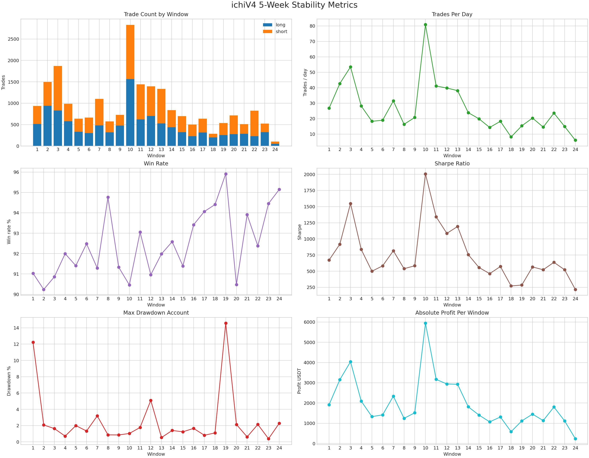
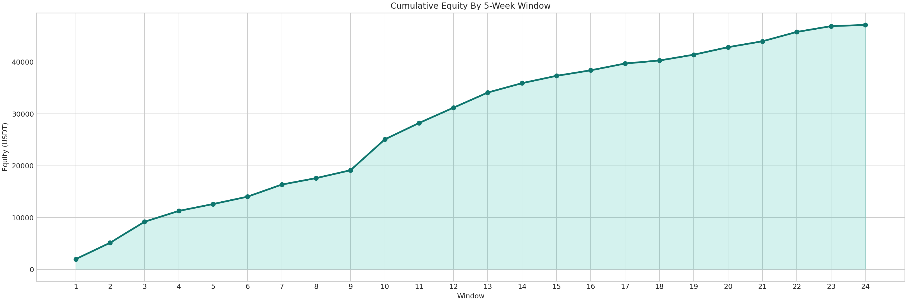

# ichiV4 5-Week Stability Visual Report

## Scope
- Strategy: ichiV4
- Timeframe: 5m
- Range: 2024-01-01 to 2026-04-02
- Window size: 35 days
- Window count: 24

## Visuals





## Key Findings
- All 24 windows are profitable; profitable ratio is 24/24.
- Mean trades/day is 26.53, with a range from 6.06 to 80.89.
- Mean win rate is 92.50%, with a range from 90.24% to 95.91%.
- Mean Sharpe is 749.39, with a range from 216.78 to 2006.87.
- Mean max drawdown account is 2.57%, while the worst window reaches 14.58%.

## Notable Windows
- Highest profit window: 20241111-20241216 with 5945.77 USDT.
- Highest activity window: 20241111-20241216 with 2831 trades.
- Best Sharpe window: 20241111-20241216 with Sharpe 2006.87.
- Worst drawdown window: 20250922-20251027 with account drawdown 14.58%.

## Interpretation
- The strategy shows strong directional stability because every 5-week window remains profitable.
- Performance volatility comes mainly from trade density and payoff size, not from a collapse in win rate.
- Risk spikes are concentrated in a small subset of windows, so drawdown-focused follow-up analysis should target those windows rather than the full sample.

## Source Data
- Summary json: ../../tmp/stability_outputs/ichiv4_5week_stability_20260402.json
- Summary csv: ../../tmp/stability_outputs/ichiv4_5week_stability_20260402.csv
- Archived windows: ../../user_data/archive/ichiv4_5week_stability_20260402

## Window Source Statistics
- The appendix below reconstructs the native backtest statistics for each 5-week window from the archived result zips.
- Sections are ordered from window_01 to window_24.

<!-- GENERATED SOURCE DATA START -->
### window_01_20240101-20240205
```text
2026-04-02 09:07:46,000 - freqtrade.misc - INFO - dumping json to "/home/watson/work/freqtrd/user_data/backtest_results/backtest-result-2026-04-02_09-07-54.meta.json"
Result for strategy ichiV4

                                               BACKTESTING REPORT                                              
+----------------+--------+--------------+-----------------+--------------+--------------+--------------------+
| Pair           | Trades | Avg Profit % | Tot Profit USDT | Tot Profit % | Avg Duration | Win Draw Loss Win% |
+================+========+==============+=================+==============+==============+====================+
| SUI/USDT:USDT  |    343 |         4.21 |         720.484 |       720.48 |      0:06:00 |      313 0 30 91.3 |
| SOL/USDT:USDT  |    117 |         4.31 |         251.631 |       251.63 |      0:06:00 |       111 0 6 94.9 |
| ETC/USDT:USDT  |    123 |         4.02 |         245.938 |       245.94 |      0:07:00 |      112 0 11 91.1 |
| PEPE/USDT:USDT |    120 |         4.04 |         241.758 |       241.76 |      0:06:00 |      105 0 15 87.5 |
| LINK/USDT:USDT |     73 |         3.96 |         144.309 |       144.31 |      0:07:00 |        68 0 5 93.2 |
| DOGE/USDT:USDT |     40 |         3.85 |          76.979 |        76.98 |      0:07:00 |        35 0 5 87.5 |
| XRP/USDT:USDT  |     30 |         4.00 |          59.843 |        59.84 |      0:05:00 |        28 0 2 93.3 |
| LTC/USDT:USDT  |     24 |         4.46 |          52.847 |        52.85 |      0:10:00 |        22 1 1 91.7 |
| BNB/USDT:USDT  |     24 |         4.43 |          52.800 |        52.80 |      0:08:00 |        22 0 2 91.7 |
| ETH/USDT:USDT  |     22 |         3.54 |          38.770 |        38.77 |      0:08:00 |        20 0 2 90.9 |
| BTC/USDT:USDT  |     21 |         3.08 |          32.134 |        32.13 |      0:07:00 |        17 0 4 81.0 |
| TOTAL          |    937 |         4.11 |        1917.495 |      1917.49 |      0:06:00 |      853 1 83 91.0 |
+----------------+--------+--------------+-----------------+--------------+--------------+--------------------+

                                       LEFT OPEN TRADES REPORT                                        
+-------+--------+--------------+-----------------+--------------+--------------+--------------------+
| Pair  | Trades | Avg Profit % | Tot Profit USDT | Tot Profit % | Avg Duration | Win Draw Loss Win% |
+=======+========+==============+=================+==============+==============+====================+
| TOTAL |      0 |         0.00 |           0.000 |         0.00 |         0:00 |          0 0 0 0.0 |
+-------+--------+--------------+-----------------+--------------+--------------+--------------------+

                                              ENTER TAG STATS                                              
+-----------+---------+--------------+-----------------+--------------+--------------+--------------------+
| Enter Tag | Entries | Avg Profit % | Tot Profit USDT | Tot Profit % | Avg Duration | Win Draw Loss Win% |
+===========+=========+==============+=================+==============+==============+====================+
| OTHER     |     937 |         4.11 |        1917.495 |      1917.49 |      0:06:00 |      853 1 83 91.0 |
| TOTAL     |     937 |         4.11 |        1917.495 |      1917.49 |      0:06:00 |      853 1 83 91.0 |
+-----------+---------+--------------+-----------------+--------------+--------------+--------------------+

                                                 EXIT REASON STATS                                                  
+----------------------+-------+--------------+-----------------+--------------+--------------+--------------------+
| Exit Reason          | Exits | Avg Profit % | Tot Profit USDT | Tot Profit % | Avg Duration | Win Draw Loss Win% |
+======================+=======+==============+=================+==============+==============+====================+
| roi                  |   747 |         5.40 |        2010.571 |      2010.57 |      0:04:00 |       746 1 0 99.9 |
| profit_protect       |    56 |         1.19 |          33.346 |        33.35 |      0:12:00 |       56 0 0 100.0 |
| profit_protect_short |    48 |         0.99 |          23.693 |        23.69 |      0:11:00 |       48 0 0 100.0 |
| stop_loss            |     1 |       -28.03 |         -13.958 |       -13.96 |      0:05:00 |          0 0 1 0.0 |
| exit_signal          |    85 |        -3.21 |        -136.157 |      -136.16 |      0:23:00 |         3 0 82 3.5 |
| TOTAL                |   937 |         4.11 |        1917.495 |      1917.49 |      0:06:00 |      853 1 83 91.0 |
+----------------------+-------+--------------+-----------------+--------------+--------------+--------------------+

                                                         MIXED TAG STATS                                                         
+-----------+----------------------+--------+--------------+-----------------+--------------+--------------+--------------------+
| Enter Tag | Exit Reason          | Trades | Avg Profit % | Tot Profit USDT | Tot Profit % | Avg Duration | Win Draw Loss Win% |
+===========+======================+========+==============+=================+==============+==============+====================+
| OTHER     | roi                  |    747 |         5.40 |        2010.571 |      2010.57 |      0:04:00 |       746 1 0 99.9 |
| OTHER     | profit_protect       |     56 |         1.19 |          33.346 |        33.35 |      0:12:00 |       56 0 0 100.0 |
| OTHER     | profit_protect_short |     48 |         0.99 |          23.693 |        23.69 |      0:11:00 |       48 0 0 100.0 |
| OTHER     | stop_loss            |      1 |       -28.03 |         -13.958 |       -13.96 |      0:05:00 |          0 0 1 0.0 |
| OTHER     | exit_signal          |     85 |        -3.21 |        -136.157 |      -136.16 |      0:23:00 |         3 0 82 3.5 |
| TOTAL     |                      |    937 |         4.11 |        1917.495 |      1917.49 |      0:06:00 |      853 1 83 91.0 |
+-----------+----------------------+--------+--------------+-----------------+--------------+--------------+--------------------+

                         SUMMARY METRICS                          
+-------------------------------+--------------------------------+
| Metric                        | Value                          |
+===============================+================================+
| Backtesting from              | 2024-01-01 00:00:00            |
| Backtesting to                | 2024-02-05 00:00:00            |
| Trading Mode                  | Isolated Futures               |
| Max open trades               | 5                              |
| Total/Daily Avg Trades        | 937 / 26.77                    |
| Starting balance              | 100 USDT                       |
| Final balance                 | 2017.495 USDT                  |
| Absolute profit               | 1917.495 USDT                  |
| Total profit %                | 1917.49%                       |
| CAGR %                        | 4048824987336848.50%           |
| Sortino                       | 562.56                         |
| Sharpe                        | 672.26                         |
| Calmar                        | 8555.80                        |
| SQN                           | 40.21                          |
| Profit factor                 | 13.74                          |
| Expectancy (Ratio)            | 2.05 (1.13)                    |
| Avg. daily profit             | 54.79 USDT                     |
| Avg. stake amount             | 49.84 USDT                     |
| Total trade volume            | 467579.756 USDT                |
| Long / Short trades           | 513 / 424                      |
| Long / Short profit %         | 1125.36% / 792.13%             |
| Long / Short profit USDT      | 1125.360 / 792.134             |
| Best Pair                     | SUI/USDT:USDT 720.48%          |
| Worst Pair                    | BTC/USDT:USDT 32.13%           |
| Best trade                    | PEPE/USDT:USDT 6.14%           |
| Worst trade                   | SOL/USDT:USDT -28.03%          |
| Best day                      | 257.527 USDT                   |
| Worst day                     | 1.834 USDT                     |
| Days win/draw/lose            | 35 / 0 / 0                     |
| Min/Max/Avg. Duration Winners | 0d 00:00 / 0d 01:00 / 0d 00:05 |
| Min/Max/Avg. Duration Losers  | 0d 00:05 / 0d 00:55 / 0d 00:23 |
| Max Consecutive Wins / Loss   | 56 / 6                         |
| Rejected Entry signals        | 16                             |
| Entry/Exit Timeouts           | 0 / 0                          |
| Min balance                   | 102.959 USDT                   |
| Max balance                   | 2017.495 USDT                  |
| Max % of account underwater   | 12.23%                         |
| Absolute drawdown             | 33.362 USDT (12.23%)           |
| Drawdown duration             | 0 days 00:40:00                |
| Profit at drawdown start      | 172.707 USDT                   |
| Profit at drawdown end        | 139.345 USDT                   |
| Drawdown start                | 2024-01-03 12:15:00            |
| Drawdown end                  | 2024-01-03 12:55:00            |
| Market change                 | 4.10%                          |
+-------------------------------+--------------------------------+

Backtested 2024-01-01 00:00:00 -> 2024-02-05 00:00:00 | Max open trades : 5
                                                       STRATEGY SUMMARY                                                       
+----------+--------+--------------+-----------------+--------------+--------------+--------------------+--------------------+
| Strategy | Trades | Avg Profit % | Tot Profit USDT | Tot Profit % | Avg Duration | Win Draw Loss Win% |           Drawdown |
+==========+========+==============+=================+==============+==============+====================+====================+
| ichiV4   |    937 |         4.11 |        1917.495 |      1917.49 |      0:06:00 |      853 1 83 91.0 | 33.362 USDT 12.23% |
+----------+--------+--------------+-----------------+--------------+--------------+--------------------+--------------------+
```

### window_02_20240205-20240311
```text
2026-04-02 09:07:58,000 - freqtrade.misc - INFO - dumping json to "/home/watson/work/freqtrd/user_data/backtest_results/backtest-result-2026-04-02_09-08-06.meta.json"
Result for strategy ichiV4

                                               BACKTESTING REPORT                                              
+----------------+--------+--------------+-----------------+--------------+--------------+--------------------+
| Pair           | Trades | Avg Profit % | Tot Profit USDT | Tot Profit % | Avg Duration | Win Draw Loss Win% |
+================+========+==============+=================+==============+==============+====================+
| PEPE/USDT:USDT |    662 |         4.34 |        1422.748 |      1422.75 |      0:04:00 |      600 0 62 90.6 |
| DOGE/USDT:USDT |    280 |         4.28 |         598.273 |       598.27 |      0:05:00 |      250 0 30 89.3 |
| SOL/USDT:USDT  |    112 |         4.21 |         235.341 |       235.34 |      0:06:00 |       103 0 9 92.0 |
| SUI/USDT:USDT  |    106 |         4.01 |         211.724 |       211.72 |      0:08:00 |       92 0 14 86.8 |
| ETC/USDT:USDT  |     86 |         4.18 |         178.622 |       178.62 |      0:06:00 |       75 0 11 87.2 |
| LTC/USDT:USDT  |     71 |         4.12 |         143.577 |       143.58 |      0:09:00 |        66 0 5 93.0 |
| LINK/USDT:USDT |     57 |         3.83 |         108.655 |       108.65 |      0:09:00 |        51 0 6 89.5 |
| XRP/USDT:USDT  |     44 |         3.90 |          85.574 |        85.57 |      0:09:00 |        39 0 5 88.6 |
| ETH/USDT:USDT  |     28 |         4.67 |          64.959 |        64.96 |      0:05:00 |        26 0 2 92.9 |
| BNB/USDT:USDT  |     28 |         4.19 |          58.060 |        58.06 |      0:08:00 |       28 0 0 100.0 |
| BTC/USDT:USDT  |     22 |         3.77 |          40.941 |        40.94 |      0:06:00 |        20 0 2 90.9 |
| TOTAL          |   1496 |         4.24 |        3148.476 |      3148.48 |      0:05:00 |    1350 0 146 90.2 |
+----------------+--------+--------------+-----------------+--------------+--------------+--------------------+

                                       LEFT OPEN TRADES REPORT                                        
+-------+--------+--------------+-----------------+--------------+--------------+--------------------+
| Pair  | Trades | Avg Profit % | Tot Profit USDT | Tot Profit % | Avg Duration | Win Draw Loss Win% |
+=======+========+==============+=================+==============+==============+====================+
| TOTAL |      0 |         0.00 |           0.000 |         0.00 |         0:00 |          0 0 0 0.0 |
+-------+--------+--------------+-----------------+--------------+--------------+--------------------+

                                              ENTER TAG STATS                                              
+-----------+---------+--------------+-----------------+--------------+--------------+--------------------+
| Enter Tag | Entries | Avg Profit % | Tot Profit USDT | Tot Profit % | Avg Duration | Win Draw Loss Win% |
+===========+=========+==============+=================+==============+==============+====================+
| OTHER     |    1496 |         4.24 |        3148.476 |      3148.48 |      0:05:00 |    1350 0 146 90.2 |
| TOTAL     |    1496 |         4.24 |        3148.476 |      3148.48 |      0:05:00 |    1350 0 146 90.2 |
+-----------+---------+--------------+-----------------+--------------+--------------+--------------------+

                                                 EXIT REASON STATS                                                  
+----------------------+-------+--------------+-----------------+--------------+--------------+--------------------+
| Exit Reason          | Exits | Avg Profit % | Tot Profit USDT | Tot Profit % | Avg Duration | Win Draw Loss Win% |
+======================+=======+==============+=================+==============+==============+====================+
| roi                  |  1246 |         5.60 |        3462.371 |      3462.37 |      0:03:00 |     1246 0 0 100.0 |
| profit_protect       |    54 |         1.18 |          31.571 |        31.57 |      0:12:00 |       54 0 0 100.0 |
| profit_protect_short |    45 |         1.03 |          23.044 |        23.04 |      0:10:00 |       45 0 0 100.0 |
| stop_loss            |     6 |       -27.95 |         -82.942 |       -82.94 |      0:11:00 |          0 0 6 0.0 |
| exit_signal          |   145 |        -3.97 |        -285.568 |      -285.57 |      0:23:00 |        5 0 140 3.4 |
| TOTAL                |  1496 |         4.24 |        3148.476 |      3148.48 |      0:05:00 |    1350 0 146 90.2 |
+----------------------+-------+--------------+-----------------+--------------+--------------+--------------------+

                                                         MIXED TAG STATS                                                         
+-----------+----------------------+--------+--------------+-----------------+--------------+--------------+--------------------+
| Enter Tag | Exit Reason          | Trades | Avg Profit % | Tot Profit USDT | Tot Profit % | Avg Duration | Win Draw Loss Win% |
+===========+======================+========+==============+=================+==============+==============+====================+
| OTHER     | roi                  |   1246 |         5.60 |        3462.371 |      3462.37 |      0:03:00 |     1246 0 0 100.0 |
| OTHER     | profit_protect       |     54 |         1.18 |          31.571 |        31.57 |      0:12:00 |       54 0 0 100.0 |
| OTHER     | profit_protect_short |     45 |         1.03 |          23.044 |        23.04 |      0:10:00 |       45 0 0 100.0 |
| OTHER     | stop_loss            |      6 |       -27.95 |         -82.942 |       -82.94 |      0:11:00 |          0 0 6 0.0 |
| OTHER     | exit_signal          |    145 |        -3.97 |        -285.568 |      -285.57 |      0:23:00 |        5 0 140 3.4 |
| TOTAL     |                      |   1496 |         4.24 |        3148.476 |      3148.48 |      0:05:00 |    1350 0 146 90.2 |
+-----------+----------------------+--------+--------------+-----------------+--------------+--------------+--------------------+

                         SUMMARY METRICS                          
+-------------------------------+--------------------------------+
| Metric                        | Value                          |
+===============================+================================+
| Backtesting from              | 2024-02-05 00:00:00            |
| Backtesting to                | 2024-03-11 00:00:00            |
| Trading Mode                  | Isolated Futures               |
| Max open trades               | 5                              |
| Total/Daily Avg Trades        | 1496 / 42.74                   |
| Starting balance              | 100 USDT                       |
| Final balance                 | 3248.476 USDT                  |
| Absolute profit               | 3148.476 USDT                  |
| Total profit %                | 3148.48%                       |
| CAGR %                        | 581647023970878208.00%         |
| Sortino                       | 628.32                         |
| Sharpe                        | 917.10                         |
| Calmar                        | 82737.11                       |
| SQN                           | 43.42                          |
| Profit factor                 | 9.52                           |
| Expectancy (Ratio)            | 2.10 (0.83)                    |
| Avg. daily profit             | 89.96 USDT                     |
| Avg. stake amount             | 49.65 USDT                     |
| Total trade volume            | 744108.836 USDT                |
| Long / Short trades           | 939 / 557                      |
| Long / Short profit %         | 2040.62% / 1107.85%            |
| Long / Short profit USDT      | 2040.624 / 1107.852            |
| Best Pair                     | PEPE/USDT:USDT 1422.75%        |
| Worst Pair                    | BTC/USDT:USDT 40.94%           |
| Best trade                    | PEPE/USDT:USDT 6.13%           |
| Worst trade                   | PEPE/USDT:USDT -28.02%         |
| Best day                      | 554.313 USDT                   |
| Worst day                     | 0.000 USDT                     |
| Days win/draw/lose            | 34 / 1 / 0                     |
| Min/Max/Avg. Duration Winners | 0d 00:00 / 0d 01:20 / 0d 00:03 |
| Min/Max/Avg. Duration Losers  | 0d 00:05 / 0d 01:20 / 0d 00:23 |
| Max Consecutive Wins / Loss   | 81 / 5                         |
| Rejected Entry signals        | 24                             |
| Entry/Exit Timeouts           | 0 / 0                          |
| Min balance                   | 100.477 USDT                   |
| Max balance                   | 3248.476 USDT                  |
| Max % of account underwater   | 2.08%                          |
| Absolute drawdown             | 17.922 USDT (2.08%)            |
| Drawdown duration             | 0 days 00:10:00                |
| Profit at drawdown start      | 762.793 USDT                   |
| Profit at drawdown end        | 744.871 USDT                   |
| Drawdown start                | 2024-02-28 17:20:00            |
| Drawdown end                  | 2024-02-28 17:30:00            |
| Market change                 | 122.82%                        |
+-------------------------------+--------------------------------+

Backtested 2024-02-05 00:00:00 -> 2024-03-11 00:00:00 | Max open trades : 5
                                                       STRATEGY SUMMARY                                                      
+----------+--------+--------------+-----------------+--------------+--------------+--------------------+-------------------+
| Strategy | Trades | Avg Profit % | Tot Profit USDT | Tot Profit % | Avg Duration | Win Draw Loss Win% |          Drawdown |
+==========+========+==============+=================+==============+==============+====================+===================+
| ichiV4   |   1496 |         4.24 |        3148.476 |      3148.48 |      0:05:00 |    1350 0 146 90.2 | 17.922 USDT 2.08% |
+----------+--------+--------------+-----------------+--------------+--------------+--------------------+-------------------+
```

### window_03_20240311-20240415
```text
2026-04-02 09:08:11,000 - freqtrade.misc - INFO - dumping json to "/home/watson/work/freqtrd/user_data/backtest_results/backtest-result-2026-04-02_09-08-20.meta.json"
Result for strategy ichiV4

                                               BACKTESTING REPORT                                              
+----------------+--------+--------------+-----------------+--------------+--------------+--------------------+
| Pair           | Trades | Avg Profit % | Tot Profit USDT | Tot Profit % | Avg Duration | Win Draw Loss Win% |
+================+========+==============+=================+==============+==============+====================+
| PEPE/USDT:USDT |    484 |         4.46 |        1061.652 |      1061.65 |      0:05:00 |      442 0 42 91.3 |
| DOGE/USDT:USDT |    316 |         4.18 |         658.787 |       658.79 |      0:06:00 |      279 0 37 88.3 |
| SUI/USDT:USDT  |    253 |         4.55 |         574.033 |       574.03 |      0:05:00 |      232 0 21 91.7 |
| SOL/USDT:USDT  |    197 |         4.32 |         423.770 |       423.77 |      0:06:00 |      181 0 16 91.9 |
| LTC/USDT:USDT  |    140 |         4.41 |         303.581 |       303.58 |      0:06:00 |      129 0 11 92.1 |
| ETC/USDT:USDT  |    114 |         4.55 |         257.586 |       257.59 |      0:05:00 |       106 0 8 93.0 |
| XRP/USDT:USDT  |    102 |         4.38 |         222.895 |       222.90 |      0:05:00 |       92 0 10 90.2 |
| LINK/USDT:USDT |     97 |         3.92 |         189.497 |       189.50 |      0:07:00 |       85 0 12 87.6 |
| BNB/USDT:USDT  |     75 |         4.10 |         152.190 |       152.19 |      0:06:00 |        67 0 8 89.3 |
| ETH/USDT:USDT  |     63 |         4.14 |         129.519 |       129.52 |      0:08:00 |        59 0 4 93.7 |
| BTC/USDT:USDT  |     31 |         4.34 |          66.230 |        66.23 |      0:08:00 |        29 0 2 93.5 |
| TOTAL          |   1872 |         4.35 |        4039.739 |      4039.74 |      0:05:00 |    1701 0 171 90.9 |
+----------------+--------+--------------+-----------------+--------------+--------------+--------------------+

                                       LEFT OPEN TRADES REPORT                                        
+-------+--------+--------------+-----------------+--------------+--------------+--------------------+
| Pair  | Trades | Avg Profit % | Tot Profit USDT | Tot Profit % | Avg Duration | Win Draw Loss Win% |
+=======+========+==============+=================+==============+==============+====================+
| TOTAL |      0 |         0.00 |           0.000 |         0.00 |         0:00 |          0 0 0 0.0 |
+-------+--------+--------------+-----------------+--------------+--------------+--------------------+

                                              ENTER TAG STATS                                              
+-----------+---------+--------------+-----------------+--------------+--------------+--------------------+
| Enter Tag | Entries | Avg Profit % | Tot Profit USDT | Tot Profit % | Avg Duration | Win Draw Loss Win% |
+===========+=========+==============+=================+==============+==============+====================+
| OTHER     |    1872 |         4.35 |        4039.739 |      4039.74 |      0:05:00 |    1701 0 171 90.9 |
| TOTAL     |    1872 |         4.35 |        4039.739 |      4039.74 |      0:05:00 |    1701 0 171 90.9 |
+-----------+---------+--------------+-----------------+--------------+--------------+--------------------+

                                                 EXIT REASON STATS                                                  
+----------------------+-------+--------------+-----------------+--------------+--------------+--------------------+
| Exit Reason          | Exits | Avg Profit % | Tot Profit USDT | Tot Profit % | Avg Duration | Win Draw Loss Win% |
+======================+=======+==============+=================+==============+==============+====================+
| roi                  |  1543 |         5.52 |        4221.847 |      4221.85 |      0:03:00 |     1543 0 0 100.0 |
| profit_protect_short |    90 |         1.25 |          55.879 |        55.88 |      0:11:00 |       90 0 0 100.0 |
| profit_protect       |    66 |         1.19 |          38.879 |        38.88 |      0:12:00 |       66 0 0 100.0 |
| exit_signal          |   173 |        -3.23 |        -276.867 |      -276.87 |      0:22:00 |        2 0 171 1.2 |
| TOTAL                |  1872 |         4.35 |        4039.739 |      4039.74 |      0:05:00 |    1701 0 171 90.9 |
+----------------------+-------+--------------+-----------------+--------------+--------------+--------------------+

                                                         MIXED TAG STATS                                                         
+-----------+----------------------+--------+--------------+-----------------+--------------+--------------+--------------------+
| Enter Tag | Exit Reason          | Trades | Avg Profit % | Tot Profit USDT | Tot Profit % | Avg Duration | Win Draw Loss Win% |
+===========+======================+========+==============+=================+==============+==============+====================+
| OTHER     | roi                  |   1543 |         5.52 |        4221.847 |      4221.85 |      0:03:00 |     1543 0 0 100.0 |
| OTHER     | profit_protect_short |     90 |         1.25 |          55.879 |        55.88 |      0:11:00 |       90 0 0 100.0 |
| OTHER     | profit_protect       |     66 |         1.19 |          38.879 |        38.88 |      0:12:00 |       66 0 0 100.0 |
| OTHER     | exit_signal          |    173 |        -3.23 |        -276.867 |      -276.87 |      0:22:00 |        2 0 171 1.2 |
| TOTAL     |                      |   1872 |         4.35 |        4039.739 |      4039.74 |      0:05:00 |    1701 0 171 90.9 |
+-----------+----------------------+--------+--------------+-----------------+--------------+--------------+--------------------+

                         SUMMARY METRICS                          
+-------------------------------+--------------------------------+
| Metric                        | Value                          |
+===============================+================================+
| Backtesting from              | 2024-03-11 00:00:00            |
| Backtesting to                | 2024-04-15 00:00:00            |
| Trading Mode                  | Isolated Futures               |
| Max open trades               | 5                              |
| Total/Daily Avg Trades        | 1872 / 53.49                   |
| Starting balance              | 100 USDT                       |
| Final balance                 | 4139.739 USDT                  |
| Absolute profit               | 4039.739 USDT                  |
| Total profit %                | 4039.74%                       |
| CAGR %                        | 7289844271441271808.00%        |
| Sortino                       | 2337.23                        |
| Sharpe                        | 1548.28                        |
| Calmar                        | 135256.59                      |
| SQN                           | 65.54                          |
| Profit factor                 | 15.58                          |
| Expectancy (Ratio)            | 2.16 (1.33)                    |
| Avg. daily profit             | 115.42 USDT                    |
| Avg. stake amount             | 49.58 USDT                     |
| Total trade volume            | 928106.734 USDT                |
| Long / Short trades           | 829 / 1043                     |
| Long / Short profit %         | 1809.97% / 2229.77%            |
| Long / Short profit USDT      | 1809.969 / 2229.770            |
| Best Pair                     | PEPE/USDT:USDT 1061.65%        |
| Worst Pair                    | BTC/USDT:USDT 66.23%           |
| Best trade                    | PEPE/USDT:USDT 5.95%           |
| Worst trade                   | XRP/USDT:USDT -13.71%          |
| Best day                      | 461.386 USDT                   |
| Worst day                     | 0.000 USDT                     |
| Days win/draw/lose            | 34 / 1 / 0                     |
| Min/Max/Avg. Duration Winners | 0d 00:00 / 0d 00:50 / 0d 00:04 |
| Min/Max/Avg. Duration Losers  | 0d 00:05 / 0d 01:10 / 0d 00:22 |
| Max Consecutive Wins / Loss   | 104 / 5                        |
| Rejected Entry signals        | 87                             |
| Entry/Exit Timeouts           | 0 / 0                          |
| Min balance                   | 98.936 USDT                    |
| Max balance                   | 4139.739 USDT                  |
| Max % of account underwater   | 1.63%                          |
| Absolute drawdown             | 15.820 USDT (1.63%)            |
| Drawdown duration             | 0 days 00:30:00                |
| Profit at drawdown start      | 870.364 USDT                   |
| Profit at drawdown end        | 854.544 USDT                   |
| Drawdown start                | 2024-03-15 09:10:00            |
| Drawdown end                  | 2024-03-15 09:40:00            |
| Market change                 | -15.26%                        |
+-------------------------------+--------------------------------+

Backtested 2024-03-11 00:00:00 -> 2024-04-15 00:00:00 | Max open trades : 5
                                                       STRATEGY SUMMARY                                                      
+----------+--------+--------------+-----------------+--------------+--------------+--------------------+-------------------+
| Strategy | Trades | Avg Profit % | Tot Profit USDT | Tot Profit % | Avg Duration | Win Draw Loss Win% |          Drawdown |
+==========+========+==============+=================+==============+==============+====================+===================+
| ichiV4   |   1872 |         4.35 |        4039.739 |      4039.74 |      0:05:00 |    1701 0 171 90.9 | 15.820 USDT 1.63% |
+----------+--------+--------------+-----------------+--------------+--------------+--------------------+-------------------+
```

### window_04_20240415-20240520
```text
2026-04-02 09:08:25,000 - freqtrade.misc - INFO - dumping json to "/home/watson/work/freqtrd/user_data/backtest_results/backtest-result-2026-04-02_09-08-33.meta.json"
Result for strategy ichiV4

                                               BACKTESTING REPORT                                              
+----------------+--------+--------------+-----------------+--------------+--------------+--------------------+
| Pair           | Trades | Avg Profit % | Tot Profit USDT | Tot Profit % | Avg Duration | Win Draw Loss Win% |
+================+========+==============+=================+==============+==============+====================+
| PEPE/USDT:USDT |    401 |         4.45 |         878.187 |       878.19 |      0:05:00 |      368 0 33 91.8 |
| DOGE/USDT:USDT |    122 |         4.18 |         254.396 |       254.40 |      0:06:00 |      111 0 11 91.0 |
| SOL/USDT:USDT  |    112 |         4.27 |         238.334 |       238.33 |      0:05:00 |       108 0 4 96.4 |
| SUI/USDT:USDT  |    108 |         3.84 |         206.773 |       206.77 |      0:07:00 |       95 0 13 88.0 |
| ETC/USDT:USDT  |     75 |         4.20 |         156.744 |       156.74 |      0:06:00 |        69 0 6 92.0 |
| LINK/USDT:USDT |     64 |         4.55 |         144.962 |       144.96 |      0:05:00 |        60 0 4 93.8 |
| ETH/USDT:USDT  |     29 |         4.05 |          58.311 |        58.31 |      0:09:00 |        26 0 3 89.7 |
| LTC/USDT:USDT  |     22 |         4.88 |          52.570 |        52.57 |      0:05:00 |       22 0 0 100.0 |
| XRP/USDT:USDT  |     23 |         3.94 |          45.204 |        45.20 |      0:06:00 |        21 0 2 91.3 |
| BTC/USDT:USDT  |     19 |         4.02 |          37.759 |        37.76 |      0:06:00 |        17 0 2 89.5 |
| BNB/USDT:USDT  |     12 |         3.09 |          18.360 |        18.36 |      0:12:00 |        11 0 1 91.7 |
| TOTAL          |    987 |         4.28 |        2091.600 |      2091.60 |      0:06:00 |      908 0 79 92.0 |
+----------------+--------+--------------+-----------------+--------------+--------------+--------------------+

                                       LEFT OPEN TRADES REPORT                                        
+-------+--------+--------------+-----------------+--------------+--------------+--------------------+
| Pair  | Trades | Avg Profit % | Tot Profit USDT | Tot Profit % | Avg Duration | Win Draw Loss Win% |
+=======+========+==============+=================+==============+==============+====================+
| TOTAL |      0 |         0.00 |           0.000 |         0.00 |         0:00 |          0 0 0 0.0 |
+-------+--------+--------------+-----------------+--------------+--------------+--------------------+

                                              ENTER TAG STATS                                              
+-----------+---------+--------------+-----------------+--------------+--------------+--------------------+
| Enter Tag | Entries | Avg Profit % | Tot Profit USDT | Tot Profit % | Avg Duration | Win Draw Loss Win% |
+===========+=========+==============+=================+==============+==============+====================+
| OTHER     |     987 |         4.28 |        2091.600 |      2091.60 |      0:06:00 |      908 0 79 92.0 |
| TOTAL     |     987 |         4.28 |        2091.600 |      2091.60 |      0:06:00 |      908 0 79 92.0 |
+-----------+---------+--------------+-----------------+--------------+--------------+--------------------+

                                                 EXIT REASON STATS                                                  
+----------------------+-------+--------------+-----------------+--------------+--------------+--------------------+
| Exit Reason          | Exits | Avg Profit % | Tot Profit USDT | Tot Profit % | Avg Duration | Win Draw Loss Win% |
+======================+=======+==============+=================+==============+==============+====================+
| roi                  |   779 |         5.53 |        2134.418 |      2134.42 |      0:03:00 |      779 0 0 100.0 |
| profit_protect       |    72 |         1.13 |          40.299 |        40.30 |      0:12:00 |       72 0 0 100.0 |
| profit_protect_short |    56 |         1.19 |          33.030 |        33.03 |      0:11:00 |       56 0 0 100.0 |
| exit_signal          |    80 |        -2.93 |        -116.148 |      -116.15 |      0:25:00 |         1 0 79 1.2 |
| TOTAL                |   987 |         4.28 |        2091.600 |      2091.60 |      0:06:00 |      908 0 79 92.0 |
+----------------------+-------+--------------+-----------------+--------------+--------------+--------------------+

                                                         MIXED TAG STATS                                                         
+-----------+----------------------+--------+--------------+-----------------+--------------+--------------+--------------------+
| Enter Tag | Exit Reason          | Trades | Avg Profit % | Tot Profit USDT | Tot Profit % | Avg Duration | Win Draw Loss Win% |
+===========+======================+========+==============+=================+==============+==============+====================+
| OTHER     | roi                  |    779 |         5.53 |        2134.418 |      2134.42 |      0:03:00 |      779 0 0 100.0 |
| OTHER     | profit_protect       |     72 |         1.13 |          40.299 |        40.30 |      0:12:00 |       72 0 0 100.0 |
| OTHER     | profit_protect_short |     56 |         1.19 |          33.030 |        33.03 |      0:11:00 |       56 0 0 100.0 |
| OTHER     | exit_signal          |     80 |        -2.93 |        -116.148 |      -116.15 |      0:25:00 |         1 0 79 1.2 |
| TOTAL     |                      |    987 |         4.28 |        2091.600 |      2091.60 |      0:06:00 |      908 0 79 92.0 |
+-----------+----------------------+--------+--------------+-----------------+--------------+--------------+--------------------+

                         SUMMARY METRICS                          
+-------------------------------+--------------------------------+
| Metric                        | Value                          |
+===============================+================================+
| Backtesting from              | 2024-04-15 00:00:00            |
| Backtesting to                | 2024-05-20 00:00:00            |
| Trading Mode                  | Isolated Futures               |
| Max open trades               | 5                              |
| Total/Daily Avg Trades        | 987 / 28.20                    |
| Starting balance              | 100 USDT                       |
| Final balance                 | 2191.600 USDT                  |
| Absolute profit               | 2091.600 USDT                  |
| Total profit %                | 2091.60%                       |
| CAGR %                        | 9598961025130170.00%           |
| Sortino                       | 1362.07                        |
| Sharpe                        | 836.61                         |
| Calmar                        | 161053.95                      |
| SQN                           | 48.76                          |
| Profit factor                 | 19.01                          |
| Expectancy (Ratio)            | 2.12 (1.44)                    |
| Avg. daily profit             | 59.76 USDT                     |
| Avg. stake amount             | 49.56 USDT                     |
| Total trade volume            | 489851.207 USDT                |
| Long / Short trades           | 580 / 407                      |
| Long / Short profit %         | 1232.04% / 859.56%             |
| Long / Short profit USDT      | 1232.039 / 859.560             |
| Best Pair                     | PEPE/USDT:USDT 878.19%         |
| Worst Pair                    | BNB/USDT:USDT 18.36%           |
| Best trade                    | PEPE/USDT:USDT 5.95%           |
| Worst trade                   | PEPE/USDT:USDT -7.47%          |
| Best day                      | 300.715 USDT                   |
| Worst day                     | 2.945 USDT                     |
| Days win/draw/lose            | 34 / 0 / 0                     |
| Min/Max/Avg. Duration Winners | 0d 00:00 / 0d 01:00 / 0d 00:04 |
| Min/Max/Avg. Duration Losers  | 0d 00:05 / 0d 01:00 / 0d 00:25 |
| Max Consecutive Wins / Loss   | 101 / 4                        |
| Rejected Entry signals        | 23                             |
| Entry/Exit Timeouts           | 0 / 0                          |
| Min balance                   | 102.939 USDT                   |
| Max balance                   | 2192.350 USDT                  |
| Max % of account underwater   | 0.71%                          |
| Absolute drawdown             | 10.333 USDT (0.71%)            |
| Drawdown duration             | 0 days 00:25:00                |
| Profit at drawdown start      | 1357.665 USDT                  |
| Profit at drawdown end        | 1347.331 USDT                  |
| Drawdown start                | 2024-05-01 19:05:00            |
| Drawdown end                  | 2024-05-01 19:30:00            |
| Market change                 | 8.28%                          |
+-------------------------------+--------------------------------+

Backtested 2024-04-15 00:00:00 -> 2024-05-20 00:00:00 | Max open trades : 5
                                                       STRATEGY SUMMARY                                                      
+----------+--------+--------------+-----------------+--------------+--------------+--------------------+-------------------+
| Strategy | Trades | Avg Profit % | Tot Profit USDT | Tot Profit % | Avg Duration | Win Draw Loss Win% |          Drawdown |
+==========+========+==============+=================+==============+==============+====================+===================+
| ichiV4   |    987 |         4.28 |        2091.600 |      2091.60 |      0:06:00 |      908 0 79 92.0 | 10.333 USDT 0.71% |
+----------+--------+--------------+-----------------+--------------+--------------+--------------------+-------------------+
```

### window_05_20240520-20240624
```text
2026-04-02 09:08:37,000 - freqtrade.misc - INFO - dumping json to "/home/watson/work/freqtrd/user_data/backtest_results/backtest-result-2026-04-02_09-08-44.meta.json"
Result for strategy ichiV4

                                               BACKTESTING REPORT                                              
+----------------+--------+--------------+-----------------+--------------+--------------+--------------------+
| Pair           | Trades | Avg Profit % | Tot Profit USDT | Tot Profit % | Avg Duration | Win Draw Loss Win% |
+================+========+==============+=================+==============+==============+====================+
| PEPE/USDT:USDT |    298 |         4.33 |         627.055 |       627.06 |      0:06:00 |      275 0 23 92.3 |
| SUI/USDT:USDT  |     56 |         3.99 |         111.471 |       111.47 |      0:07:00 |        50 0 6 89.3 |
| ETC/USDT:USDT  |     53 |         4.11 |         108.052 |       108.05 |      0:07:00 |        48 0 5 90.6 |
| DOGE/USDT:USDT |     55 |         3.82 |         104.789 |       104.79 |      0:07:00 |        49 0 6 89.1 |
| LINK/USDT:USDT |     45 |         4.00 |          89.728 |        89.73 |      0:08:00 |        40 0 5 88.9 |
| SOL/USDT:USDT  |     38 |         4.23 |          80.258 |        80.26 |      0:07:00 |        35 0 3 92.1 |
| BNB/USDT:USDT  |     22 |         4.92 |          53.566 |        53.57 |      0:05:00 |       22 0 0 100.0 |
| ETH/USDT:USDT  |     26 |         4.13 |          53.322 |        53.32 |      0:08:00 |        22 0 4 84.6 |
| XRP/USDT:USDT  |     19 |         4.81 |          45.611 |        45.61 |      0:03:00 |        18 0 1 94.7 |
| LTC/USDT:USDT  |     21 |         3.71 |          38.222 |        38.22 |      0:09:00 |        19 0 2 90.5 |
| BTC/USDT:USDT  |      7 |         4.22 |          14.539 |        14.54 |      0:06:00 |        7 0 0 100.0 |
| TOTAL          |    640 |         4.21 |        1326.613 |      1326.61 |      0:07:00 |      585 0 55 91.4 |
+----------------+--------+--------------+-----------------+--------------+--------------+--------------------+

                                       LEFT OPEN TRADES REPORT                                        
+-------+--------+--------------+-----------------+--------------+--------------+--------------------+
| Pair  | Trades | Avg Profit % | Tot Profit USDT | Tot Profit % | Avg Duration | Win Draw Loss Win% |
+=======+========+==============+=================+==============+==============+====================+
| TOTAL |      0 |         0.00 |           0.000 |         0.00 |         0:00 |          0 0 0 0.0 |
+-------+--------+--------------+-----------------+--------------+--------------+--------------------+

                                              ENTER TAG STATS                                              
+-----------+---------+--------------+-----------------+--------------+--------------+--------------------+
| Enter Tag | Entries | Avg Profit % | Tot Profit USDT | Tot Profit % | Avg Duration | Win Draw Loss Win% |
+===========+=========+==============+=================+==============+==============+====================+
| OTHER     |     640 |         4.21 |        1326.613 |      1326.61 |      0:07:00 |      585 0 55 91.4 |
| TOTAL     |     640 |         4.21 |        1326.613 |      1326.61 |      0:07:00 |      585 0 55 91.4 |
+-----------+---------+--------------+-----------------+--------------+--------------+--------------------+

                                                 EXIT REASON STATS                                                  
+----------------------+-------+--------------+-----------------+--------------+--------------+--------------------+
| Exit Reason          | Exits | Avg Profit % | Tot Profit USDT | Tot Profit % | Avg Duration | Win Draw Loss Win% |
+======================+=======+==============+=================+==============+==============+====================+
| roi                  |   516 |         5.45 |        1384.164 |      1384.16 |      0:03:00 |      516 0 0 100.0 |
| profit_protect_short |    36 |         1.23 |          21.975 |        21.97 |      0:11:00 |       36 0 0 100.0 |
| profit_protect       |    32 |         1.14 |          18.007 |        18.01 |      0:12:00 |       32 0 0 100.0 |
| exit_signal          |    56 |        -3.53 |         -97.532 |       -97.53 |      0:30:00 |         1 0 55 1.8 |
| TOTAL                |   640 |         4.21 |        1326.613 |      1326.61 |      0:07:00 |      585 0 55 91.4 |
+----------------------+-------+--------------+-----------------+--------------+--------------+--------------------+

                                                         MIXED TAG STATS                                                         
+-----------+----------------------+--------+--------------+-----------------+--------------+--------------+--------------------+
| Enter Tag | Exit Reason          | Trades | Avg Profit % | Tot Profit USDT | Tot Profit % | Avg Duration | Win Draw Loss Win% |
+===========+======================+========+==============+=================+==============+==============+====================+
| OTHER     | roi                  |    516 |         5.45 |        1384.164 |      1384.16 |      0:03:00 |      516 0 0 100.0 |
| OTHER     | profit_protect_short |     36 |         1.23 |          21.975 |        21.97 |      0:11:00 |       36 0 0 100.0 |
| OTHER     | profit_protect       |     32 |         1.14 |          18.007 |        18.01 |      0:12:00 |       32 0 0 100.0 |
| OTHER     | exit_signal          |     56 |        -3.53 |         -97.532 |       -97.53 |      0:30:00 |         1 0 55 1.8 |
| TOTAL     |                      |    640 |         4.21 |        1326.613 |      1326.61 |      0:07:00 |      585 0 55 91.4 |
+-----------+----------------------+--------+--------------+-----------------+--------------+--------------+--------------------+

                         SUMMARY METRICS                          
+-------------------------------+--------------------------------+
| Metric                        | Value                          |
+===============================+================================+
| Backtesting from              | 2024-05-20 00:00:00            |
| Backtesting to                | 2024-06-24 00:00:00            |
| Trading Mode                  | Isolated Futures               |
| Max open trades               | 5                              |
| Total/Daily Avg Trades        | 640 / 18.29                    |
| Starting balance              | 100 USDT                       |
| Final balance                 | 1426.613 USDT                  |
| Absolute profit               | 1326.613 USDT                  |
| Total profit %                | 1326.61%                       |
| CAGR %                        | 109084723954671.39%            |
| Sortino                       | 645.70                         |
| Sharpe                        | 499.16                         |
| Calmar                        | 36200.03                       |
| SQN                           | 36.12                          |
| Profit factor                 | 14.54                          |
| Expectancy (Ratio)            | 2.07 (1.16)                    |
| Avg. daily profit             | 37.90 USDT                     |
| Avg. stake amount             | 49.24 USDT                     |
| Total trade volume            | 315397.331 USDT                |
| Long / Short trades           | 331 / 309                      |
| Long / Short profit %         | 713.37% / 613.24%              |
| Long / Short profit USDT      | 713.369 / 613.244              |
| Best Pair                     | PEPE/USDT:USDT 627.06%         |
| Worst Pair                    | BTC/USDT:USDT 14.54%           |
| Best trade                    | XRP/USDT:USDT 5.94%            |
| Worst trade                   | LTC/USDT:USDT -11.30%          |
| Best day                      | 150.142 USDT                   |
| Worst day                     | 0.000 USDT                     |
| Days win/draw/lose            | 34 / 1 / 0                     |
| Min/Max/Avg. Duration Winners | 0d 00:00 / 0d 00:45 / 0d 00:04 |
| Min/Max/Avg. Duration Losers  | 0d 00:05 / 0d 01:10 / 0d 00:30 |
| Max Consecutive Wins / Loss   | 62 / 4                         |
| Rejected Entry signals        | 22                             |
| Entry/Exit Timeouts           | 0 / 0                          |
| Min balance                   | 102.944 USDT                   |
| Max balance                   | 1426.613 USDT                  |
| Max % of account underwater   | 2.00%                          |
| Absolute drawdown             | 18.068 USDT (2.00%)            |
| Drawdown duration             | 0 days 01:05:00                |
| Profit at drawdown start      | 803.251 USDT                   |
| Profit at drawdown end        | 785.182 USDT                   |
| Drawdown start                | 2024-06-07 18:25:00            |
| Drawdown end                  | 2024-06-07 19:30:00            |
| Market change                 | -7.86%                         |
+-------------------------------+--------------------------------+

Backtested 2024-05-20 00:00:00 -> 2024-06-24 00:00:00 | Max open trades : 5
                                                       STRATEGY SUMMARY                                                      
+----------+--------+--------------+-----------------+--------------+--------------+--------------------+-------------------+
| Strategy | Trades | Avg Profit % | Tot Profit USDT | Tot Profit % | Avg Duration | Win Draw Loss Win% |          Drawdown |
+==========+========+==============+=================+==============+==============+====================+===================+
| ichiV4   |    640 |         4.21 |        1326.613 |      1326.61 |      0:07:00 |      585 0 55 91.4 | 18.068 USDT 2.00% |
+----------+--------+--------------+-----------------+--------------+--------------+--------------------+-------------------+
```

### window_06_20240624-20240729
```text
2026-04-02 09:08:48,000 - freqtrade.misc - INFO - dumping json to "/home/watson/work/freqtrd/user_data/backtest_results/backtest-result-2026-04-02_09-08-55.meta.json"
Result for strategy ichiV4

                                               BACKTESTING REPORT                                              
+----------------+--------+--------------+-----------------+--------------+--------------+--------------------+
| Pair           | Trades | Avg Profit % | Tot Profit USDT | Tot Profit % | Avg Duration | Win Draw Loss Win% |
+================+========+==============+=================+==============+==============+====================+
| PEPE/USDT:USDT |    257 |         4.18 |         526.506 |       526.51 |      0:06:00 |      234 0 23 91.1 |
| SUI/USDT:USDT  |     79 |         4.29 |         169.023 |       169.02 |      0:07:00 |        75 0 4 94.9 |
| DOGE/USDT:USDT |     73 |         4.10 |         149.305 |       149.31 |      0:06:00 |        64 0 9 87.7 |
| SOL/USDT:USDT  |     58 |         4.55 |         131.678 |       131.68 |      0:07:00 |        57 0 1 98.3 |
| XRP/USDT:USDT  |     46 |         4.24 |          97.381 |        97.38 |      0:07:00 |        42 0 4 91.3 |
| LINK/USDT:USDT |     34 |         4.34 |          73.505 |        73.51 |      0:09:00 |        32 0 2 94.1 |
| ETC/USDT:USDT  |     30 |         4.90 |          73.105 |        73.11 |      0:05:00 |        28 0 2 93.3 |
| LTC/USDT:USDT  |     24 |         4.67 |          55.827 |        55.83 |      0:06:00 |        23 0 1 95.8 |
| BNB/USDT:USDT  |     23 |         4.70 |          53.451 |        53.45 |      0:05:00 |        22 0 1 95.7 |
| ETH/USDT:USDT  |     25 |         3.97 |          49.346 |        49.35 |      0:10:00 |        23 0 2 92.0 |
| BTC/USDT:USDT  |     16 |         4.45 |          35.174 |        35.17 |      0:07:00 |        15 0 1 93.8 |
| TOTAL          |    665 |         4.30 |        1414.303 |      1414.30 |      0:07:00 |      615 0 50 92.5 |
+----------------+--------+--------------+-----------------+--------------+--------------+--------------------+

                                       LEFT OPEN TRADES REPORT                                        
+-------+--------+--------------+-----------------+--------------+--------------+--------------------+
| Pair  | Trades | Avg Profit % | Tot Profit USDT | Tot Profit % | Avg Duration | Win Draw Loss Win% |
+=======+========+==============+=================+==============+==============+====================+
| TOTAL |      0 |         0.00 |           0.000 |         0.00 |         0:00 |          0 0 0 0.0 |
+-------+--------+--------------+-----------------+--------------+--------------+--------------------+

                                              ENTER TAG STATS                                              
+-----------+---------+--------------+-----------------+--------------+--------------+--------------------+
| Enter Tag | Entries | Avg Profit % | Tot Profit USDT | Tot Profit % | Avg Duration | Win Draw Loss Win% |
+===========+=========+==============+=================+==============+==============+====================+
| OTHER     |     665 |         4.30 |        1414.303 |      1414.30 |      0:07:00 |      615 0 50 92.5 |
| TOTAL     |     665 |         4.30 |        1414.303 |      1414.30 |      0:07:00 |      615 0 50 92.5 |
+-----------+---------+--------------+-----------------+--------------+--------------+--------------------+

                                                 EXIT REASON STATS                                                  
+----------------------+-------+--------------+-----------------+--------------+--------------+--------------------+
| Exit Reason          | Exits | Avg Profit % | Tot Profit USDT | Tot Profit % | Avg Duration | Win Draw Loss Win% |
+======================+=======+==============+=================+==============+==============+====================+
| roi                  |   544 |         5.38 |        1448.643 |      1448.64 |      0:04:00 |      544 0 0 100.0 |
| profit_protect_short |    37 |         1.32 |          24.165 |        24.17 |      0:14:00 |       37 0 0 100.0 |
| profit_protect       |    33 |         1.16 |          18.966 |        18.97 |      0:16:00 |       33 0 0 100.0 |
| exit_signal          |    51 |        -3.10 |         -77.471 |       -77.47 |      0:25:00 |         1 0 50 2.0 |
| TOTAL                |   665 |         4.30 |        1414.303 |      1414.30 |      0:07:00 |      615 0 50 92.5 |
+----------------------+-------+--------------+-----------------+--------------+--------------+--------------------+

                                                         MIXED TAG STATS                                                         
+-----------+----------------------+--------+--------------+-----------------+--------------+--------------+--------------------+
| Enter Tag | Exit Reason          | Trades | Avg Profit % | Tot Profit USDT | Tot Profit % | Avg Duration | Win Draw Loss Win% |
+===========+======================+========+==============+=================+==============+==============+====================+
| OTHER     | roi                  |    544 |         5.38 |        1448.643 |      1448.64 |      0:04:00 |      544 0 0 100.0 |
| OTHER     | profit_protect_short |     37 |         1.32 |          24.165 |        24.17 |      0:14:00 |       37 0 0 100.0 |
| OTHER     | profit_protect       |     33 |         1.16 |          18.966 |        18.97 |      0:16:00 |       33 0 0 100.0 |
| OTHER     | exit_signal          |     51 |        -3.10 |         -77.471 |       -77.47 |      0:25:00 |         1 0 50 2.0 |
| TOTAL     |                      |    665 |         4.30 |        1414.303 |      1414.30 |      0:07:00 |      615 0 50 92.5 |
+-----------+----------------------+--------+--------------+-----------------+--------------+--------------+--------------------+

                         SUMMARY METRICS                          
+-------------------------------+--------------------------------+
| Metric                        | Value                          |
+===============================+================================+
| Backtesting from              | 2024-06-24 00:00:00            |
| Backtesting to                | 2024-07-29 00:00:00            |
| Trading Mode                  | Isolated Futures               |
| Max open trades               | 5                              |
| Total/Daily Avg Trades        | 665 / 19.00                    |
| Starting balance              | 100 USDT                       |
| Final balance                 | 1514.303 USDT                  |
| Absolute profit               | 1414.303 USDT                  |
| Total profit %                | 1414.30%                       |
| CAGR %                        | 203204721063556.41%            |
| Sortino                       | 1043.06                        |
| Sharpe                        | 582.33                         |
| Calmar                        | 57841.57                       |
| SQN                           | 41.34                          |
| Profit factor                 | 19.23                          |
| Expectancy (Ratio)            | 2.13 (1.37)                    |
| Avg. daily profit             | 40.41 USDT                     |
| Avg. stake amount             | 49.44 USDT                     |
| Total trade volume            | 328781.172 USDT                |
| Long / Short trades           | 304 / 361                      |
| Long / Short profit %         | 635.63% / 778.68%              |
| Long / Short profit USDT      | 635.626 / 778.677              |
| Best Pair                     | PEPE/USDT:USDT 526.51%         |
| Worst Pair                    | BTC/USDT:USDT 35.17%           |
| Best trade                    | XRP/USDT:USDT 5.94%            |
| Worst trade                   | ETH/USDT:USDT -7.65%           |
| Best day                      | 233.129 USDT                   |
| Worst day                     | 0.000 USDT                     |
| Days win/draw/lose            | 32 / 2 / 0                     |
| Min/Max/Avg. Duration Winners | 0d 00:00 / 0d 01:05 / 0d 00:05 |
| Min/Max/Avg. Duration Losers  | 0d 00:05 / 0d 01:05 / 0d 00:25 |
| Max Consecutive Wins / Loss   | 53 / 5                         |
| Rejected Entry signals        | 23                             |
| Entry/Exit Timeouts           | 0 / 0                          |
| Min balance                   | 102.877 USDT                   |
| Max balance                   | 1514.303 USDT                  |
| Max % of account underwater   | 1.33%                          |
| Absolute drawdown             | 12.167 USDT (1.33%)            |
| Drawdown duration             | 0 days 00:00:00                |
| Profit at drawdown start      | 811.563 USDT                   |
| Profit at drawdown end        | 799.397 USDT                   |
| Drawdown start                | 2024-07-08 15:15:00            |
| Drawdown end                  | 2024-07-08 15:15:00            |
| Market change                 | 6.45%                          |
+-------------------------------+--------------------------------+

Backtested 2024-06-24 00:00:00 -> 2024-07-29 00:00:00 | Max open trades : 5
                                                       STRATEGY SUMMARY                                                      
+----------+--------+--------------+-----------------+--------------+--------------+--------------------+-------------------+
| Strategy | Trades | Avg Profit % | Tot Profit USDT | Tot Profit % | Avg Duration | Win Draw Loss Win% |          Drawdown |
+==========+========+==============+=================+==============+==============+====================+===================+
| ichiV4   |    665 |         4.30 |        1414.303 |      1414.30 |      0:07:00 |      615 0 50 92.5 | 12.167 USDT 1.33% |
+----------+--------+--------------+-----------------+--------------+--------------+--------------------+-------------------+
```

### window_07_20240729-20240902
```text
2026-04-02 09:09:00,000 - freqtrade.misc - INFO - dumping json to "/home/watson/work/freqtrd/user_data/backtest_results/backtest-result-2026-04-02_09-09-07.meta.json"
Result for strategy ichiV4

                                               BACKTESTING REPORT                                              
+----------------+--------+--------------+-----------------+--------------+--------------+--------------------+
| Pair           | Trades | Avg Profit % | Tot Profit USDT | Tot Profit % | Avg Duration | Win Draw Loss Win% |
+================+========+==============+=================+==============+==============+====================+
| SUI/USDT:USDT  |    218 |         4.41 |         479.584 |       479.58 |      0:06:00 |      204 0 14 93.6 |
| PEPE/USDT:USDT |    233 |         4.05 |         464.286 |       464.29 |      0:06:00 |      204 0 29 87.6 |
| SOL/USDT:USDT  |    128 |         3.91 |         249.780 |       249.78 |      0:06:00 |      112 0 16 87.5 |
| LINK/USDT:USDT |     90 |         4.80 |         215.332 |       215.33 |      0:04:00 |        87 0 3 96.7 |
| DOGE/USDT:USDT |     99 |         3.79 |         187.397 |       187.40 |      0:08:00 |       89 0 10 89.9 |
| XRP/USDT:USDT  |     80 |         4.40 |         175.903 |       175.90 |      0:04:00 |        72 0 8 90.0 |
| ETH/USDT:USDT  |     79 |         4.22 |         165.728 |       165.73 |      0:06:00 |        73 0 6 92.4 |
| LTC/USDT:USDT  |     57 |         4.81 |         135.323 |       135.32 |      0:04:00 |        55 0 2 96.5 |
| BNB/USDT:USDT  |     42 |         4.75 |          98.930 |        98.93 |      0:05:00 |        40 0 2 95.2 |
| ETC/USDT:USDT  |     37 |         4.61 |          85.022 |        85.02 |      0:04:00 |        34 0 3 91.9 |
| BTC/USDT:USDT  |     39 |         4.12 |          79.478 |        79.48 |      0:07:00 |        36 0 3 92.3 |
| TOTAL          |   1102 |         4.27 |        2336.763 |      2336.76 |      0:06:00 |     1006 0 96 91.3 |
+----------------+--------+--------------+-----------------+--------------+--------------+--------------------+

                                       LEFT OPEN TRADES REPORT                                        
+-------+--------+--------------+-----------------+--------------+--------------+--------------------+
| Pair  | Trades | Avg Profit % | Tot Profit USDT | Tot Profit % | Avg Duration | Win Draw Loss Win% |
+=======+========+==============+=================+==============+==============+====================+
| TOTAL |      0 |         0.00 |           0.000 |         0.00 |         0:00 |          0 0 0 0.0 |
+-------+--------+--------------+-----------------+--------------+--------------+--------------------+

                                              ENTER TAG STATS                                              
+-----------+---------+--------------+-----------------+--------------+--------------+--------------------+
| Enter Tag | Entries | Avg Profit % | Tot Profit USDT | Tot Profit % | Avg Duration | Win Draw Loss Win% |
+===========+=========+==============+=================+==============+==============+====================+
| OTHER     |    1102 |         4.27 |        2336.763 |      2336.76 |      0:06:00 |     1006 0 96 91.3 |
| TOTAL     |    1102 |         4.27 |        2336.763 |      2336.76 |      0:06:00 |     1006 0 96 91.3 |
+-----------+---------+--------------+-----------------+--------------+--------------+--------------------+

                                                 EXIT REASON STATS                                                  
+----------------------+-------+--------------+-----------------+--------------+--------------+--------------------+
| Exit Reason          | Exits | Avg Profit % | Tot Profit USDT | Tot Profit % | Avg Duration | Win Draw Loss Win% |
+======================+=======+==============+=================+==============+==============+====================+
| roi                  |   899 |         5.49 |        2452.998 |      2453.00 |      0:03:00 |      899 0 0 100.0 |
| profit_protect       |    54 |         1.12 |          30.221 |        30.22 |      0:15:00 |       54 0 0 100.0 |
| profit_protect_short |    51 |         1.15 |          29.124 |        29.12 |      0:12:00 |       51 0 0 100.0 |
| stop_loss            |     2 |       -28.00 |         -27.944 |       -27.94 |      0:00:00 |          0 0 2 0.0 |
| exit_signal          |    96 |        -3.10 |        -147.635 |      -147.64 |      0:22:00 |         2 0 94 2.1 |
| TOTAL                |  1102 |         4.27 |        2336.763 |      2336.76 |      0:06:00 |     1006 0 96 91.3 |
+----------------------+-------+--------------+-----------------+--------------+--------------+--------------------+

                                                         MIXED TAG STATS                                                         
+-----------+----------------------+--------+--------------+-----------------+--------------+--------------+--------------------+
| Enter Tag | Exit Reason          | Trades | Avg Profit % | Tot Profit USDT | Tot Profit % | Avg Duration | Win Draw Loss Win% |
+===========+======================+========+==============+=================+==============+==============+====================+
| OTHER     | roi                  |    899 |         5.49 |        2452.998 |      2453.00 |      0:03:00 |      899 0 0 100.0 |
| OTHER     | profit_protect       |     54 |         1.12 |          30.221 |        30.22 |      0:15:00 |       54 0 0 100.0 |
| OTHER     | profit_protect_short |     51 |         1.15 |          29.124 |        29.12 |      0:12:00 |       51 0 0 100.0 |
| OTHER     | stop_loss            |      2 |       -28.00 |         -27.944 |       -27.94 |      0:00:00 |          0 0 2 0.0 |
| OTHER     | exit_signal          |     96 |        -3.10 |        -147.635 |      -147.64 |      0:22:00 |         2 0 94 2.1 |
| TOTAL     |                      |   1102 |         4.27 |        2336.763 |      2336.76 |      0:06:00 |     1006 0 96 91.3 |
+-----------+----------------------+--------+--------------+-----------------+--------------+--------------+--------------------+

                         SUMMARY METRICS                          
+-------------------------------+--------------------------------+
| Metric                        | Value                          |
+===============================+================================+
| Backtesting from              | 2024-07-29 00:00:00            |
| Backtesting to                | 2024-09-02 00:00:00            |
| Trading Mode                  | Isolated Futures               |
| Max open trades               | 5                              |
| Total/Daily Avg Trades        | 1102 / 31.49                   |
| Starting balance              | 100 USDT                       |
| Final balance                 | 2436.763 USDT                  |
| Absolute profit               | 2336.763 USDT                  |
| Total profit %                | 2336.76%                       |
| CAGR %                        | 29005596201261092.00%          |
| Sortino                       | 613.04                         |
| Sharpe                        | 815.98                         |
| Calmar                        | 40000.75                       |
| SQN                           | 45.01                          |
| Profit factor                 | 14.30                          |
| Expectancy (Ratio)            | 2.12 (1.16)                    |
| Avg. daily profit             | 66.76 USDT                     |
| Avg. stake amount             | 49.68 USDT                     |
| Total trade volume            | 547391.813 USDT                |
| Long / Short trades           | 479 / 623                      |
| Long / Short profit %         | 1009.59% / 1327.17%            |
| Long / Short profit USDT      | 1009.590 / 1327.174            |
| Best Pair                     | SUI/USDT:USDT 479.58%          |
| Worst Pair                    | BTC/USDT:USDT 79.48%           |
| Best trade                    | XRP/USDT:USDT 5.95%            |
| Worst trade                   | SOL/USDT:USDT -28.03%          |
| Best day                      | 721.992 USDT                   |
| Worst day                     | 0.000 USDT                     |
| Days win/draw/lose            | 33 / 2 / 0                     |
| Min/Max/Avg. Duration Winners | 0d 00:00 / 0d 01:00 / 0d 00:04 |
| Min/Max/Avg. Duration Losers  | 0d 00:00 / 0d 01:05 / 0d 00:22 |
| Max Consecutive Wins / Loss   | 96 / 5                         |
| Rejected Entry signals        | 71                             |
| Entry/Exit Timeouts           | 0 / 0                          |
| Min balance                   | 100.841 USDT                   |
| Max balance                   | 2436.763 USDT                  |
| Max % of account underwater   | 3.19%                          |
| Absolute drawdown             | 32.308 USDT (3.19%)            |
| Drawdown duration             | 0 days 00:05:00                |
| Profit at drawdown start      | 913.166 USDT                   |
| Profit at drawdown end        | 880.859 USDT                   |
| Drawdown start                | 2024-08-05 13:30:00            |
| Drawdown end                  | 2024-08-05 13:35:00            |
| Market change                 | -19.34%                        |
+-------------------------------+--------------------------------+

Backtested 2024-07-29 00:00:00 -> 2024-09-02 00:00:00 | Max open trades : 5
                                                       STRATEGY SUMMARY                                                      
+----------+--------+--------------+-----------------+--------------+--------------+--------------------+-------------------+
| Strategy | Trades | Avg Profit % | Tot Profit USDT | Tot Profit % | Avg Duration | Win Draw Loss Win% |          Drawdown |
+==========+========+==============+=================+==============+==============+====================+===================+
| ichiV4   |   1102 |         4.27 |        2336.763 |      2336.76 |      0:06:00 |     1006 0 96 91.3 | 32.308 USDT 3.19% |
+----------+--------+--------------+-----------------+--------------+--------------+--------------------+-------------------+
```

### window_08_20240902-20241007
```text
2026-04-02 09:09:12,000 - freqtrade.misc - INFO - dumping json to "/home/watson/work/freqtrd/user_data/backtest_results/backtest-result-2026-04-02_09-09-18.meta.json"
Result for strategy ichiV4

                                               BACKTESTING REPORT                                              
+----------------+--------+--------------+-----------------+--------------+--------------+--------------------+
| Pair           | Trades | Avg Profit % | Tot Profit USDT | Tot Profit % | Avg Duration | Win Draw Loss Win% |
+================+========+==============+=================+==============+==============+====================+
| SUI/USDT:USDT  |    250 |         4.46 |         555.780 |       555.78 |      0:07:00 |      239 0 11 95.6 |
| PEPE/USDT:USDT |    170 |         4.36 |         363.387 |       363.39 |      0:06:00 |       161 0 9 94.7 |
| XRP/USDT:USDT  |     32 |         4.61 |          73.631 |        73.63 |      0:06:00 |        31 0 1 96.9 |
| DOGE/USDT:USDT |     30 |         4.32 |          64.752 |        64.75 |      0:06:00 |        28 0 2 93.3 |
| SOL/USDT:USDT  |     29 |         4.25 |          61.376 |        61.38 |      0:08:00 |        27 0 2 93.1 |
| ETH/USDT:USDT  |     14 |         4.28 |          29.843 |        29.84 |      0:06:00 |        13 0 1 92.9 |
| LINK/USDT:USDT |     15 |         3.69 |          27.649 |        27.65 |      0:11:00 |        13 0 2 86.7 |
| LTC/USDT:USDT  |     13 |         3.68 |          24.049 |        24.05 |      0:08:00 |        11 0 2 84.6 |
| ETC/USDT:USDT  |      6 |         5.90 |          17.621 |        17.62 |      0:01:00 |        6 0 0 100.0 |
| BNB/USDT:USDT  |      7 |         4.01 |          13.858 |        13.86 |      0:05:00 |        7 0 0 100.0 |
| BTC/USDT:USDT  |      7 |         2.83 |           9.784 |         9.78 |      0:10:00 |        7 0 0 100.0 |
| TOTAL          |    573 |         4.37 |        1241.730 |      1241.73 |      0:07:00 |      543 0 30 94.8 |
+----------------+--------+--------------+-----------------+--------------+--------------+--------------------+

                                       LEFT OPEN TRADES REPORT                                        
+-------+--------+--------------+-----------------+--------------+--------------+--------------------+
| Pair  | Trades | Avg Profit % | Tot Profit USDT | Tot Profit % | Avg Duration | Win Draw Loss Win% |
+=======+========+==============+=================+==============+==============+====================+
| TOTAL |      0 |         0.00 |           0.000 |         0.00 |         0:00 |          0 0 0 0.0 |
+-------+--------+--------------+-----------------+--------------+--------------+--------------------+

                                              ENTER TAG STATS                                              
+-----------+---------+--------------+-----------------+--------------+--------------+--------------------+
| Enter Tag | Entries | Avg Profit % | Tot Profit USDT | Tot Profit % | Avg Duration | Win Draw Loss Win% |
+===========+=========+==============+=================+==============+==============+====================+
| OTHER     |     573 |         4.37 |        1241.730 |      1241.73 |      0:07:00 |      543 0 30 94.8 |
| TOTAL     |     573 |         4.37 |        1241.730 |      1241.73 |      0:07:00 |      543 0 30 94.8 |
+-----------+---------+--------------+-----------------+--------------+--------------+--------------------+

                                                 EXIT REASON STATS                                                  
+----------------------+-------+--------------+-----------------+--------------+--------------+--------------------+
| Exit Reason          | Exits | Avg Profit % | Tot Profit USDT | Tot Profit % | Avg Duration | Win Draw Loss Win% |
+======================+=======+==============+=================+==============+==============+====================+
| roi                  |   466 |         5.40 |        1247.787 |      1247.79 |      0:04:00 |      466 0 0 100.0 |
| profit_protect       |    50 |         1.12 |          27.743 |        27.74 |      0:13:00 |       50 0 0 100.0 |
| profit_protect_short |    26 |         1.19 |          15.369 |        15.37 |      0:14:00 |       26 0 0 100.0 |
| exit_signal          |    31 |        -3.22 |         -49.169 |       -49.17 |      0:28:00 |         1 0 30 3.2 |
| TOTAL                |   573 |         4.37 |        1241.730 |      1241.73 |      0:07:00 |      543 0 30 94.8 |
+----------------------+-------+--------------+-----------------+--------------+--------------+--------------------+

                                                         MIXED TAG STATS                                                         
+-----------+----------------------+--------+--------------+-----------------+--------------+--------------+--------------------+
| Enter Tag | Exit Reason          | Trades | Avg Profit % | Tot Profit USDT | Tot Profit % | Avg Duration | Win Draw Loss Win% |
+===========+======================+========+==============+=================+==============+==============+====================+
| OTHER     | roi                  |    466 |         5.40 |        1247.787 |      1247.79 |      0:04:00 |      466 0 0 100.0 |
| OTHER     | profit_protect       |     50 |         1.12 |          27.743 |        27.74 |      0:13:00 |       50 0 0 100.0 |
| OTHER     | profit_protect_short |     26 |         1.19 |          15.369 |        15.37 |      0:14:00 |       26 0 0 100.0 |
| OTHER     | exit_signal          |     31 |        -3.22 |         -49.169 |       -49.17 |      0:28:00 |         1 0 30 3.2 |
| TOTAL     |                      |    573 |         4.37 |        1241.730 |      1241.73 |      0:07:00 |      543 0 30 94.8 |
+-----------+----------------------+--------+--------------+-----------------+--------------+--------------+--------------------+

                         SUMMARY METRICS                          
+-------------------------------+--------------------------------+
| Metric                        | Value                          |
+===============================+================================+
| Backtesting from              | 2024-09-02 00:00:00            |
| Backtesting to                | 2024-10-07 00:00:00            |
| Trading Mode                  | Isolated Futures               |
| Max open trades               | 5                              |
| Total/Daily Avg Trades        | 573 / 16.37                    |
| Starting balance              | 100 USDT                       |
| Final balance                 | 1341.730 USDT                  |
| Absolute profit               | 1241.730 USDT                  |
| Total profit %                | 1241.73%                       |
| CAGR %                        | 57535432984305.56%             |
| Sortino                       | 764.56                         |
| Sharpe                        | 538.53                         |
| Calmar                        | 78570.58                       |
| SQN                           | 41.18                          |
| Profit factor                 | 26.16                          |
| Expectancy (Ratio)            | 2.17 (1.32)                    |
| Avg. daily profit             | 35.48 USDT                     |
| Avg. stake amount             | 49.58 USDT                     |
| Total trade volume            | 284436.322 USDT                |
| Long / Short trades           | 321 / 252                      |
| Long / Short profit %         | 704.40% / 537.33%              |
| Long / Short profit USDT      | 704.401 / 537.328              |
| Best Pair                     | SUI/USDT:USDT 555.78%          |
| Worst Pair                    | BTC/USDT:USDT 9.78%            |
| Best trade                    | XRP/USDT:USDT 5.94%            |
| Worst trade                   | SUI/USDT:USDT -7.61%           |
| Best day                      | 154.079 USDT                   |
| Worst day                     | 0.000 USDT                     |
| Days win/draw/lose            | 34 / 1 / 0                     |
| Min/Max/Avg. Duration Winners | 0d 00:00 / 0d 01:10 / 0d 00:05 |
| Min/Max/Avg. Duration Losers  | 0d 00:10 / 0d 00:50 / 0d 00:28 |
| Max Consecutive Wins / Loss   | 55 / 4                         |
| Rejected Entry signals        | 1                              |
| Entry/Exit Timeouts           | 0 / 0                          |
| Min balance                   | 102.945 USDT                   |
| Max balance                   | 1341.730 USDT                  |
| Max % of account underwater   | 0.86%                          |
| Absolute drawdown             | 8.841 USDT (0.86%)             |
| Drawdown duration             | 0 days 00:25:00                |
| Profit at drawdown start      | 924.863 USDT                   |
| Profit at drawdown end        | 916.022 USDT                   |
| Drawdown start                | 2024-10-01 15:10:00            |
| Drawdown end                  | 2024-10-01 15:35:00            |
| Market change                 | 23.39%                         |
+-------------------------------+--------------------------------+

Backtested 2024-09-02 00:00:00 -> 2024-10-07 00:00:00 | Max open trades : 5
                                                      STRATEGY SUMMARY                                                      
+----------+--------+--------------+-----------------+--------------+--------------+--------------------+------------------+
| Strategy | Trades | Avg Profit % | Tot Profit USDT | Tot Profit % | Avg Duration | Win Draw Loss Win% |         Drawdown |
+==========+========+==============+=================+==============+==============+====================+==================+
| ichiV4   |    573 |         4.37 |        1241.730 |      1241.73 |      0:07:00 |      543 0 30 94.8 | 8.841 USDT 0.86% |
+----------+--------+--------------+-----------------+--------------+--------------+--------------------+------------------+
```

### window_09_20241007-20241111
```text
2026-04-02 09:09:22,000 - freqtrade.misc - INFO - dumping json to "/home/watson/work/freqtrd/user_data/backtest_results/backtest-result-2026-04-02_09-09-28.meta.json"
Result for strategy ichiV4

                                               BACKTESTING REPORT                                              
+----------------+--------+--------------+-----------------+--------------+--------------+--------------------+
| Pair           | Trades | Avg Profit % | Tot Profit USDT | Tot Profit % | Avg Duration | Win Draw Loss Win% |
+================+========+==============+=================+==============+==============+====================+
| DOGE/USDT:USDT |    198 |         4.27 |         421.338 |       421.34 |      0:05:00 |      183 0 15 92.4 |
| SUI/USDT:USDT  |    185 |         4.42 |         407.677 |       407.68 |      0:06:00 |      173 0 12 93.5 |
| PEPE/USDT:USDT |    160 |         4.63 |         363.650 |       363.65 |      0:05:00 |       152 0 8 95.0 |
| LINK/USDT:USDT |     32 |         4.28 |          68.350 |        68.35 |      0:05:00 |        30 0 2 93.8 |
| SOL/USDT:USDT  |     34 |         3.49 |          59.155 |        59.16 |      0:09:00 |        30 0 4 88.2 |
| ETC/USDT:USDT  |     30 |         3.94 |          58.894 |        58.89 |      0:07:00 |        26 0 4 86.7 |
| ETH/USDT:USDT  |     28 |         3.60 |          50.258 |        50.26 |      0:10:00 |        24 0 4 85.7 |
| XRP/USDT:USDT  |     22 |         3.29 |          35.573 |        35.57 |      0:09:00 |        17 0 5 77.3 |
| LTC/USDT:USDT  |     19 |         2.87 |          26.975 |        26.98 |      0:10:00 |        15 0 4 78.9 |
| BTC/USDT:USDT  |     13 |         2.20 |          14.098 |        14.10 |      0:13:00 |         9 0 4 69.2 |
| BNB/USDT:USDT  |      6 |         3.20 |           9.472 |         9.47 |      0:08:00 |         5 0 1 83.3 |
| TOTAL          |    727 |         4.20 |        1515.440 |      1515.44 |      0:06:00 |      664 0 63 91.3 |
+----------------+--------+--------------+-----------------+--------------+--------------+--------------------+

                                       LEFT OPEN TRADES REPORT                                        
+-------+--------+--------------+-----------------+--------------+--------------+--------------------+
| Pair  | Trades | Avg Profit % | Tot Profit USDT | Tot Profit % | Avg Duration | Win Draw Loss Win% |
+=======+========+==============+=================+==============+==============+====================+
| TOTAL |      0 |         0.00 |           0.000 |         0.00 |         0:00 |          0 0 0 0.0 |
+-------+--------+--------------+-----------------+--------------+--------------+--------------------+

                                              ENTER TAG STATS                                              
+-----------+---------+--------------+-----------------+--------------+--------------+--------------------+
| Enter Tag | Entries | Avg Profit % | Tot Profit USDT | Tot Profit % | Avg Duration | Win Draw Loss Win% |
+===========+=========+==============+=================+==============+==============+====================+
| OTHER     |     727 |         4.20 |        1515.440 |      1515.44 |      0:06:00 |      664 0 63 91.3 |
| TOTAL     |     727 |         4.20 |        1515.440 |      1515.44 |      0:06:00 |      664 0 63 91.3 |
+-----------+---------+--------------+-----------------+--------------+--------------+--------------------+

                                                 EXIT REASON STATS                                                  
+----------------------+-------+--------------+-----------------+--------------+--------------+--------------------+
| Exit Reason          | Exits | Avg Profit % | Tot Profit USDT | Tot Profit % | Avg Duration | Win Draw Loss Win% |
+======================+=======+==============+=================+==============+==============+====================+
| roi                  |   576 |         5.47 |        1563.241 |      1563.24 |      0:03:00 |      576 0 0 100.0 |
| profit_protect       |    49 |         1.24 |          30.264 |        30.26 |      0:12:00 |       49 0 0 100.0 |
| profit_protect_short |    39 |         1.28 |          24.783 |        24.78 |      0:12:00 |       39 0 0 100.0 |
| exit_signal          |    63 |        -3.29 |        -102.847 |      -102.85 |      0:25:00 |         0 0 63 0.0 |
| TOTAL                |   727 |         4.20 |        1515.440 |      1515.44 |      0:06:00 |      664 0 63 91.3 |
+----------------------+-------+--------------+-----------------+--------------+--------------+--------------------+

                                                         MIXED TAG STATS                                                         
+-----------+----------------------+--------+--------------+-----------------+--------------+--------------+--------------------+
| Enter Tag | Exit Reason          | Trades | Avg Profit % | Tot Profit USDT | Tot Profit % | Avg Duration | Win Draw Loss Win% |
+===========+======================+========+==============+=================+==============+==============+====================+
| OTHER     | roi                  |    576 |         5.47 |        1563.241 |      1563.24 |      0:03:00 |      576 0 0 100.0 |
| OTHER     | profit_protect       |     49 |         1.24 |          30.264 |        30.26 |      0:12:00 |       49 0 0 100.0 |
| OTHER     | profit_protect_short |     39 |         1.28 |          24.783 |        24.78 |      0:12:00 |       39 0 0 100.0 |
| OTHER     | exit_signal          |     63 |        -3.29 |        -102.847 |      -102.85 |      0:25:00 |         0 0 63 0.0 |
| TOTAL     |                      |    727 |         4.20 |        1515.440 |      1515.44 |      0:06:00 |      664 0 63 91.3 |
+-----------+----------------------+--------+--------------+-----------------+--------------+--------------+--------------------+

                         SUMMARY METRICS                          
+-------------------------------+--------------------------------+
| Metric                        | Value                          |
+===============================+================================+
| Backtesting from              | 2024-10-07 00:00:00            |
| Backtesting to                | 2024-11-11 00:00:00            |
| Trading Mode                  | Isolated Futures               |
| Max open trades               | 5                              |
| Total/Daily Avg Trades        | 727 / 20.77                    |
| Starting balance              | 100 USDT                       |
| Final balance                 | 1615.440 USDT                  |
| Absolute profit               | 1515.440 USDT                  |
| Total profit %                | 1515.44%                       |
| CAGR %                        | 398793189437535.69%            |
| Sortino                       | 1069.29                        |
| Sharpe                        | 583.19                         |
| Calmar                        | 96925.58                       |
| SQN                           | 39.60                          |
| Profit factor                 | 15.73                          |
| Expectancy (Ratio)            | 2.08 (1.28)                    |
| Avg. daily profit             | 43.30 USDT                     |
| Avg. stake amount             | 49.57 USDT                     |
| Total trade volume            | 361167.934 USDT                |
| Long / Short trades           | 476 / 251                      |
| Long / Short profit %         | 1041.94% / 473.50%             |
| Long / Short profit USDT      | 1041.936 / 473.504             |
| Best Pair                     | DOGE/USDT:USDT 421.34%         |
| Worst Pair                    | BNB/USDT:USDT 9.47%            |
| Best trade                    | XRP/USDT:USDT 5.95%            |
| Worst trade                   | ETC/USDT:USDT -7.32%           |
| Best day                      | 212.952 USDT                   |
| Worst day                     | -0.385 USDT                    |
| Days win/draw/lose            | 34 / 0 / 1                     |
| Min/Max/Avg. Duration Winners | 0d 00:00 / 0d 01:00 / 0d 00:04 |
| Min/Max/Avg. Duration Losers  | 0d 00:05 / 0d 00:50 / 0d 00:25 |
| Max Consecutive Wins / Loss   | 44 / 5                         |
| Rejected Entry signals        | 11                             |
| Entry/Exit Timeouts           | 0 / 0                          |
| Min balance                   | 101.838 USDT                   |
| Max balance                   | 1620.177 USDT                  |
| Max % of account underwater   | 0.85%                          |
| Absolute drawdown             | 13.827 USDT (0.85%)            |
| Drawdown duration             | 0 days 00:25:00                |
| Profit at drawdown start      | 1520.177 USDT                  |
| Profit at drawdown end        | 1506.350 USDT                  |
| Drawdown start                | 2024-11-10 21:10:00            |
| Drawdown end                  | 2024-11-10 21:35:00            |
| Market change                 | 38.97%                         |
+-------------------------------+--------------------------------+

Backtested 2024-10-07 00:00:00 -> 2024-11-11 00:00:00 | Max open trades : 5
                                                       STRATEGY SUMMARY                                                      
+----------+--------+--------------+-----------------+--------------+--------------+--------------------+-------------------+
| Strategy | Trades | Avg Profit % | Tot Profit USDT | Tot Profit % | Avg Duration | Win Draw Loss Win% |          Drawdown |
+==========+========+==============+=================+==============+==============+====================+===================+
| ichiV4   |    727 |         4.20 |        1515.440 |      1515.44 |      0:06:00 |      664 0 63 91.3 | 13.827 USDT 0.85% |
+----------+--------+--------------+-----------------+--------------+--------------+--------------------+-------------------+
```

### window_10_20241111-20241216
```text
2026-04-02 09:09:32,000 - freqtrade.misc - INFO - dumping json to "/home/watson/work/freqtrd/user_data/backtest_results/backtest-result-2026-04-02_09-09-44.meta.json"
Result for strategy ichiV4

                                               BACKTESTING REPORT                                              
+----------------+--------+--------------+-----------------+--------------+--------------+--------------------+
| Pair           | Trades | Avg Profit % | Tot Profit USDT | Tot Profit % | Avg Duration | Win Draw Loss Win% |
+================+========+==============+=================+==============+==============+====================+
| PEPE/USDT:USDT |    564 |         4.36 |        1176.040 |      1176.04 |      0:04:00 |      504 0 60 89.4 |
| XRP/USDT:USDT  |    519 |         4.36 |        1127.309 |      1127.31 |      0:05:00 |      468 0 51 90.2 |
| DOGE/USDT:USDT |    377 |         4.12 |         770.831 |       770.83 |      0:05:00 |      334 0 43 88.6 |
| LINK/USDT:USDT |    314 |         4.18 |         654.222 |       654.22 |      0:05:00 |      285 0 29 90.8 |
| ETC/USDT:USDT  |    291 |         4.39 |         634.625 |       634.62 |      0:05:00 |      267 0 24 91.8 |
| SUI/USDT:USDT  |    282 |         4.24 |         593.695 |       593.69 |      0:05:00 |      259 0 23 91.8 |
| LTC/USDT:USDT  |    275 |         4.39 |         591.207 |       591.21 |      0:04:00 |      254 0 21 92.4 |
| SOL/USDT:USDT  |     85 |         4.06 |         171.635 |       171.64 |      0:06:00 |        77 0 8 90.6 |
| BNB/USDT:USDT  |     66 |         3.92 |         127.471 |       127.47 |      0:07:00 |        62 0 4 93.9 |
| ETH/USDT:USDT  |     39 |         3.50 |          67.748 |        67.75 |      0:08:00 |        35 0 4 89.7 |
| BTC/USDT:USDT  |     19 |         3.32 |          30.986 |        30.99 |      0:08:00 |        16 0 3 84.2 |
| TOTAL          |   2831 |         4.26 |        5945.768 |      5945.77 |      0:05:00 |    2561 0 270 90.5 |
+----------------+--------+--------------+-----------------+--------------+--------------+--------------------+

                                            LEFT OPEN TRADES REPORT                                            
+----------------+--------+--------------+-----------------+--------------+--------------+--------------------+
| Pair           | Trades | Avg Profit % | Tot Profit USDT | Tot Profit % | Avg Duration | Win Draw Loss Win% |
+================+========+==============+=================+==============+==============+====================+
| ETC/USDT:USDT  |      1 |         0.65 |           0.324 |         0.32 |      0:15:00 |        1 0 0 100.0 |
| LTC/USDT:USDT  |      1 |         0.49 |           0.237 |         0.24 |      0:15:00 |        1 0 0 100.0 |
| PEPE/USDT:USDT |      1 |        -1.05 |          -0.511 |        -0.51 |      0:05:00 |          0 0 1 0.0 |
| TOTAL          |      3 |         0.03 |           0.050 |         0.05 |      0:12:00 |         2 0 1 66.7 |
+----------------+--------+--------------+-----------------+--------------+--------------+--------------------+

                                              ENTER TAG STATS                                              
+-----------+---------+--------------+-----------------+--------------+--------------+--------------------+
| Enter Tag | Entries | Avg Profit % | Tot Profit USDT | Tot Profit % | Avg Duration | Win Draw Loss Win% |
+===========+=========+==============+=================+==============+==============+====================+
| OTHER     |    2831 |         4.26 |        5945.768 |      5945.77 |      0:05:00 |    2561 0 270 90.5 |
| TOTAL     |    2831 |         4.26 |        5945.768 |      5945.77 |      0:05:00 |    2561 0 270 90.5 |
+-----------+---------+--------------+-----------------+--------------+--------------+--------------------+

                                                 EXIT REASON STATS                                                  
+----------------------+-------+--------------+-----------------+--------------+--------------+--------------------+
| Exit Reason          | Exits | Avg Profit % | Tot Profit USDT | Tot Profit % | Avg Duration | Win Draw Loss Win% |
+======================+=======+==============+=================+==============+==============+====================+
| roi                  |  2302 |         5.58 |        6322.359 |      6322.36 |      0:02:00 |     2302 0 0 100.0 |
| profit_protect       |   138 |         1.16 |          79.220 |        79.22 |      0:11:00 |      138 0 0 100.0 |
| profit_protect_short |   112 |         1.13 |          62.696 |        62.70 |      0:10:00 |      112 0 0 100.0 |
| force_exit           |     3 |         0.03 |           0.050 |         0.05 |      0:12:00 |         2 0 1 66.7 |
| stop_loss            |     5 |       -28.01 |         -69.371 |       -69.37 |      0:07:00 |          0 0 5 0.0 |
| exit_signal          |   271 |        -3.36 |        -449.186 |      -449.19 |      0:21:00 |        7 0 264 2.6 |
| TOTAL                |  2831 |         4.26 |        5945.768 |      5945.77 |      0:05:00 |    2561 0 270 90.5 |
+----------------------+-------+--------------+-----------------+--------------+--------------+--------------------+

                                                         MIXED TAG STATS                                                         
+-----------+----------------------+--------+--------------+-----------------+--------------+--------------+--------------------+
| Enter Tag | Exit Reason          | Trades | Avg Profit % | Tot Profit USDT | Tot Profit % | Avg Duration | Win Draw Loss Win% |
+===========+======================+========+==============+=================+==============+==============+====================+
| OTHER     | roi                  |   2302 |         5.58 |        6322.359 |      6322.36 |      0:02:00 |     2302 0 0 100.0 |
| OTHER     | profit_protect       |    138 |         1.16 |          79.220 |        79.22 |      0:11:00 |      138 0 0 100.0 |
| OTHER     | profit_protect_short |    112 |         1.13 |          62.696 |        62.70 |      0:10:00 |      112 0 0 100.0 |
| OTHER     | force_exit           |      3 |         0.03 |           0.050 |         0.05 |      0:12:00 |         2 0 1 66.7 |
| OTHER     | stop_loss            |      5 |       -28.01 |         -69.371 |       -69.37 |      0:07:00 |          0 0 5 0.0 |
| OTHER     | exit_signal          |    271 |        -3.36 |        -449.186 |      -449.19 |      0:21:00 |        7 0 264 2.6 |
| TOTAL     |                      |   2831 |         4.26 |        5945.768 |      5945.77 |      0:05:00 |    2561 0 270 90.5 |
+-----------+----------------------+--------+--------------+-----------------+--------------+--------------+--------------------+

                         SUMMARY METRICS                          
+-------------------------------+--------------------------------+
| Metric                        | Value                          |
+===============================+================================+
| Backtesting from              | 2024-11-11 00:00:00            |
| Backtesting to                | 2024-12-16 00:00:00            |
| Trading Mode                  | Isolated Futures               |
| Max open trades               | 5                              |
| Total/Daily Avg Trades        | 2831 / 80.89                   |
| Starting balance              | 100 USDT                       |
| Final balance                 | 6045.768 USDT                  |
| Absolute profit               | 5945.768 USDT                  |
| Total profit %                | 5945.77%                       |
| CAGR %                        | 378437425449529180160.00%      |
| Sortino                       | 1651.06                        |
| Sharpe                        | 2006.87                        |
| Calmar                        | 313518.86                      |
| SQN                           | 69.09                          |
| Profit factor                 | 12.42                          |
| Expectancy (Ratio)            | 2.10 (1.09)                    |
| Avg. daily profit             | 169.88 USDT                    |
| Avg. stake amount             | 49.26 USDT                     |
| Total trade volume            | 1396031.066 USDT               |
| Long / Short trades           | 1565 / 1266                    |
| Long / Short profit %         | 3383.08% / 2562.69%            |
| Long / Short profit USDT      | 3383.076 / 2562.692            |
| Best Pair                     | PEPE/USDT:USDT 1176.04%        |
| Worst Pair                    | BTC/USDT:USDT 30.99%           |
| Best trade                    | XRP/USDT:USDT 5.93%            |
| Worst trade                   | LINK/USDT:USDT -28.03%         |
| Best day                      | 486.144 USDT                   |
| Worst day                     | 0.050 USDT                     |
| Days win/draw/lose            | 36 / 0 / 0                     |
| Min/Max/Avg. Duration Winners | 0d 00:00 / 0d 01:00 / 0d 00:03 |
| Min/Max/Avg. Duration Losers  | 0d 00:05 / 0d 00:55 / 0d 00:21 |
| Max Consecutive Wins / Loss   | 90 / 5                         |
| Rejected Entry signals        | 47                             |
| Entry/Exit Timeouts           | 0 / 0                          |
| Min balance                   | 100.302 USDT                   |
| Max balance                   | 6046.280 USDT                  |
| Max % of account underwater   | 1.04%                          |
| Absolute drawdown             | 53.746 USDT (1.04%)            |
| Drawdown duration             | 0 days 00:35:00                |
| Profit at drawdown start      | 5091.844 USDT                  |
| Profit at drawdown end        | 5038.098 USDT                  |
| Drawdown start                | 2024-12-09 21:05:00            |
| Drawdown end                  | 2024-12-09 21:40:00            |
| Market change                 | 72.05%                         |
+-------------------------------+--------------------------------+

Backtested 2024-11-11 00:00:00 -> 2024-12-16 00:00:00 | Max open trades : 5
                                                       STRATEGY SUMMARY                                                      
+----------+--------+--------------+-----------------+--------------+--------------+--------------------+-------------------+
| Strategy | Trades | Avg Profit % | Tot Profit USDT | Tot Profit % | Avg Duration | Win Draw Loss Win% |          Drawdown |
+==========+========+==============+=================+==============+==============+====================+===================+
| ichiV4   |   2831 |         4.26 |        5945.768 |      5945.77 |      0:05:00 |    2561 0 270 90.5 | 53.746 USDT 1.04% |
+----------+--------+--------------+-----------------+--------------+--------------+--------------------+-------------------+
```

### window_11_20241216-20250120
```text
2026-04-02 09:09:48,000 - freqtrade.misc - INFO - dumping json to "/home/watson/work/freqtrd/user_data/backtest_results/backtest-result-2026-04-02_09-09-56.meta.json"
Result for strategy ichiV4

                                               BACKTESTING REPORT                                              
+----------------+--------+--------------+-----------------+--------------+--------------+--------------------+
| Pair           | Trades | Avg Profit % | Tot Profit USDT | Tot Profit % | Avg Duration | Win Draw Loss Win% |
+================+========+==============+=================+==============+==============+====================+
| PEPE/USDT:USDT |    236 |         4.45 |         505.121 |       505.12 |      0:05:00 |      216 0 20 91.5 |
| SUI/USDT:USDT  |    202 |         4.42 |         442.252 |       442.25 |      0:06:00 |      187 0 15 92.6 |
| LINK/USDT:USDT |    187 |         4.49 |         417.870 |       417.87 |      0:05:00 |      171 0 16 91.4 |
| DOGE/USDT:USDT |    188 |         4.33 |         404.318 |       404.32 |      0:06:00 |      175 0 13 93.1 |
| XRP/USDT:USDT  |    174 |         4.49 |         388.513 |       388.51 |      0:06:00 |      163 0 11 93.7 |
| LTC/USDT:USDT  |    157 |         4.42 |         338.532 |       338.53 |      0:06:00 |      147 0 10 93.6 |
| SOL/USDT:USDT  |    123 |         4.72 |         288.882 |       288.88 |      0:05:00 |       117 0 6 95.1 |
| ETC/USDT:USDT  |     99 |         4.63 |         227.969 |       227.97 |      0:05:00 |        94 0 5 94.9 |
| ETH/USDT:USDT  |     48 |         4.36 |         103.843 |       103.84 |      0:07:00 |        46 0 2 95.8 |
| BNB/USDT:USDT  |     15 |         4.29 |          31.581 |        31.58 |      0:07:00 |        14 0 1 93.3 |
| BTC/USDT:USDT  |     11 |         3.11 |          16.747 |        16.75 |      0:10:00 |        10 0 1 90.9 |
| TOTAL          |   1440 |         4.46 |        3165.629 |      3165.63 |      0:06:00 |    1340 0 100 93.1 |
+----------------+--------+--------------+-----------------+--------------+--------------+--------------------+

                                       LEFT OPEN TRADES REPORT                                        
+-------+--------+--------------+-----------------+--------------+--------------+--------------------+
| Pair  | Trades | Avg Profit % | Tot Profit USDT | Tot Profit % | Avg Duration | Win Draw Loss Win% |
+=======+========+==============+=================+==============+==============+====================+
| TOTAL |      0 |         0.00 |           0.000 |         0.00 |         0:00 |          0 0 0 0.0 |
+-------+--------+--------------+-----------------+--------------+--------------+--------------------+

                                              ENTER TAG STATS                                              
+-----------+---------+--------------+-----------------+--------------+--------------+--------------------+
| Enter Tag | Entries | Avg Profit % | Tot Profit USDT | Tot Profit % | Avg Duration | Win Draw Loss Win% |
+===========+=========+==============+=================+==============+==============+====================+
| OTHER     |    1440 |         4.46 |        3165.629 |      3165.63 |      0:06:00 |    1340 0 100 93.1 |
| TOTAL     |    1440 |         4.46 |        3165.629 |      3165.63 |      0:06:00 |    1340 0 100 93.1 |
+-----------+---------+--------------+-----------------+--------------+--------------+--------------------+

                                                 EXIT REASON STATS                                                  
+----------------------+-------+--------------+-----------------+--------------+--------------+--------------------+
| Exit Reason          | Exits | Avg Profit % | Tot Profit USDT | Tot Profit % | Avg Duration | Win Draw Loss Win% |
+======================+=======+==============+=================+==============+==============+====================+
| roi                  |  1198 |         5.47 |        3234.338 |      3234.34 |      0:03:00 |     1198 0 0 100.0 |
| profit_protect       |    71 |         1.30 |          45.498 |        45.50 |      0:14:00 |       71 0 0 100.0 |
| profit_protect_short |    70 |         1.03 |          35.767 |        35.77 |      0:12:00 |       70 0 0 100.0 |
| exit_signal          |   101 |        -3.01 |        -149.974 |      -149.97 |      0:23:00 |        1 0 100 1.0 |
| TOTAL                |  1440 |         4.46 |        3165.629 |      3165.63 |      0:06:00 |    1340 0 100 93.1 |
+----------------------+-------+--------------+-----------------+--------------+--------------+--------------------+

                                                         MIXED TAG STATS                                                         
+-----------+----------------------+--------+--------------+-----------------+--------------+--------------+--------------------+
| Enter Tag | Exit Reason          | Trades | Avg Profit % | Tot Profit USDT | Tot Profit % | Avg Duration | Win Draw Loss Win% |
+===========+======================+========+==============+=================+==============+==============+====================+
| OTHER     | roi                  |   1198 |         5.47 |        3234.338 |      3234.34 |      0:03:00 |     1198 0 0 100.0 |
| OTHER     | profit_protect       |     71 |         1.30 |          45.498 |        45.50 |      0:14:00 |       71 0 0 100.0 |
| OTHER     | profit_protect_short |     70 |         1.03 |          35.767 |        35.77 |      0:12:00 |       70 0 0 100.0 |
| OTHER     | exit_signal          |    101 |        -3.01 |        -149.974 |      -149.97 |      0:23:00 |        1 0 100 1.0 |
| TOTAL     |                      |   1440 |         4.46 |        3165.629 |      3165.63 |      0:06:00 |    1340 0 100 93.1 |
+-----------+----------------------+--------+--------------+-----------------+--------------+--------------+--------------------+

                         SUMMARY METRICS                          
+-------------------------------+--------------------------------+
| Metric                        | Value                          |
+===============================+================================+
| Backtesting from              | 2024-12-16 00:00:00            |
| Backtesting to                | 2025-01-20 00:00:00            |
| Trading Mode                  | Isolated Futures               |
| Max open trades               | 5                              |
| Total/Daily Avg Trades        | 1440 / 41.14                   |
| Starting balance              | 100 USDT                       |
| Final balance                 | 3265.629 USDT                  |
| Absolute profit               | 3165.629 USDT                  |
| Total profit %                | 3165.63%                       |
| CAGR %                        | 614485170408796160.00%         |
| Sortino                       | 1977.37                        |
| Sharpe                        | 1341.20                        |
| Calmar                        | 97647.56                       |
| SQN                           | 64.73                          |
| Profit factor                 | 22.10                          |
| Expectancy (Ratio)            | 2.20 (1.47)                    |
| Avg. daily profit             | 90.45 USDT                     |
| Avg. stake amount             | 49.32 USDT                     |
| Total trade volume            | 710086.071 USDT                |
| Long / Short trades           | 622 / 818                      |
| Long / Short profit %         | 1338.94% / 1826.69%            |
| Long / Short profit USDT      | 1338.937 / 1826.692            |
| Best Pair                     | PEPE/USDT:USDT 505.12%         |
| Worst Pair                    | BTC/USDT:USDT 16.75%           |
| Best trade                    | PEPE/USDT:USDT 5.92%           |
| Worst trade                   | PEPE/USDT:USDT -11.17%         |
| Best day                      | 447.512 USDT                   |
| Worst day                     | 0.000 USDT                     |
| Days win/draw/lose            | 32 / 3 / 0                     |
| Min/Max/Avg. Duration Winners | 0d 00:00 / 0d 01:10 / 0d 00:04 |
| Min/Max/Avg. Duration Losers  | 0d 00:05 / 0d 01:00 / 0d 00:24 |
| Max Consecutive Wins / Loss   | 106 / 5                        |
| Rejected Entry signals        | 70                             |
| Entry/Exit Timeouts           | 0 / 0                          |
| Min balance                   | 102.924 USDT                   |
| Max balance                   | 3271.113 USDT                  |
| Max % of account underwater   | 1.77%                          |
| Absolute drawdown             | 12.708 USDT (1.77%)            |
| Drawdown duration             | 0 days 00:30:00                |
| Profit at drawdown start      | 618.140 USDT                   |
| Profit at drawdown end        | 605.432 USDT                   |
| Drawdown start                | 2024-12-19 18:40:00            |
| Drawdown end                  | 2024-12-19 19:10:00            |
| Market change                 | -9.17%                         |
+-------------------------------+--------------------------------+

Backtested 2024-12-16 00:00:00 -> 2025-01-20 00:00:00 | Max open trades : 5
                                                       STRATEGY SUMMARY                                                      
+----------+--------+--------------+-----------------+--------------+--------------+--------------------+-------------------+
| Strategy | Trades | Avg Profit % | Tot Profit USDT | Tot Profit % | Avg Duration | Win Draw Loss Win% |          Drawdown |
+==========+========+==============+=================+==============+==============+====================+===================+
| ichiV4   |   1440 |         4.46 |        3165.629 |      3165.63 |      0:06:00 |    1340 0 100 93.1 | 12.708 USDT 1.77% |
+----------+--------+--------------+-----------------+--------------+--------------+--------------------+-------------------+
```

### window_12_20250120-20250224
```text
2026-04-02 09:10:01,000 - freqtrade.misc - INFO - dumping json to "/home/watson/work/freqtrd/user_data/backtest_results/backtest-result-2026-04-02_09-10-09.meta.json"
Result for strategy ichiV4

                                               BACKTESTING REPORT                                              
+----------------+--------+--------------+-----------------+--------------+--------------+--------------------+
| Pair           | Trades | Avg Profit % | Tot Profit USDT | Tot Profit % | Avg Duration | Win Draw Loss Win% |
+================+========+==============+=================+==============+==============+====================+
| PEPE/USDT:USDT |    257 |         4.24 |         531.575 |       531.58 |      0:06:00 |      229 0 28 89.1 |
| SUI/USDT:USDT  |    218 |         4.35 |         470.167 |       470.17 |      0:06:00 |      200 0 18 91.7 |
| LTC/USDT:USDT  |    163 |         4.34 |         344.205 |       344.20 |      0:06:00 |      147 0 16 90.2 |
| LINK/USDT:USDT |    155 |         4.30 |         331.877 |       331.88 |      0:06:00 |      142 0 13 91.6 |
| XRP/USDT:USDT  |    151 |         4.33 |         324.980 |       324.98 |      0:05:00 |      141 0 10 93.4 |
| DOGE/USDT:USDT |    139 |         4.08 |         281.869 |       281.87 |      0:05:00 |      125 0 14 89.9 |
| SOL/USDT:USDT  |    124 |         3.84 |         236.863 |       236.86 |      0:06:00 |      108 0 16 87.1 |
| ETC/USDT:USDT  |     62 |         4.84 |         149.277 |       149.28 |      0:04:00 |        58 0 4 93.5 |
| ETH/USDT:USDT  |     61 |         4.14 |         125.533 |       125.53 |      0:08:00 |        56 0 5 91.8 |
| BNB/USDT:USDT  |     40 |         4.53 |          89.474 |        89.47 |      0:06:00 |        38 0 2 95.0 |
| BTC/USDT:USDT  |     24 |         4.63 |          54.425 |        54.43 |      0:04:00 |       24 0 0 100.0 |
| TOTAL          |   1394 |         4.27 |        2940.246 |      2940.25 |      0:06:00 |    1268 0 126 91.0 |
+----------------+--------+--------------+-----------------+--------------+--------------+--------------------+

                                       LEFT OPEN TRADES REPORT                                        
+-------+--------+--------------+-----------------+--------------+--------------+--------------------+
| Pair  | Trades | Avg Profit % | Tot Profit USDT | Tot Profit % | Avg Duration | Win Draw Loss Win% |
+=======+========+==============+=================+==============+==============+====================+
| TOTAL |      0 |         0.00 |           0.000 |         0.00 |         0:00 |          0 0 0 0.0 |
+-------+--------+--------------+-----------------+--------------+--------------+--------------------+

                                              ENTER TAG STATS                                              
+-----------+---------+--------------+-----------------+--------------+--------------+--------------------+
| Enter Tag | Entries | Avg Profit % | Tot Profit USDT | Tot Profit % | Avg Duration | Win Draw Loss Win% |
+===========+=========+==============+=================+==============+==============+====================+
| OTHER     |    1394 |         4.27 |        2940.246 |      2940.25 |      0:06:00 |    1268 0 126 91.0 |
| TOTAL     |    1394 |         4.27 |        2940.246 |      2940.25 |      0:06:00 |    1268 0 126 91.0 |
+-----------+---------+--------------+-----------------+--------------+--------------+--------------------+

                                                 EXIT REASON STATS                                                  
+----------------------+-------+--------------+-----------------+--------------+--------------+--------------------+
| Exit Reason          | Exits | Avg Profit % | Tot Profit USDT | Tot Profit % | Avg Duration | Win Draw Loss Win% |
+======================+=======+==============+=================+==============+==============+====================+
| roi                  |  1121 |         5.53 |        3065.747 |      3065.75 |      0:03:00 |     1121 0 0 100.0 |
| profit_protect       |    75 |         1.18 |          43.803 |        43.80 |      0:13:00 |       75 0 0 100.0 |
| profit_protect_short |    70 |         1.09 |          37.706 |        37.71 |      0:10:00 |       70 0 0 100.0 |
| stop_loss            |     1 |       -28.03 |         -13.934 |       -13.93 |      0:15:00 |          0 0 1 0.0 |
| exit_signal          |   127 |        -3.07 |        -193.076 |      -193.08 |      0:23:00 |        2 0 125 1.6 |
| TOTAL                |  1394 |         4.27 |        2940.246 |      2940.25 |      0:06:00 |    1268 0 126 91.0 |
+----------------------+-------+--------------+-----------------+--------------+--------------+--------------------+

                                                         MIXED TAG STATS                                                         
+-----------+----------------------+--------+--------------+-----------------+--------------+--------------+--------------------+
| Enter Tag | Exit Reason          | Trades | Avg Profit % | Tot Profit USDT | Tot Profit % | Avg Duration | Win Draw Loss Win% |
+===========+======================+========+==============+=================+==============+==============+====================+
| OTHER     | roi                  |   1121 |         5.53 |        3065.747 |      3065.75 |      0:03:00 |     1121 0 0 100.0 |
| OTHER     | profit_protect       |     75 |         1.18 |          43.803 |        43.80 |      0:13:00 |       75 0 0 100.0 |
| OTHER     | profit_protect_short |     70 |         1.09 |          37.706 |        37.71 |      0:10:00 |       70 0 0 100.0 |
| OTHER     | stop_loss            |      1 |       -28.03 |         -13.934 |       -13.93 |      0:15:00 |          0 0 1 0.0 |
| OTHER     | exit_signal          |    127 |        -3.07 |        -193.076 |      -193.08 |      0:23:00 |        2 0 125 1.6 |
| TOTAL     |                      |   1394 |         4.27 |        2940.246 |      2940.25 |      0:06:00 |    1268 0 126 91.0 |
+-----------+----------------------+--------+--------------+-----------------+--------------+--------------+--------------------+

                         SUMMARY METRICS                          
+-------------------------------+--------------------------------+
| Metric                        | Value                          |
+===============================+================================+
| Backtesting from              | 2025-01-20 00:00:00            |
| Backtesting to                | 2025-02-24 00:00:00            |
| Trading Mode                  | Isolated Futures               |
| Max open trades               | 5                              |
| Total/Daily Avg Trades        | 1394 / 39.83                   |
| Starting balance              | 100 USDT                       |
| Final balance                 | 3040.246 USDT                  |
| Absolute profit               | 2940.246 USDT                  |
| Total profit %                | 2940.25%                       |
| CAGR %                        | 291487296566137152.00%         |
| Sortino                       | 1088.98                        |
| Sharpe                        | 1085.25                        |
| Calmar                        | 31484.73                       |
| SQN                           | 53.23                          |
| Profit factor                 | 15.17                          |
| Expectancy (Ratio)            | 2.11 (1.28)                    |
| Avg. daily profit             | 84.01 USDT                     |
| Avg. stake amount             | 49.42 USDT                     |
| Total trade volume            | 689245.478 USDT                |
| Long / Short trades           | 701 / 693                      |
| Long / Short profit %         | 1429.08% / 1511.17%            |
| Long / Short profit USDT      | 1429.076 / 1511.170            |
| Best Pair                     | PEPE/USDT:USDT 531.58%         |
| Worst Pair                    | BTC/USDT:USDT 54.43%           |
| Best trade                    | PEPE/USDT:USDT 5.93%           |
| Worst trade                   | DOGE/USDT:USDT -28.03%         |
| Best day                      | 712.602 USDT                   |
| Worst day                     | -1.026 USDT                    |
| Days win/draw/lose            | 34 / 0 / 1                     |
| Min/Max/Avg. Duration Winners | 0d 00:00 / 0d 00:45 / 0d 00:04 |
| Min/Max/Avg. Duration Losers  | 0d 00:05 / 0d 00:55 / 0d 00:23 |
| Max Consecutive Wins / Loss   | 111 / 5                        |
| Rejected Entry signals        | 49                             |
| Entry/Exit Timeouts           | 0 / 0                          |
| Min balance                   | 102.940 USDT                   |
| Max balance                   | 3041.258 USDT                  |
| Max % of account underwater   | 5.10%                          |
| Absolute drawdown             | 18.348 USDT (5.10%)            |
| Drawdown duration             | 0 days 00:35:00                |
| Profit at drawdown start      | 259.931 USDT                   |
| Profit at drawdown end        | 241.583 USDT                   |
| Drawdown start                | 2025-01-20 17:50:00            |
| Drawdown end                  | 2025-01-20 18:25:00            |
| Market change                 | -17.35%                        |
+-------------------------------+--------------------------------+

Backtested 2025-01-20 00:00:00 -> 2025-02-24 00:00:00 | Max open trades : 5
                                                       STRATEGY SUMMARY                                                      
+----------+--------+--------------+-----------------+--------------+--------------+--------------------+-------------------+
| Strategy | Trades | Avg Profit % | Tot Profit USDT | Tot Profit % | Avg Duration | Win Draw Loss Win% |          Drawdown |
+==========+========+==============+=================+==============+==============+====================+===================+
| ichiV4   |   1394 |         4.27 |        2940.246 |      2940.25 |      0:06:00 |    1268 0 126 91.0 | 18.348 USDT 5.10% |
+----------+--------+--------------+-----------------+--------------+--------------+--------------------+-------------------+
```

### window_13_20250224-20250331
```text
2026-04-02 09:10:14,000 - freqtrade.misc - INFO - dumping json to "/home/watson/work/freqtrd/user_data/backtest_results/backtest-result-2026-04-02_09-10-22.meta.json"
Result for strategy ichiV4

                                               BACKTESTING REPORT                                              
+----------------+--------+--------------+-----------------+--------------+--------------+--------------------+
| Pair           | Trades | Avg Profit % | Tot Profit USDT | Tot Profit % | Avg Duration | Win Draw Loss Win% |
+================+========+==============+=================+==============+==============+====================+
| SUI/USDT:USDT  |    191 |         4.51 |         428.547 |       428.55 |      0:05:00 |      174 0 17 91.1 |
| PEPE/USDT:USDT |    198 |         4.38 |         426.866 |       426.87 |      0:05:00 |      184 0 14 92.9 |
| LINK/USDT:USDT |    164 |         4.43 |         362.106 |       362.11 |      0:05:00 |      148 0 16 90.2 |
| SOL/USDT:USDT  |    152 |         4.53 |         342.781 |       342.78 |      0:05:00 |       144 0 8 94.7 |
| XRP/USDT:USDT  |    149 |         4.13 |         306.320 |       306.32 |      0:05:00 |      131 0 18 87.9 |
| DOGE/USDT:USDT |    137 |         4.24 |         289.511 |       289.51 |      0:06:00 |      126 0 11 92.0 |
| LTC/USDT:USDT  |    104 |         4.65 |         236.400 |       236.40 |      0:05:00 |        98 0 6 94.2 |
| ETH/USDT:USDT  |     98 |         4.40 |         214.807 |       214.81 |      0:06:00 |       88 0 10 89.8 |
| ETC/USDT:USDT  |     64 |         4.60 |         146.749 |       146.75 |      0:06:00 |        61 0 3 95.3 |
| BTC/USDT:USDT  |     47 |         4.51 |         103.848 |       103.85 |      0:05:00 |        44 0 3 93.6 |
| BNB/USDT:USDT  |     31 |         4.32 |          66.141 |        66.14 |      0:05:00 |        30 0 1 96.8 |
| TOTAL          |   1335 |         4.42 |        2924.077 |      2924.08 |      0:05:00 |    1228 0 107 92.0 |
+----------------+--------+--------------+-----------------+--------------+--------------+--------------------+

                                       LEFT OPEN TRADES REPORT                                        
+-------+--------+--------------+-----------------+--------------+--------------+--------------------+
| Pair  | Trades | Avg Profit % | Tot Profit USDT | Tot Profit % | Avg Duration | Win Draw Loss Win% |
+=======+========+==============+=================+==============+==============+====================+
| TOTAL |      0 |         0.00 |           0.000 |         0.00 |         0:00 |          0 0 0 0.0 |
+-------+--------+--------------+-----------------+--------------+--------------+--------------------+

                                              ENTER TAG STATS                                              
+-----------+---------+--------------+-----------------+--------------+--------------+--------------------+
| Enter Tag | Entries | Avg Profit % | Tot Profit USDT | Tot Profit % | Avg Duration | Win Draw Loss Win% |
+===========+=========+==============+=================+==============+==============+====================+
| OTHER     |    1335 |         4.42 |        2924.077 |      2924.08 |      0:05:00 |    1228 0 107 92.0 |
| TOTAL     |    1335 |         4.42 |        2924.077 |      2924.08 |      0:05:00 |    1228 0 107 92.0 |
+-----------+---------+--------------+-----------------+--------------+--------------+--------------------+

                                                 EXIT REASON STATS                                                  
+----------------------+-------+--------------+-----------------+--------------+--------------+--------------------+
| Exit Reason          | Exits | Avg Profit % | Tot Profit USDT | Tot Profit % | Avg Duration | Win Draw Loss Win% |
+======================+=======+==============+=================+==============+==============+====================+
| roi                  |  1099 |         5.53 |        3012.990 |      3012.99 |      0:03:00 |     1099 0 0 100.0 |
| profit_protect       |    64 |         1.09 |          34.467 |        34.47 |      0:11:00 |       64 0 0 100.0 |
| profit_protect_short |    62 |         1.06 |          32.417 |        32.42 |      0:11:00 |       62 0 0 100.0 |
| exit_signal          |   110 |        -2.85 |        -155.797 |      -155.80 |      0:22:00 |        3 0 107 2.7 |
| TOTAL                |  1335 |         4.42 |        2924.077 |      2924.08 |      0:05:00 |    1228 0 107 92.0 |
+----------------------+-------+--------------+-----------------+--------------+--------------+--------------------+

                                                         MIXED TAG STATS                                                         
+-----------+----------------------+--------+--------------+-----------------+--------------+--------------+--------------------+
| Enter Tag | Exit Reason          | Trades | Avg Profit % | Tot Profit USDT | Tot Profit % | Avg Duration | Win Draw Loss Win% |
+===========+======================+========+==============+=================+==============+==============+====================+
| OTHER     | roi                  |   1099 |         5.53 |        3012.990 |      3012.99 |      0:03:00 |     1099 0 0 100.0 |
| OTHER     | profit_protect       |     64 |         1.09 |          34.467 |        34.47 |      0:11:00 |       64 0 0 100.0 |
| OTHER     | profit_protect_short |     62 |         1.06 |          32.417 |        32.42 |      0:11:00 |       62 0 0 100.0 |
| OTHER     | exit_signal          |    110 |        -2.85 |        -155.797 |      -155.80 |      0:22:00 |        3 0 107 2.7 |
| TOTAL     |                      |   1335 |         4.42 |        2924.077 |      2924.08 |      0:05:00 |    1228 0 107 92.0 |
+-----------+----------------------+--------+--------------+-----------------+--------------+--------------+--------------------+

                         SUMMARY METRICS                          
+-------------------------------+--------------------------------+
| Metric                        | Value                          |
+===============================+================================+
| Backtesting from              | 2025-02-24 00:00:00            |
| Backtesting to                | 2025-03-31 00:00:00            |
| Trading Mode                  | Isolated Futures               |
| Max open trades               | 5                              |
| Total/Daily Avg Trades        | 1335 / 38.14                   |
| Starting balance              | 100 USDT                       |
| Final balance                 | 3024.077 USDT                  |
| Absolute profit               | 2924.077 USDT                  |
| Total profit %                | 2924.08%                       |
| CAGR %                        | 275720352641176608.00%         |
| Sortino                       | 2072.84                        |
| Sharpe                        | 1191.73                        |
| Calmar                        | 299002.25                      |
| SQN                           | 59.73                          |
| Profit factor                 | 19.60                          |
| Expectancy (Ratio)            | 2.19 (1.49)                    |
| Avg. daily profit             | 83.55 USDT                     |
| Avg. stake amount             | 49.60 USDT                     |
| Total trade volume            | 661654.444 USDT                |
| Long / Short trades           | 527 / 808                      |
| Long / Short profit %         | 1070.99% / 1853.09%            |
| Long / Short profit USDT      | 1070.988 / 1853.090            |
| Best Pair                     | SUI/USDT:USDT 428.55%          |
| Worst Pair                    | BNB/USDT:USDT 66.14%           |
| Best trade                    | PEPE/USDT:USDT 5.94%           |
| Worst trade                   | XRP/USDT:USDT -7.32%           |
| Best day                      | 347.813 USDT                   |
| Worst day                     | 0.000 USDT                     |
| Days win/draw/lose            | 34 / 1 / 0                     |
| Min/Max/Avg. Duration Winners | 0d 00:00 / 0d 00:50 / 0d 00:04 |
| Min/Max/Avg. Duration Losers  | 0d 00:05 / 0d 00:55 / 0d 00:22 |
| Max Consecutive Wins / Loss   | 98 / 5                         |
| Rejected Entry signals        | 84                             |
| Entry/Exit Timeouts           | 0 / 0                          |
| Min balance                   | 101.845 USDT                   |
| Max balance                   | 3024.077 USDT                  |
| Max % of account underwater   | 0.53%                          |
| Absolute drawdown             | 10.604 USDT (0.53%)            |
| Drawdown duration             | 0 days 00:15:00                |
| Profit at drawdown start      | 1886.421 USDT                  |
| Profit at drawdown end        | 1875.818 USDT                  |
| Drawdown start                | 2025-03-07 01:05:00            |
| Drawdown end                  | 2025-03-07 01:20:00            |
| Market change                 | -24.20%                        |
+-------------------------------+--------------------------------+

Backtested 2025-02-24 00:00:00 -> 2025-03-31 00:00:00 | Max open trades : 5
                                                       STRATEGY SUMMARY                                                      
+----------+--------+--------------+-----------------+--------------+--------------+--------------------+-------------------+
| Strategy | Trades | Avg Profit % | Tot Profit USDT | Tot Profit % | Avg Duration | Win Draw Loss Win% |          Drawdown |
+==========+========+==============+=================+==============+==============+====================+===================+
| ichiV4   |   1335 |         4.42 |        2924.077 |      2924.08 |      0:05:00 |    1228 0 107 92.0 | 10.604 USDT 0.53% |
+----------+--------+--------------+-----------------+--------------+--------------+--------------------+-------------------+
```

### window_14_20250331-20250505
```text
2026-04-02 09:10:26,000 - freqtrade.misc - INFO - dumping json to "/home/watson/work/freqtrd/user_data/backtest_results/backtest-result-2026-04-02_09-10-32.meta.json"
Result for strategy ichiV4

                                               BACKTESTING REPORT                                              
+----------------+--------+--------------+-----------------+--------------+--------------+--------------------+
| Pair           | Trades | Avg Profit % | Tot Profit USDT | Tot Profit % | Avg Duration | Win Draw Loss Win% |
+================+========+==============+=================+==============+==============+====================+
| SUI/USDT:USDT  |    173 |         4.31 |         371.154 |       371.15 |      0:06:00 |      158 0 15 91.3 |
| PEPE/USDT:USDT |    136 |         4.48 |         298.273 |       298.27 |      0:05:00 |       128 0 8 94.1 |
| SOL/USDT:USDT  |     82 |         4.41 |         180.214 |       180.21 |      0:06:00 |        78 0 4 95.1 |
| XRP/USDT:USDT  |     83 |         4.32 |         178.769 |       178.77 |      0:04:00 |        77 0 6 92.8 |
| LINK/USDT:USDT |     86 |         4.15 |         178.129 |       178.13 |      0:06:00 |        79 0 7 91.9 |
| DOGE/USDT:USDT |     84 |         4.24 |         177.441 |       177.44 |      0:06:00 |        76 0 8 90.5 |
| ETH/USDT:USDT  |     69 |         4.24 |         145.728 |       145.73 |      0:06:00 |        61 0 8 88.4 |
| ETC/USDT:USDT  |     48 |         4.97 |         118.850 |       118.85 |      0:04:00 |       48 0 0 100.0 |
| LTC/USDT:USDT  |     50 |         4.44 |         108.848 |       108.85 |      0:06:00 |        46 0 4 92.0 |
| BNB/USDT:USDT  |     13 |         4.18 |          26.771 |        26.77 |      0:05:00 |        12 0 1 92.3 |
| BTC/USDT:USDT  |     12 |         4.38 |          25.981 |        25.98 |      0:05:00 |        11 0 1 91.7 |
| TOTAL          |    836 |         4.36 |        1810.159 |      1810.16 |      0:06:00 |      774 0 62 92.6 |
+----------------+--------+--------------+-----------------+--------------+--------------+--------------------+

                                       LEFT OPEN TRADES REPORT                                        
+-------+--------+--------------+-----------------+--------------+--------------+--------------------+
| Pair  | Trades | Avg Profit % | Tot Profit USDT | Tot Profit % | Avg Duration | Win Draw Loss Win% |
+=======+========+==============+=================+==============+==============+====================+
| TOTAL |      0 |         0.00 |           0.000 |         0.00 |         0:00 |          0 0 0 0.0 |
+-------+--------+--------------+-----------------+--------------+--------------+--------------------+

                                              ENTER TAG STATS                                              
+-----------+---------+--------------+-----------------+--------------+--------------+--------------------+
| Enter Tag | Entries | Avg Profit % | Tot Profit USDT | Tot Profit % | Avg Duration | Win Draw Loss Win% |
+===========+=========+==============+=================+==============+==============+====================+
| OTHER     |     836 |         4.36 |        1810.159 |      1810.16 |      0:06:00 |      774 0 62 92.6 |
| TOTAL     |     836 |         4.36 |        1810.159 |      1810.16 |      0:06:00 |      774 0 62 92.6 |
+-----------+---------+--------------+-----------------+--------------+--------------+--------------------+

                                                 EXIT REASON STATS                                                  
+----------------------+-------+--------------+-----------------+--------------+--------------+--------------------+
| Exit Reason          | Exits | Avg Profit % | Tot Profit USDT | Tot Profit % | Avg Duration | Win Draw Loss Win% |
+======================+=======+==============+=================+==============+==============+====================+
| roi                  |   676 |         5.49 |        1841.454 |      1841.45 |      0:03:00 |      676 0 0 100.0 |
| profit_protect       |    55 |         1.18 |          32.158 |        32.16 |      0:12:00 |       55 0 0 100.0 |
| profit_protect_short |    43 |         1.10 |          23.464 |        23.46 |      0:12:00 |       43 0 0 100.0 |
| exit_signal          |    62 |        -2.82 |         -86.917 |       -86.92 |      0:23:00 |         0 0 62 0.0 |
| TOTAL                |   836 |         4.36 |        1810.159 |      1810.16 |      0:06:00 |      774 0 62 92.6 |
+----------------------+-------+--------------+-----------------+--------------+--------------+--------------------+

                                                         MIXED TAG STATS                                                         
+-----------+----------------------+--------+--------------+-----------------+--------------+--------------+--------------------+
| Enter Tag | Exit Reason          | Trades | Avg Profit % | Tot Profit USDT | Tot Profit % | Avg Duration | Win Draw Loss Win% |
+===========+======================+========+==============+=================+==============+==============+====================+
| OTHER     | roi                  |    676 |         5.49 |        1841.454 |      1841.45 |      0:03:00 |      676 0 0 100.0 |
| OTHER     | profit_protect       |     55 |         1.18 |          32.158 |        32.16 |      0:12:00 |       55 0 0 100.0 |
| OTHER     | profit_protect_short |     43 |         1.10 |          23.464 |        23.46 |      0:12:00 |       43 0 0 100.0 |
| OTHER     | exit_signal          |     62 |        -2.82 |         -86.917 |       -86.92 |      0:23:00 |         0 0 62 0.0 |
| TOTAL     |                      |    836 |         4.36 |        1810.159 |      1810.16 |      0:06:00 |      774 0 62 92.6 |
+-----------+----------------------+--------+--------------+-----------------+--------------+--------------+--------------------+

                         SUMMARY METRICS                          
+-------------------------------+--------------------------------+
| Metric                        | Value                          |
+===============================+================================+
| Backtesting from              | 2025-03-31 00:00:00            |
| Backtesting to                | 2025-05-05 00:00:00            |
| Trading Mode                  | Isolated Futures               |
| Max open trades               | 5                              |
| Total/Daily Avg Trades        | 836 / 23.89                    |
| Starting balance              | 100 USDT                       |
| Final balance                 | 1910.159 USDT                  |
| Absolute profit               | 1810.159 USDT                  |
| Total profit %                | 1810.16%                       |
| CAGR %                        | 2289413602664965.00%           |
| Sortino                       | 1449.67                        |
| Sharpe                        | 755.77                         |
| Calmar                        | 70387.93                       |
| SQN                           | 47.86                          |
| Profit factor                 | 21.83                          |
| Expectancy (Ratio)            | 2.17 (1.54)                    |
| Avg. daily profit             | 51.72 USDT                     |
| Avg. stake amount             | 49.63 USDT                     |
| Total trade volume            | 415202.544 USDT                |
| Long / Short trades           | 438 / 398                      |
| Long / Short profit %         | 933.45% / 876.71%              |
| Long / Short profit USDT      | 933.451 / 876.708              |
| Best Pair                     | SUI/USDT:USDT 371.15%          |
| Worst Pair                    | BTC/USDT:USDT 25.98%           |
| Best trade                    | PEPE/USDT:USDT 5.93%           |
| Worst trade                   | SUI/USDT:USDT -6.65%           |
| Best day                      | 391.932 USDT                   |
| Worst day                     | 0.000 USDT                     |
| Days win/draw/lose            | 30 / 4 / 0                     |
| Min/Max/Avg. Duration Winners | 0d 00:00 / 0d 01:20 / 0d 00:04 |
| Min/Max/Avg. Duration Losers  | 0d 00:05 / 0d 00:50 / 0d 00:23 |
| Max Consecutive Wins / Loss   | 95 / 5                         |
| Rejected Entry signals        | 39                             |
| Entry/Exit Timeouts           | 0 / 0                          |
| Min balance                   | 100.382 USDT                   |
| Max balance                   | 1910.159 USDT                  |
| Max % of account underwater   | 1.40%                          |
| Absolute drawdown             | 10.695 USDT (1.40%)            |
| Drawdown duration             | 0 days 00:30:00                |
| Profit at drawdown start      | 661.895 USDT                   |
| Profit at drawdown end        | 651.200 USDT                   |
| Drawdown start                | 2025-04-07 07:10:00            |
| Drawdown end                  | 2025-04-07 07:40:00            |
| Market change                 | 7.64%                          |
+-------------------------------+--------------------------------+

Backtested 2025-03-31 00:00:00 -> 2025-05-05 00:00:00 | Max open trades : 5
                                                       STRATEGY SUMMARY                                                      
+----------+--------+--------------+-----------------+--------------+--------------+--------------------+-------------------+
| Strategy | Trades | Avg Profit % | Tot Profit USDT | Tot Profit % | Avg Duration | Win Draw Loss Win% |          Drawdown |
+==========+========+==============+=================+==============+==============+====================+===================+
| ichiV4   |    836 |         4.36 |        1810.159 |      1810.16 |      0:06:00 |      774 0 62 92.6 | 10.695 USDT 1.40% |
+----------+--------+--------------+-----------------+--------------+--------------+--------------------+-------------------+
```

### window_15_20250505-20250609
```text
2026-04-02 09:10:36,000 - freqtrade.misc - INFO - dumping json to "/home/watson/work/freqtrd/user_data/backtest_results/backtest-result-2026-04-02_09-10-42.meta.json"
Result for strategy ichiV4

                                               BACKTESTING REPORT                                              
+----------------+--------+--------------+-----------------+--------------+--------------+--------------------+
| Pair           | Trades | Avg Profit % | Tot Profit USDT | Tot Profit % | Avg Duration | Win Draw Loss Win% |
+================+========+==============+=================+==============+==============+====================+
| PEPE/USDT:USDT |    262 |         4.34 |         553.284 |       553.28 |      0:06:00 |      241 0 21 92.0 |
| DOGE/USDT:USDT |    100 |         4.23 |         210.775 |       210.77 |      0:05:00 |        96 0 4 96.0 |
| SUI/USDT:USDT  |     90 |         4.00 |         178.742 |       178.74 |      0:07:00 |        81 0 9 90.0 |
| ETH/USDT:USDT  |     55 |         3.98 |         108.831 |       108.83 |      0:07:00 |        49 0 6 89.1 |
| LTC/USDT:USDT  |     49 |         4.12 |          99.130 |        99.13 |      0:07:00 |        45 0 4 91.8 |
| LINK/USDT:USDT |     44 |         3.68 |          80.739 |        80.74 |      0:09:00 |        41 0 3 93.2 |
| XRP/USDT:USDT  |     27 |         4.22 |          56.621 |        56.62 |      0:09:00 |        23 0 4 85.2 |
| SOL/USDT:USDT  |     35 |         3.11 |          54.218 |        54.22 |      0:14:00 |        29 0 6 82.9 |
| ETC/USDT:USDT  |     28 |         3.56 |          49.704 |        49.70 |      0:09:00 |        25 0 3 89.3 |
| BNB/USDT:USDT  |      7 |         3.65 |          12.611 |        12.61 |      0:09:00 |        7 0 0 100.0 |
| BTC/USDT:USDT  |      0 |         0.00 |           0.000 |         0.00 |         0:00 |          0 0 0 0.0 |
| TOTAL          |    697 |         4.09 |        1404.656 |      1404.66 |      0:07:00 |      637 0 60 91.4 |
+----------------+--------+--------------+-----------------+--------------+--------------+--------------------+

                                       LEFT OPEN TRADES REPORT                                        
+-------+--------+--------------+-----------------+--------------+--------------+--------------------+
| Pair  | Trades | Avg Profit % | Tot Profit USDT | Tot Profit % | Avg Duration | Win Draw Loss Win% |
+=======+========+==============+=================+==============+==============+====================+
| TOTAL |      0 |         0.00 |           0.000 |         0.00 |         0:00 |          0 0 0 0.0 |
+-------+--------+--------------+-----------------+--------------+--------------+--------------------+

                                              ENTER TAG STATS                                              
+-----------+---------+--------------+-----------------+--------------+--------------+--------------------+
| Enter Tag | Entries | Avg Profit % | Tot Profit USDT | Tot Profit % | Avg Duration | Win Draw Loss Win% |
+===========+=========+==============+=================+==============+==============+====================+
| OTHER     |     697 |         4.09 |        1404.656 |      1404.66 |      0:07:00 |      637 0 60 91.4 |
| TOTAL     |     697 |         4.09 |        1404.656 |      1404.66 |      0:07:00 |      637 0 60 91.4 |
+-----------+---------+--------------+-----------------+--------------+--------------+--------------------+

                                                 EXIT REASON STATS                                                  
+----------------------+-------+--------------+-----------------+--------------+--------------+--------------------+
| Exit Reason          | Exits | Avg Profit % | Tot Profit USDT | Tot Profit % | Avg Duration | Win Draw Loss Win% |
+======================+=======+==============+=================+==============+==============+====================+
| roi                  |   537 |         5.40 |        1429.617 |      1429.62 |      0:04:00 |      537 0 0 100.0 |
| profit_protect_short |    64 |         1.12 |          35.430 |        35.43 |      0:11:00 |       64 0 0 100.0 |
| profit_protect       |    36 |         1.33 |          23.603 |        23.60 |      0:12:00 |       36 0 0 100.0 |
| exit_signal          |    60 |        -2.84 |         -83.994 |       -83.99 |      0:28:00 |         0 0 60 0.0 |
| TOTAL                |   697 |         4.09 |        1404.656 |      1404.66 |      0:07:00 |      637 0 60 91.4 |
+----------------------+-------+--------------+-----------------+--------------+--------------+--------------------+

                                                         MIXED TAG STATS                                                         
+-----------+----------------------+--------+--------------+-----------------+--------------+--------------+--------------------+
| Enter Tag | Exit Reason          | Trades | Avg Profit % | Tot Profit USDT | Tot Profit % | Avg Duration | Win Draw Loss Win% |
+===========+======================+========+==============+=================+==============+==============+====================+
| OTHER     | roi                  |    537 |         5.40 |        1429.617 |      1429.62 |      0:04:00 |      537 0 0 100.0 |
| OTHER     | profit_protect_short |     64 |         1.12 |          35.430 |        35.43 |      0:11:00 |       64 0 0 100.0 |
| OTHER     | profit_protect       |     36 |         1.33 |          23.603 |        23.60 |      0:12:00 |       36 0 0 100.0 |
| OTHER     | exit_signal          |     60 |        -2.84 |         -83.994 |       -83.99 |      0:28:00 |         0 0 60 0.0 |
| TOTAL     |                      |    697 |         4.09 |        1404.656 |      1404.66 |      0:07:00 |      637 0 60 91.4 |
+-----------+----------------------+--------+--------------+-----------------+--------------+--------------+--------------------+

                         SUMMARY METRICS                          
+-------------------------------+--------------------------------+
| Metric                        | Value                          |
+===============================+================================+
| Backtesting from              | 2025-05-05 00:00:00            |
| Backtesting to                | 2025-06-09 00:00:00            |
| Trading Mode                  | Isolated Futures               |
| Max open trades               | 5                              |
| Total/Daily Avg Trades        | 697 / 19.91                    |
| Starting balance              | 100 USDT                       |
| Final balance                 | 1504.656 USDT                  |
| Absolute profit               | 1404.656 USDT                  |
| Total profit %                | 1404.66%                       |
| CAGR %                        | 190102782088860.72%            |
| Sortino                       | 890.84                         |
| Sharpe                        | 557.13                         |
| Calmar                        | 61826.34                       |
| SQN                           | 38.63                          |
| Profit factor                 | 17.72                          |
| Expectancy (Ratio)            | 2.02 (1.44)                    |
| Avg. daily profit             | 40.13 USDT                     |
| Avg. stake amount             | 49.31 USDT                     |
| Total trade volume            | 343758.126 USDT                |
| Long / Short trades           | 322 / 375                      |
| Long / Short profit %         | 659.36% / 745.29%              |
| Long / Short profit USDT      | 659.363 / 745.293              |
| Best Pair                     | PEPE/USDT:USDT 553.28%         |
| Worst Pair                    | BTC/USDT:USDT 0.00%            |
| Best trade                    | PEPE/USDT:USDT 5.92%           |
| Worst trade                   | PEPE/USDT:USDT -10.36%         |
| Best day                      | 178.648 USDT                   |
| Worst day                     | 0.000 USDT                     |
| Days win/draw/lose            | 32 / 3 / 0                     |
| Min/Max/Avg. Duration Winners | 0d 00:00 / 0d 01:00 / 0d 00:05 |
| Min/Max/Avg. Duration Losers  | 0d 00:05 / 0d 01:05 / 0d 00:28 |
| Max Consecutive Wins / Loss   | 65 / 4                         |
| Rejected Entry signals        | 15                             |
| Entry/Exit Timeouts           | 0 / 0                          |
| Min balance                   | 102.937 USDT                   |
| Max balance                   | 1506.171 USDT                  |
| Max % of account underwater   | 1.24%                          |
| Absolute drawdown             | 7.335 USDT (1.24%)             |
| Drawdown duration             | 0 days 00:05:00                |
| Profit at drawdown start      | 491.461 USDT                   |
| Profit at drawdown end        | 484.126 USDT                   |
| Drawdown start                | 2025-05-12 07:45:00            |
| Drawdown end                  | 2025-05-12 07:50:00            |
| Market change                 | 11.98%                         |
+-------------------------------+--------------------------------+

Backtested 2025-05-05 00:00:00 -> 2025-06-09 00:00:00 | Max open trades : 5
                                                      STRATEGY SUMMARY                                                      
+----------+--------+--------------+-----------------+--------------+--------------+--------------------+------------------+
| Strategy | Trades | Avg Profit % | Tot Profit USDT | Tot Profit % | Avg Duration | Win Draw Loss Win% |         Drawdown |
+==========+========+==============+=================+==============+==============+====================+==================+
| ichiV4   |    697 |         4.09 |        1404.656 |      1404.66 |      0:07:00 |      637 0 60 91.4 | 7.335 USDT 1.24% |
+----------+--------+--------------+-----------------+--------------+--------------+--------------------+------------------+
```

### window_16_20250609-20250714
```text
2026-04-02 09:10:46,000 - freqtrade.misc - INFO - dumping json to "/home/watson/work/freqtrd/user_data/backtest_results/backtest-result-2026-04-02_09-10-52.meta.json"
Result for strategy ichiV4

                                               BACKTESTING REPORT                                              
+----------------+--------+--------------+-----------------+--------------+--------------+--------------------+
| Pair           | Trades | Avg Profit % | Tot Profit USDT | Tot Profit % | Avg Duration | Win Draw Loss Win% |
+================+========+==============+=================+==============+==============+====================+
| PEPE/USDT:USDT |    142 |         4.23 |         293.966 |       293.97 |      0:07:00 |      130 0 12 91.5 |
| SUI/USDT:USDT  |     73 |         4.30 |         156.148 |       156.15 |      0:08:00 |        69 0 4 94.5 |
| DOGE/USDT:USDT |     70 |         4.28 |         149.422 |       149.42 |      0:08:00 |        65 0 5 92.9 |
| ETH/USDT:USDT  |     53 |         4.09 |         107.778 |       107.78 |      0:09:00 |        49 0 4 92.5 |
| SOL/USDT:USDT  |     42 |         4.78 |         100.036 |       100.04 |      0:05:00 |        40 0 2 95.2 |
| LINK/USDT:USDT |     44 |         4.39 |          95.566 |        95.57 |      0:06:00 |        42 0 2 95.5 |
| XRP/USDT:USDT  |     37 |         4.29 |          78.965 |        78.96 |      0:07:00 |        33 0 4 89.2 |
| ETC/USDT:USDT  |     22 |         4.20 |          45.390 |        45.39 |      0:06:00 |       22 0 0 100.0 |
| LTC/USDT:USDT  |     16 |         4.52 |          35.512 |        35.51 |      0:08:00 |       16 0 0 100.0 |
| BTC/USDT:USDT  |      2 |         4.80 |           4.628 |         4.63 |      0:08:00 |        2 0 0 100.0 |
| BNB/USDT:USDT  |      0 |         0.00 |           0.000 |         0.00 |         0:00 |          0 0 0 0.0 |
| TOTAL          |    501 |         4.31 |        1067.411 |      1067.41 |      0:07:00 |      468 0 33 93.4 |
+----------------+--------+--------------+-----------------+--------------+--------------+--------------------+

                                       LEFT OPEN TRADES REPORT                                        
+-------+--------+--------------+-----------------+--------------+--------------+--------------------+
| Pair  | Trades | Avg Profit % | Tot Profit USDT | Tot Profit % | Avg Duration | Win Draw Loss Win% |
+=======+========+==============+=================+==============+==============+====================+
| TOTAL |      0 |         0.00 |           0.000 |         0.00 |         0:00 |          0 0 0 0.0 |
+-------+--------+--------------+-----------------+--------------+--------------+--------------------+

                                              ENTER TAG STATS                                              
+-----------+---------+--------------+-----------------+--------------+--------------+--------------------+
| Enter Tag | Entries | Avg Profit % | Tot Profit USDT | Tot Profit % | Avg Duration | Win Draw Loss Win% |
+===========+=========+==============+=================+==============+==============+====================+
| OTHER     |     501 |         4.31 |        1067.411 |      1067.41 |      0:07:00 |      468 0 33 93.4 |
| TOTAL     |     501 |         4.31 |        1067.411 |      1067.41 |      0:07:00 |      468 0 33 93.4 |
+-----------+---------+--------------+-----------------+--------------+--------------+--------------------+

                                                 EXIT REASON STATS                                                  
+----------------------+-------+--------------+-----------------+--------------+--------------+--------------------+
| Exit Reason          | Exits | Avg Profit % | Tot Profit USDT | Tot Profit % | Avg Duration | Win Draw Loss Win% |
+======================+=======+==============+=================+==============+==============+====================+
| roi                  |   405 |         5.37 |        1074.612 |      1074.61 |      0:04:00 |      405 0 0 100.0 |
| profit_protect       |    33 |         1.29 |          21.196 |        21.20 |      0:12:00 |       33 0 0 100.0 |
| profit_protect_short |    30 |         1.16 |          17.225 |        17.22 |      0:12:00 |       30 0 0 100.0 |
| exit_signal          |    33 |        -2.79 |         -45.621 |       -45.62 |      0:29:00 |         0 0 33 0.0 |
| TOTAL                |   501 |         4.31 |        1067.411 |      1067.41 |      0:07:00 |      468 0 33 93.4 |
+----------------------+-------+--------------+-----------------+--------------+--------------+--------------------+

                                                         MIXED TAG STATS                                                         
+-----------+----------------------+--------+--------------+-----------------+--------------+--------------+--------------------+
| Enter Tag | Exit Reason          | Trades | Avg Profit % | Tot Profit USDT | Tot Profit % | Avg Duration | Win Draw Loss Win% |
+===========+======================+========+==============+=================+==============+==============+====================+
| OTHER     | roi                  |    405 |         5.37 |        1074.612 |      1074.61 |      0:04:00 |      405 0 0 100.0 |
| OTHER     | profit_protect       |     33 |         1.29 |          21.196 |        21.20 |      0:12:00 |       33 0 0 100.0 |
| OTHER     | profit_protect_short |     30 |         1.16 |          17.225 |        17.22 |      0:12:00 |       30 0 0 100.0 |
| OTHER     | exit_signal          |     33 |        -2.79 |         -45.621 |       -45.62 |      0:29:00 |         0 0 33 0.0 |
| TOTAL     |                      |    501 |         4.31 |        1067.411 |      1067.41 |      0:07:00 |      468 0 33 93.4 |
+-----------+----------------------+--------+--------------+-----------------+--------------+--------------+--------------------+

                         SUMMARY METRICS                          
+-------------------------------+--------------------------------+
| Metric                        | Value                          |
+===============================+================================+
| Backtesting from              | 2025-06-09 00:00:00            |
| Backtesting to                | 2025-07-14 00:00:00            |
| Trading Mode                  | Isolated Futures               |
| Max open trades               | 5                              |
| Total/Daily Avg Trades        | 501 / 14.31                    |
| Starting balance              | 100 USDT                       |
| Final balance                 | 1167.411 USDT                  |
| Absolute profit               | 1067.411 USDT                  |
| Total profit %                | 1067.41%                       |
| CAGR %                        | 13477849385333.30%             |
| Sortino                       | 968.09                         |
| Sharpe                        | 461.57                         |
| Calmar                        | 35168.42                       |
| SQN                           | 37.74                          |
| Profit factor                 | 24.40                          |
| Expectancy (Ratio)            | 2.13 (1.54)                    |
| Avg. daily profit             | 30.50 USDT                     |
| Avg. stake amount             | 49.49 USDT                     |
| Total trade volume            | 248000.435 USDT                |
| Long / Short trades           | 231 / 270                      |
| Long / Short profit %         | 497.78% / 569.63%              |
| Long / Short profit USDT      | 497.777 / 569.635              |
| Best Pair                     | PEPE/USDT:USDT 293.97%         |
| Worst Pair                    | BNB/USDT:USDT 0.00%            |
| Best trade                    | PEPE/USDT:USDT 5.93%           |
| Worst trade                   | PEPE/USDT:USDT -5.44%          |
| Best day                      | 164.097 USDT                   |
| Worst day                     | 0.000 USDT                     |
| Days win/draw/lose            | 30 / 5 / 0                     |
| Min/Max/Avg. Duration Winners | 0d 00:00 / 0d 01:10 / 0d 00:05 |
| Min/Max/Avg. Duration Losers  | 0d 00:10 / 0d 01:20 / 0d 00:29 |
| Max Consecutive Wins / Loss   | 112 / 4                        |
| Rejected Entry signals        | 18                             |
| Entry/Exit Timeouts           | 0 / 0                          |
| Min balance                   | 102.895 USDT                   |
| Max balance                   | 1167.411 USDT                  |
| Max % of account underwater   | 1.66%                          |
| Absolute drawdown             | 8.906 USDT (1.66%)             |
| Drawdown duration             | 0 days 00:30:00                |
| Profit at drawdown start      | 437.577 USDT                   |
| Profit at drawdown end        | 428.671 USDT                   |
| Drawdown start                | 2025-06-20 17:45:00            |
| Drawdown end                  | 2025-06-20 18:15:00            |
| Market change                 | 10.94%                         |
+-------------------------------+--------------------------------+

Backtested 2025-06-09 00:00:00 -> 2025-07-14 00:00:00 | Max open trades : 5
                                                      STRATEGY SUMMARY                                                      
+----------+--------+--------------+-----------------+--------------+--------------+--------------------+------------------+
| Strategy | Trades | Avg Profit % | Tot Profit USDT | Tot Profit % | Avg Duration | Win Draw Loss Win% |         Drawdown |
+==========+========+==============+=================+==============+==============+====================+==================+
| ichiV4   |    501 |         4.31 |        1067.411 |      1067.41 |      0:07:00 |      468 0 33 93.4 | 8.906 USDT 1.66% |
+----------+--------+--------------+-----------------+--------------+--------------+--------------------+------------------+
```

### window_17_20250714-20250818
```text
2026-04-02 09:10:56,000 - freqtrade.misc - INFO - dumping json to "/home/watson/work/freqtrd/user_data/backtest_results/backtest-result-2026-04-02_09-11-01.meta.json"
Result for strategy ichiV4

                                               BACKTESTING REPORT                                              
+----------------+--------+--------------+-----------------+--------------+--------------+--------------------+
| Pair           | Trades | Avg Profit % | Tot Profit USDT | Tot Profit % | Avg Duration | Win Draw Loss Win% |
+================+========+==============+=================+==============+==============+====================+
| DOGE/USDT:USDT |    114 |         4.21 |         239.133 |       239.13 |      0:07:00 |       111 0 3 97.4 |
| PEPE/USDT:USDT |    112 |         4.08 |         222.542 |       222.54 |      0:07:00 |       106 0 6 94.6 |
| ETC/USDT:USDT  |     88 |         4.56 |         199.674 |       199.67 |      0:05:00 |        83 0 5 94.3 |
| SUI/USDT:USDT  |     77 |         3.94 |         150.481 |       150.48 |      0:07:00 |        69 0 8 89.6 |
| LINK/USDT:USDT |     71 |         4.03 |         142.452 |       142.45 |      0:08:00 |        67 0 4 94.4 |
| XRP/USDT:USDT  |     62 |         3.93 |         121.036 |       121.04 |      0:07:00 |        57 0 5 91.9 |
| LTC/USDT:USDT  |     55 |         4.03 |         108.475 |       108.48 |      0:07:00 |        52 0 3 94.5 |
| SOL/USDT:USDT  |     23 |         4.46 |          51.114 |        51.11 |      0:05:00 |        22 0 1 95.7 |
| ETH/USDT:USDT  |     24 |         4.14 |          49.202 |        49.20 |      0:08:00 |        23 0 1 95.8 |
| BNB/USDT:USDT  |     13 |         3.45 |          21.970 |        21.97 |      0:08:00 |        11 0 2 84.6 |
| BTC/USDT:USDT  |      1 |         5.90 |           2.842 |         2.84 |      0:00:00 |        1 0 0 100.0 |
| TOTAL          |    640 |         4.13 |        1308.920 |      1308.92 |      0:07:00 |      602 0 38 94.1 |
+----------------+--------+--------------+-----------------+--------------+--------------+--------------------+

                                       LEFT OPEN TRADES REPORT                                        
+-------+--------+--------------+-----------------+--------------+--------------+--------------------+
| Pair  | Trades | Avg Profit % | Tot Profit USDT | Tot Profit % | Avg Duration | Win Draw Loss Win% |
+=======+========+==============+=================+==============+==============+====================+
| TOTAL |      0 |         0.00 |           0.000 |         0.00 |         0:00 |          0 0 0 0.0 |
+-------+--------+--------------+-----------------+--------------+--------------+--------------------+

                                              ENTER TAG STATS                                              
+-----------+---------+--------------+-----------------+--------------+--------------+--------------------+
| Enter Tag | Entries | Avg Profit % | Tot Profit USDT | Tot Profit % | Avg Duration | Win Draw Loss Win% |
+===========+=========+==============+=================+==============+==============+====================+
| OTHER     |     640 |         4.13 |        1308.920 |      1308.92 |      0:07:00 |      602 0 38 94.1 |
| TOTAL     |     640 |         4.13 |        1308.920 |      1308.92 |      0:07:00 |      602 0 38 94.1 |
+-----------+---------+--------------+-----------------+--------------+--------------+--------------------+

                                                 EXIT REASON STATS                                                  
+----------------------+-------+--------------+-----------------+--------------+--------------+--------------------+
| Exit Reason          | Exits | Avg Profit % | Tot Profit USDT | Tot Profit % | Avg Duration | Win Draw Loss Win% |
+======================+=======+==============+=================+==============+==============+====================+
| roi                  |   486 |         5.37 |        1290.779 |      1290.78 |      0:04:00 |      486 0 0 100.0 |
| profit_protect_short |    61 |         1.19 |          35.771 |        35.77 |      0:12:00 |       61 0 0 100.0 |
| profit_protect       |    54 |         1.27 |          34.084 |        34.08 |      0:13:00 |       54 0 0 100.0 |
| exit_signal          |    39 |        -2.68 |         -51.714 |       -51.71 |      0:26:00 |         1 0 38 2.6 |
| TOTAL                |   640 |         4.13 |        1308.920 |      1308.92 |      0:07:00 |      602 0 38 94.1 |
+----------------------+-------+--------------+-----------------+--------------+--------------+--------------------+

                                                         MIXED TAG STATS                                                         
+-----------+----------------------+--------+--------------+-----------------+--------------+--------------+--------------------+
| Enter Tag | Exit Reason          | Trades | Avg Profit % | Tot Profit USDT | Tot Profit % | Avg Duration | Win Draw Loss Win% |
+===========+======================+========+==============+=================+==============+==============+====================+
| OTHER     | roi                  |    486 |         5.37 |        1290.779 |      1290.78 |      0:04:00 |      486 0 0 100.0 |
| OTHER     | profit_protect_short |     61 |         1.19 |          35.771 |        35.77 |      0:12:00 |       61 0 0 100.0 |
| OTHER     | profit_protect       |     54 |         1.27 |          34.084 |        34.08 |      0:13:00 |       54 0 0 100.0 |
| OTHER     | exit_signal          |     39 |        -2.68 |         -51.714 |       -51.71 |      0:26:00 |         1 0 38 2.6 |
| TOTAL     |                      |    640 |         4.13 |        1308.920 |      1308.92 |      0:07:00 |      602 0 38 94.1 |
+-----------+----------------------+--------+--------------+-----------------+--------------+--------------+--------------------+

                         SUMMARY METRICS                          
+-------------------------------+--------------------------------+
| Metric                        | Value                          |
+===============================+================================+
| Backtesting from              | 2025-07-14 00:00:00            |
| Backtesting to                | 2025-08-18 00:00:00            |
| Trading Mode                  | Isolated Futures               |
| Max open trades               | 5                              |
| Total/Daily Avg Trades        | 640 / 18.29                    |
| Starting balance              | 100 USDT                       |
| Final balance                 | 1408.920 USDT                  |
| Absolute profit               | 1308.920 USDT                  |
| Total profit %                | 1308.92%                       |
| CAGR %                        | 95773331666900.89%             |
| Sortino                       | 1178.79                        |
| Sharpe                        | 572.31                         |
| Calmar                        | 87582.34                       |
| SQN                           | 41.41                          |
| Profit factor                 | 26.28                          |
| Expectancy (Ratio)            | 2.05 (1.50)                    |
| Avg. daily profit             | 37.40 USDT                     |
| Avg. stake amount             | 49.46 USDT                     |
| Total trade volume            | 316671.919 USDT                |
| Long / Short trades           | 316 / 324                      |
| Long / Short profit %         | 654.58% / 654.35%              |
| Long / Short profit USDT      | 654.575 / 654.345              |
| Best Pair                     | DOGE/USDT:USDT 239.13%         |
| Worst Pair                    | BTC/USDT:USDT 2.84%            |
| Best trade                    | PEPE/USDT:USDT 5.92%           |
| Worst trade                   | XRP/USDT:USDT -5.63%           |
| Best day                      | 165.783 USDT                   |
| Worst day                     | 0.750 USDT                     |
| Days win/draw/lose            | 35 / 0 / 0                     |
| Min/Max/Avg. Duration Winners | 0d 00:00 / 0d 01:10 / 0d 00:06 |
| Min/Max/Avg. Duration Losers  | 0d 00:10 / 0d 00:50 / 0d 00:26 |
| Max Consecutive Wins / Loss   | 84 / 5                         |
| Rejected Entry signals        | 19                             |
| Entry/Exit Timeouts           | 0 / 0                          |
| Min balance                   | 100.475 USDT                   |
| Max balance                   | 1408.920 USDT                  |
| Max % of account underwater   | 0.82%                          |
| Absolute drawdown             | 7.611 USDT (0.82%)             |
| Drawdown duration             | 0 days 00:35:00                |
| Profit at drawdown start      | 833.018 USDT                   |
| Profit at drawdown end        | 825.407 USDT                   |
| Drawdown start                | 2025-07-30 19:10:00            |
| Drawdown end                  | 2025-07-30 19:45:00            |
| Market change                 | 20.61%                         |
+-------------------------------+--------------------------------+

Backtested 2025-07-14 00:00:00 -> 2025-08-18 00:00:00 | Max open trades : 5
                                                      STRATEGY SUMMARY                                                      
+----------+--------+--------------+-----------------+--------------+--------------+--------------------+------------------+
| Strategy | Trades | Avg Profit % | Tot Profit USDT | Tot Profit % | Avg Duration | Win Draw Loss Win% |         Drawdown |
+==========+========+==============+=================+==============+==============+====================+==================+
| ichiV4   |    640 |         4.13 |        1308.920 |      1308.92 |      0:07:00 |      602 0 38 94.1 | 7.611 USDT 0.82% |
+----------+--------+--------------+-----------------+--------------+--------------+--------------------+------------------+
```

### window_18_20250818-20250922
```text
2026-04-02 09:11:05,000 - freqtrade.misc - INFO - dumping json to "/home/watson/work/freqtrd/user_data/backtest_results/backtest-result-2026-04-02_09-11-10.meta.json"
Result for strategy ichiV4

                                               BACKTESTING REPORT                                              
+----------------+--------+--------------+-----------------+--------------+--------------+--------------------+
| Pair           | Trades | Avg Profit % | Tot Profit USDT | Tot Profit % | Avg Duration | Win Draw Loss Win% |
+================+========+==============+=================+==============+==============+====================+
| PEPE/USDT:USDT |     55 |         4.20 |         112.823 |       112.82 |      0:07:00 |       55 0 0 100.0 |
| DOGE/USDT:USDT |     56 |         3.92 |         109.436 |       109.44 |      0:08:00 |        52 0 4 92.9 |
| LINK/USDT:USDT |     54 |         4.03 |         108.361 |       108.36 |      0:09:00 |        48 0 6 88.9 |
| SOL/USDT:USDT  |     31 |         3.98 |          61.510 |        61.51 |      0:07:00 |        29 0 2 93.5 |
| ETC/USDT:USDT  |     21 |         4.78 |          49.226 |        49.23 |      0:06:00 |        20 0 1 95.2 |
| ETH/USDT:USDT  |     19 |         4.32 |          40.657 |        40.66 |      0:06:00 |        18 0 1 94.7 |
| SUI/USDT:USDT  |     22 |         3.79 |          39.989 |        39.99 |      0:08:00 |        21 0 1 95.5 |
| XRP/USDT:USDT  |     11 |         4.41 |          24.091 |        24.09 |      0:07:00 |       11 0 0 100.0 |
| LTC/USDT:USDT  |      8 |         4.60 |          17.999 |        18.00 |      0:09:00 |         7 0 1 87.5 |
| BTC/USDT:USDT  |      4 |         4.80 |           9.373 |         9.37 |      0:06:00 |        4 0 0 100.0 |
| BNB/USDT:USDT  |      5 |         3.70 |           9.199 |         9.20 |      0:08:00 |        5 0 0 100.0 |
| TOTAL          |    286 |         4.13 |         582.664 |       582.66 |      0:08:00 |      270 0 16 94.4 |
+----------------+--------+--------------+-----------------+--------------+--------------+--------------------+

                                       LEFT OPEN TRADES REPORT                                        
+-------+--------+--------------+-----------------+--------------+--------------+--------------------+
| Pair  | Trades | Avg Profit % | Tot Profit USDT | Tot Profit % | Avg Duration | Win Draw Loss Win% |
+=======+========+==============+=================+==============+==============+====================+
| TOTAL |      0 |         0.00 |           0.000 |         0.00 |         0:00 |          0 0 0 0.0 |
+-------+--------+--------------+-----------------+--------------+--------------+--------------------+

                                              ENTER TAG STATS                                              
+-----------+---------+--------------+-----------------+--------------+--------------+--------------------+
| Enter Tag | Entries | Avg Profit % | Tot Profit USDT | Tot Profit % | Avg Duration | Win Draw Loss Win% |
+===========+=========+==============+=================+==============+==============+====================+
| OTHER     |     286 |         4.13 |         582.664 |       582.66 |      0:08:00 |      270 0 16 94.4 |
| TOTAL     |     286 |         4.13 |         582.664 |       582.66 |      0:08:00 |      270 0 16 94.4 |
+-----------+---------+--------------+-----------------+--------------+--------------+--------------------+

                                                 EXIT REASON STATS                                                  
+----------------------+-------+--------------+-----------------+--------------+--------------+--------------------+
| Exit Reason          | Exits | Avg Profit % | Tot Profit USDT | Tot Profit % | Avg Duration | Win Draw Loss Win% |
+======================+=======+==============+=================+==============+==============+====================+
| roi                  |   221 |         5.22 |         568.983 |       568.98 |      0:05:00 |      221 0 0 100.0 |
| profit_protect       |    27 |         1.24 |          16.563 |        16.56 |      0:16:00 |       27 0 0 100.0 |
| profit_protect_short |    20 |         1.20 |          11.894 |        11.89 |      0:13:00 |       20 0 0 100.0 |
| exit_signal          |    18 |        -1.65 |         -14.777 |       -14.78 |      0:26:00 |        2 0 16 11.1 |
| TOTAL                |   286 |         4.13 |         582.664 |       582.66 |      0:08:00 |      270 0 16 94.4 |
+----------------------+-------+--------------+-----------------+--------------+--------------+--------------------+

                                                         MIXED TAG STATS                                                         
+-----------+----------------------+--------+--------------+-----------------+--------------+--------------+--------------------+
| Enter Tag | Exit Reason          | Trades | Avg Profit % | Tot Profit USDT | Tot Profit % | Avg Duration | Win Draw Loss Win% |
+===========+======================+========+==============+=================+==============+==============+====================+
| OTHER     | roi                  |    221 |         5.22 |         568.983 |       568.98 |      0:05:00 |      221 0 0 100.0 |
| OTHER     | profit_protect       |     27 |         1.24 |          16.563 |        16.56 |      0:16:00 |       27 0 0 100.0 |
| OTHER     | profit_protect_short |     20 |         1.20 |          11.894 |        11.89 |      0:13:00 |       20 0 0 100.0 |
| OTHER     | exit_signal          |     18 |        -1.65 |         -14.777 |       -14.78 |      0:26:00 |        2 0 16 11.1 |
| TOTAL     |                      |    286 |         4.13 |         582.664 |       582.66 |      0:08:00 |      270 0 16 94.4 |
+-----------+----------------------+--------+--------------+-----------------+--------------+--------------+--------------------+

                         SUMMARY METRICS                          
+-------------------------------+--------------------------------+
| Metric                        | Value                          |
+===============================+================================+
| Backtesting from              | 2025-08-18 00:00:00            |
| Backtesting to                | 2025-09-22 00:00:00            |
| Trading Mode                  | Isolated Futures               |
| Max open trades               | 5                              |
| Total/Daily Avg Trades        | 286 / 8.17                     |
| Starting balance              | 100 USDT                       |
| Final balance                 | 682.664 USDT                   |
| Absolute profit               | 582.664 USDT                   |
| Total profit %                | 582.66%                        |
| CAGR %                        | 50070936145.79%                |
| Sortino                       | 509.58                         |
| Sharpe                        | 271.71                         |
| Calmar                        | 28885.57                       |
| SQN                           | 29.38                          |
| Profit factor                 | 37.65                          |
| Expectancy (Ratio)            | 2.04 (2.05)                    |
| Avg. daily profit             | 16.65 USDT                     |
| Avg. stake amount             | 49.39 USDT                     |
| Total trade volume            | 141596.897 USDT                |
| Long / Short trades           | 199 / 87                       |
| Long / Short profit %         | 419.37% / 163.29%              |
| Long / Short profit USDT      | 419.370 / 163.294              |
| Best Pair                     | PEPE/USDT:USDT 112.82%         |
| Worst Pair                    | BNB/USDT:USDT 9.20%            |
| Best trade                    | PEPE/USDT:USDT 5.93%           |
| Worst trade                   | LINK/USDT:USDT -4.38%          |
| Best day                      | 183.323 USDT                   |
| Worst day                     | 0.000 USDT                     |
| Days win/draw/lose            | 27 / 7 / 0                     |
| Min/Max/Avg. Duration Winners | 0d 00:00 / 0d 00:45 / 0d 00:06 |
| Min/Max/Avg. Duration Losers  | 0d 00:05 / 0d 01:05 / 0d 00:28 |
| Max Consecutive Wins / Loss   | 76 / 4                         |
| Rejected Entry signals        | 13                             |
| Entry/Exit Timeouts           | 0 / 0                          |
| Min balance                   | 102.946 USDT                   |
| Max balance                   | 682.664 USDT                   |
| Max % of account underwater   | 1.10%                          |
| Absolute drawdown             | 3.769 USDT (1.10%)             |
| Drawdown duration             | 0 days 01:10:00                |
| Profit at drawdown start      | 242.329 USDT                   |
| Profit at drawdown end        | 238.559 USDT                   |
| Drawdown start                | 2025-08-22 16:45:00            |
| Drawdown end                  | 2025-08-22 17:55:00            |
| Market change                 | 1.51%                          |
+-------------------------------+--------------------------------+

Backtested 2025-08-18 00:00:00 -> 2025-09-22 00:00:00 | Max open trades : 5
                                                      STRATEGY SUMMARY                                                      
+----------+--------+--------------+-----------------+--------------+--------------+--------------------+------------------+
| Strategy | Trades | Avg Profit % | Tot Profit USDT | Tot Profit % | Avg Duration | Win Draw Loss Win% |         Drawdown |
+==========+========+==============+=================+==============+==============+====================+==================+
| ichiV4   |    286 |         4.13 |         582.664 |       582.66 |      0:08:00 |      270 0 16 94.4 | 3.769 USDT 1.10% |
+----------+--------+--------------+-----------------+--------------+--------------+--------------------+------------------+
```

### window_19_20250922-20251027
```text
2026-04-02 09:11:14,000 - freqtrade.misc - INFO - dumping json to "/home/watson/work/freqtrd/user_data/backtest_results/backtest-result-2026-04-02_09-11-19.meta.json"
Result for strategy ichiV4

                                               BACKTESTING REPORT                                              
+----------------+--------+--------------+-----------------+--------------+--------------+--------------------+
| Pair           | Trades | Avg Profit % | Tot Profit USDT | Tot Profit % | Avg Duration | Win Draw Loss Win% |
+================+========+==============+=================+==============+==============+====================+
| SUI/USDT:USDT  |     67 |         4.13 |         136.882 |       136.88 |      0:05:00 |        62 0 5 92.5 |
| LINK/USDT:USDT |     63 |         4.36 |         136.773 |       136.77 |      0:05:00 |        62 0 1 98.4 |
| PEPE/USDT:USDT |     65 |         4.03 |         128.839 |       128.84 |      0:04:00 |        62 0 3 95.4 |
| SOL/USDT:USDT  |     50 |         5.00 |         124.504 |       124.50 |      0:03:00 |       50 0 0 100.0 |
| DOGE/USDT:USDT |     63 |         3.85 |         120.795 |       120.80 |      0:07:00 |        60 0 3 95.2 |
| LTC/USDT:USDT  |     50 |         4.76 |         116.782 |       116.78 |      0:06:00 |        49 0 1 98.0 |
| BNB/USDT:USDT  |     56 |         4.18 |         113.507 |       113.51 |      0:05:00 |        53 0 3 94.6 |
| ETH/USDT:USDT  |     43 |         4.12 |          88.012 |        88.01 |      0:07:00 |        41 0 2 95.3 |
| ETC/USDT:USDT  |     45 |         3.77 |          84.466 |        84.47 |      0:04:00 |        42 0 3 93.3 |
| XRP/USDT:USDT  |     29 |         3.44 |          49.713 |        49.71 |      0:05:00 |        28 0 1 96.6 |
| BTC/USDT:USDT  |      7 |         4.69 |          16.024 |        16.02 |      0:06:00 |        7 0 0 100.0 |
| TOTAL          |    538 |         4.19 |        1116.297 |      1116.30 |      0:05:00 |      516 0 22 95.9 |
+----------------+--------+--------------+-----------------+--------------+--------------+--------------------+

                                       LEFT OPEN TRADES REPORT                                        
+-------+--------+--------------+-----------------+--------------+--------------+--------------------+
| Pair  | Trades | Avg Profit % | Tot Profit USDT | Tot Profit % | Avg Duration | Win Draw Loss Win% |
+=======+========+==============+=================+==============+==============+====================+
| TOTAL |      0 |         0.00 |           0.000 |         0.00 |         0:00 |          0 0 0 0.0 |
+-------+--------+--------------+-----------------+--------------+--------------+--------------------+

                                              ENTER TAG STATS                                              
+-----------+---------+--------------+-----------------+--------------+--------------+--------------------+
| Enter Tag | Entries | Avg Profit % | Tot Profit USDT | Tot Profit % | Avg Duration | Win Draw Loss Win% |
+===========+=========+==============+=================+==============+==============+====================+
| OTHER     |     538 |         4.19 |        1116.297 |      1116.30 |      0:05:00 |      516 0 22 95.9 |
| TOTAL     |     538 |         4.19 |        1116.297 |      1116.30 |      0:05:00 |      516 0 22 95.9 |
+-----------+---------+--------------+-----------------+--------------+--------------+--------------------+

                                                 EXIT REASON STATS                                                  
+----------------------+-------+--------------+-----------------+--------------+--------------+--------------------+
| Exit Reason          | Exits | Avg Profit % | Tot Profit USDT | Tot Profit % | Avg Duration | Win Draw Loss Win% |
+======================+=======+==============+=================+==============+==============+====================+
| roi                  |   440 |         5.46 |        1189.289 |      1189.29 |      0:03:00 |      440 0 0 100.0 |
| profit_protect_short |    40 |         1.24 |          24.579 |        24.58 |      0:10:00 |       40 0 0 100.0 |
| profit_protect       |    36 |         1.36 |          24.200 |        24.20 |      0:13:00 |       36 0 0 100.0 |
| exit_signal          |    15 |        -3.30 |         -24.103 |       -24.10 |      0:25:00 |         0 0 15 0.0 |
| stop_loss            |     7 |       -28.03 |         -97.668 |       -97.67 |      0:01:00 |          0 0 7 0.0 |
| TOTAL                |   538 |         4.19 |        1116.297 |      1116.30 |      0:05:00 |      516 0 22 95.9 |
+----------------------+-------+--------------+-----------------+--------------+--------------+--------------------+

                                                         MIXED TAG STATS                                                         
+-----------+----------------------+--------+--------------+-----------------+--------------+--------------+--------------------+
| Enter Tag | Exit Reason          | Trades | Avg Profit % | Tot Profit USDT | Tot Profit % | Avg Duration | Win Draw Loss Win% |
+===========+======================+========+==============+=================+==============+==============+====================+
| OTHER     | roi                  |    440 |         5.46 |        1189.289 |      1189.29 |      0:03:00 |      440 0 0 100.0 |
| OTHER     | profit_protect_short |     40 |         1.24 |          24.579 |        24.58 |      0:10:00 |       40 0 0 100.0 |
| OTHER     | profit_protect       |     36 |         1.36 |          24.200 |        24.20 |      0:13:00 |       36 0 0 100.0 |
| OTHER     | exit_signal          |     15 |        -3.30 |         -24.103 |       -24.10 |      0:25:00 |         0 0 15 0.0 |
| OTHER     | stop_loss            |      7 |       -28.03 |         -97.668 |       -97.67 |      0:01:00 |          0 0 7 0.0 |
| TOTAL     |                      |    538 |         4.19 |        1116.297 |      1116.30 |      0:05:00 |      516 0 22 95.9 |
+-----------+----------------------+--------+--------------+-----------------+--------------+--------------+--------------------+

                         SUMMARY METRICS                          
+-------------------------------+--------------------------------+
| Metric                        | Value                          |
+===============================+================================+
| Backtesting from              | 2025-09-22 00:00:00            |
| Backtesting to                | 2025-10-27 00:00:00            |
| Trading Mode                  | Isolated Futures               |
| Max open trades               | 5                              |
| Total/Daily Avg Trades        | 538 / 15.37                    |
| Starting balance              | 100 USDT                       |
| Final balance                 | 1216.297 USDT                  |
| Absolute profit               | 1116.297 USDT                  |
| Total profit %                | 1116.30%                       |
| CAGR %                        | 20673531016143.68%             |
| Sortino                       | 103.71                         |
| Sharpe                        | 285.14                         |
| Calmar                        | 4179.73                        |
| SQN                           | 22.50                          |
| Profit factor                 | 10.17                          |
| Expectancy (Ratio)            | 2.07 (0.37)                    |
| Avg. daily profit             | 31.89 USDT                     |
| Avg. stake amount             | 49.46 USDT                     |
| Total trade volume            | 266281.633 USDT                |
| Long / Short trades           | 254 / 284                      |
| Long / Short profit %         | 583.55% / 532.74%              |
| Long / Short profit USDT      | 583.554 / 532.744              |
| Best Pair                     | SUI/USDT:USDT 136.88%          |
| Worst Pair                    | BTC/USDT:USDT 16.02%           |
| Best trade                    | PEPE/USDT:USDT 5.94%           |
| Worst trade                   | SUI/USDT:USDT -28.03%          |
| Best day                      | 219.677 USDT                   |
| Worst day                     | 0.000 USDT                     |
| Days win/draw/lose            | 27 / 8 / 0                     |
| Min/Max/Avg. Duration Winners | 0d 00:00 / 0d 01:45 / 0d 00:05 |
| Min/Max/Avg. Duration Losers  | 0d 00:00 / 0d 00:55 / 0d 00:17 |
| Max Consecutive Wins / Loss   | 74 / 4                         |
| Rejected Entry signals        | 50                             |
| Entry/Exit Timeouts           | 0 / 0                          |
| Min balance                   | 102.918 USDT                   |
| Max balance                   | 1216.297 USDT                  |
| Max % of account underwater   | 14.58%                         |
| Absolute drawdown             | 84.383 USDT (14.58%)           |
| Drawdown duration             | 0 days 00:15:00                |
| Profit at drawdown start      | 478.821 USDT                   |
| Profit at drawdown end        | 394.438 USDT                   |
| Drawdown start                | 2025-10-10 21:30:00            |
| Drawdown end                  | 2025-10-10 21:45:00            |
| Market change                 | -13.56%                        |
+-------------------------------+--------------------------------+

Backtested 2025-09-22 00:00:00 -> 2025-10-27 00:00:00 | Max open trades : 5
                                                       STRATEGY SUMMARY                                                       
+----------+--------+--------------+-----------------+--------------+--------------+--------------------+--------------------+
| Strategy | Trades | Avg Profit % | Tot Profit USDT | Tot Profit % | Avg Duration | Win Draw Loss Win% |           Drawdown |
+==========+========+==============+=================+==============+==============+====================+====================+
| ichiV4   |    538 |         4.19 |        1116.297 |      1116.30 |      0:05:00 |      516 0 22 95.9 | 84.383 USDT 14.58% |
+----------+--------+--------------+-----------------+--------------+--------------+--------------------+--------------------+
```

### window_20_20251027-20251201
```text
2026-04-02 09:11:24,000 - freqtrade.misc - INFO - dumping json to "/home/watson/work/freqtrd/user_data/backtest_results/backtest-result-2026-04-02_09-11-30.meta.json"
Result for strategy ichiV4

                                               BACKTESTING REPORT                                              
+----------------+--------+--------------+-----------------+--------------+--------------+--------------------+
| Pair           | Trades | Avg Profit % | Tot Profit USDT | Tot Profit % | Avg Duration | Win Draw Loss Win% |
+================+========+==============+=================+==============+==============+====================+
| PEPE/USDT:USDT |     99 |         4.30 |         210.534 |       210.53 |      0:05:00 |        92 0 7 92.9 |
| LTC/USDT:USDT  |    106 |         3.97 |         206.279 |       206.28 |      0:07:00 |       90 0 16 84.9 |
| SUI/USDT:USDT  |     98 |         4.09 |         199.841 |       199.84 |      0:06:00 |        89 0 9 90.8 |
| ETC/USDT:USDT  |     77 |         4.50 |         172.764 |       172.76 |      0:06:00 |        71 0 6 92.2 |
| LINK/USDT:USDT |     70 |         4.16 |         145.096 |       145.10 |      0:06:00 |        67 0 3 95.7 |
| DOGE/USDT:USDT |     74 |         3.72 |         137.058 |       137.06 |      0:09:00 |       64 0 10 86.5 |
| SOL/USDT:USDT  |     63 |         4.23 |         133.006 |       133.01 |      0:06:00 |        59 0 4 93.7 |
| XRP/USDT:USDT  |     51 |         3.97 |         100.923 |       100.92 |      0:07:00 |        44 0 7 86.3 |
| ETH/USDT:USDT  |     42 |         4.04 |          84.137 |        84.14 |      0:08:00 |        40 0 2 95.2 |
| BNB/USDT:USDT  |     28 |         3.44 |          47.052 |        47.05 |      0:09:00 |        24 0 4 85.7 |
| BTC/USDT:USDT  |      6 |         4.55 |          13.312 |        13.31 |      0:06:00 |        6 0 0 100.0 |
| TOTAL          |    714 |         4.09 |        1450.003 |      1450.00 |      0:07:00 |      646 0 68 90.5 |
+----------------+--------+--------------+-----------------+--------------+--------------+--------------------+

                                       LEFT OPEN TRADES REPORT                                        
+-------+--------+--------------+-----------------+--------------+--------------+--------------------+
| Pair  | Trades | Avg Profit % | Tot Profit USDT | Tot Profit % | Avg Duration | Win Draw Loss Win% |
+=======+========+==============+=================+==============+==============+====================+
| TOTAL |      0 |         0.00 |           0.000 |         0.00 |         0:00 |          0 0 0 0.0 |
+-------+--------+--------------+-----------------+--------------+--------------+--------------------+

                                              ENTER TAG STATS                                              
+-----------+---------+--------------+-----------------+--------------+--------------+--------------------+
| Enter Tag | Entries | Avg Profit % | Tot Profit USDT | Tot Profit % | Avg Duration | Win Draw Loss Win% |
+===========+=========+==============+=================+==============+==============+====================+
| OTHER     |     714 |         4.09 |        1450.003 |      1450.00 |      0:07:00 |      646 0 68 90.5 |
| TOTAL     |     714 |         4.09 |        1450.003 |      1450.00 |      0:07:00 |      646 0 68 90.5 |
+-----------+---------+--------------+-----------------+--------------+--------------+--------------------+

                                                 EXIT REASON STATS                                                  
+----------------------+-------+--------------+-----------------+--------------+--------------+--------------------+
| Exit Reason          | Exits | Avg Profit % | Tot Profit USDT | Tot Profit % | Avg Duration | Win Draw Loss Win% |
+======================+=======+==============+=================+==============+==============+====================+
| roi                  |   565 |         5.34 |        1496.732 |      1496.73 |      0:04:00 |      565 0 0 100.0 |
| profit_protect       |    38 |         1.31 |          24.799 |        24.80 |      0:13:00 |       38 0 0 100.0 |
| profit_protect_short |    40 |         1.25 |          24.789 |        24.79 |      0:12:00 |       40 0 0 100.0 |
| exit_signal          |    71 |        -2.74 |         -96.317 |       -96.32 |      0:24:00 |         3 0 68 4.2 |
| TOTAL                |   714 |         4.09 |        1450.003 |      1450.00 |      0:07:00 |      646 0 68 90.5 |
+----------------------+-------+--------------+-----------------+--------------+--------------+--------------------+

                                                         MIXED TAG STATS                                                         
+-----------+----------------------+--------+--------------+-----------------+--------------+--------------+--------------------+
| Enter Tag | Exit Reason          | Trades | Avg Profit % | Tot Profit USDT | Tot Profit % | Avg Duration | Win Draw Loss Win% |
+===========+======================+========+==============+=================+==============+==============+====================+
| OTHER     | roi                  |    565 |         5.34 |        1496.732 |      1496.73 |      0:04:00 |      565 0 0 100.0 |
| OTHER     | profit_protect       |     38 |         1.31 |          24.799 |        24.80 |      0:13:00 |       38 0 0 100.0 |
| OTHER     | profit_protect_short |     40 |         1.25 |          24.789 |        24.79 |      0:12:00 |       40 0 0 100.0 |
| OTHER     | exit_signal          |     71 |        -2.74 |         -96.317 |       -96.32 |      0:24:00 |         3 0 68 4.2 |
| TOTAL     |                      |    714 |         4.09 |        1450.003 |      1450.00 |      0:07:00 |      646 0 68 90.5 |
+-----------+----------------------+--------+--------------+-----------------+--------------+--------------+--------------------+

                         SUMMARY METRICS                          
+-------------------------------+--------------------------------+
| Metric                        | Value                          |
+===============================+================================+
| Backtesting from              | 2025-10-27 00:00:00            |
| Backtesting to                | 2025-12-01 00:00:00            |
| Trading Mode                  | Isolated Futures               |
| Max open trades               | 5                              |
| Total/Daily Avg Trades        | 714 / 20.40                    |
| Starting balance              | 100 USDT                       |
| Final balance                 | 1550.003 USDT                  |
| Absolute profit               | 1450.003 USDT                  |
| Total profit %                | 1450.00%                       |
| CAGR %                        | 259100950422957.91%            |
| Sortino                       | 826.71                         |
| Sharpe                        | 565.63                         |
| Calmar                        | 37019.49                       |
| SQN                           | 38.75                          |
| Profit factor                 | 16.02                          |
| Expectancy (Ratio)            | 2.03 (1.43)                    |
| Avg. daily profit             | 41.43 USDT                     |
| Avg. stake amount             | 49.63 USDT                     |
| Total trade volume            | 354147.496 USDT                |
| Long / Short trades           | 277 / 437                      |
| Long / Short profit %         | 564.38% / 885.62%              |
| Long / Short profit USDT      | 564.383 / 885.620              |
| Best Pair                     | PEPE/USDT:USDT 210.53%         |
| Worst Pair                    | BTC/USDT:USDT 13.31%           |
| Best trade                    | PEPE/USDT:USDT 5.96%           |
| Worst trade                   | LTC/USDT:USDT -10.20%          |
| Best day                      | 250.601 USDT                   |
| Worst day                     | 0.000 USDT                     |
| Days win/draw/lose            | 30 / 3 / 0                     |
| Min/Max/Avg. Duration Winners | 0d 00:00 / 0d 00:55 / 0d 00:05 |
| Min/Max/Avg. Duration Losers  | 0d 00:05 / 0d 01:10 / 0d 00:25 |
| Max Consecutive Wins / Loss   | 64 / 6                         |
| Rejected Entry signals        | 50                             |
| Entry/Exit Timeouts           | 0 / 0                          |
| Min balance                   | 100.379 USDT                   |
| Max balance                   | 1550.003 USDT                  |
| Max % of account underwater   | 2.14%                          |
| Absolute drawdown             | 12.125 USDT (2.14%)            |
| Drawdown duration             | 0 days 00:20:00                |
| Profit at drawdown start      | 467.118 USDT                   |
| Profit at drawdown end        | 454.993 USDT                   |
| Drawdown start                | 2025-11-04 21:40:00            |
| Drawdown end                  | 2025-11-04 22:00:00            |
| Market change                 | -27.66%                        |
+-------------------------------+--------------------------------+

Backtested 2025-10-27 00:00:00 -> 2025-12-01 00:00:00 | Max open trades : 5
                                                       STRATEGY SUMMARY                                                      
+----------+--------+--------------+-----------------+--------------+--------------+--------------------+-------------------+
| Strategy | Trades | Avg Profit % | Tot Profit USDT | Tot Profit % | Avg Duration | Win Draw Loss Win% |          Drawdown |
+==========+========+==============+=================+==============+==============+====================+===================+
| ichiV4   |    714 |         4.09 |        1450.003 |      1450.00 |      0:07:00 |      646 0 68 90.5 | 12.125 USDT 2.14% |
+----------+--------+--------------+-----------------+--------------+--------------+--------------------+-------------------+
```

### window_21_20251201-20260105
```text
2026-04-02 09:11:34,000 - freqtrade.misc - INFO - dumping json to "/home/watson/work/freqtrd/user_data/backtest_results/backtest-result-2026-04-02_09-11-40.meta.json"
Result for strategy ichiV4

                                               BACKTESTING REPORT                                              
+----------------+--------+--------------+-----------------+--------------+--------------+--------------------+
| Pair           | Trades | Avg Profit % | Tot Profit USDT | Tot Profit % | Avg Duration | Win Draw Loss Win% |
+================+========+==============+=================+==============+==============+====================+
| PEPE/USDT:USDT |    120 |         4.43 |         262.556 |       262.56 |      0:07:00 |       111 0 9 92.5 |
| SUI/USDT:USDT  |     87 |         4.64 |         200.113 |       200.11 |      0:06:00 |        83 0 4 95.4 |
| LINK/USDT:USDT |     61 |         4.88 |         148.355 |       148.36 |      0:04:00 |        58 0 3 95.1 |
| ETH/USDT:USDT  |     58 |         4.57 |         131.571 |       131.57 |      0:07:00 |        55 0 3 94.8 |
| DOGE/USDT:USDT |     59 |         4.20 |         123.671 |       123.67 |      0:07:00 |        56 0 3 94.9 |
| SOL/USDT:USDT  |     46 |         4.51 |         102.770 |       102.77 |      0:06:00 |        44 0 2 95.7 |
| ETC/USDT:USDT  |     24 |         5.27 |          62.665 |        62.66 |      0:04:00 |       24 0 0 100.0 |
| LTC/USDT:USDT  |     18 |         4.39 |          38.912 |        38.91 |      0:06:00 |        16 0 2 88.9 |
| XRP/USDT:USDT  |     13 |         3.60 |          22.660 |        22.66 |      0:11:00 |        11 0 2 84.6 |
| BTC/USDT:USDT  |     13 |         3.27 |          20.985 |        20.99 |      0:11:00 |        11 0 2 84.6 |
| BNB/USDT:USDT  |     10 |         3.73 |          18.331 |        18.33 |      0:12:00 |         9 0 1 90.0 |
| TOTAL          |    509 |         4.49 |        1132.588 |      1132.59 |      0:06:00 |      478 0 31 93.9 |
+----------------+--------+--------------+-----------------+--------------+--------------+--------------------+

                                       LEFT OPEN TRADES REPORT                                        
+-------+--------+--------------+-----------------+--------------+--------------+--------------------+
| Pair  | Trades | Avg Profit % | Tot Profit USDT | Tot Profit % | Avg Duration | Win Draw Loss Win% |
+=======+========+==============+=================+==============+==============+====================+
| TOTAL |      0 |         0.00 |           0.000 |         0.00 |         0:00 |          0 0 0 0.0 |
+-------+--------+--------------+-----------------+--------------+--------------+--------------------+

                                              ENTER TAG STATS                                              
+-----------+---------+--------------+-----------------+--------------+--------------+--------------------+
| Enter Tag | Entries | Avg Profit % | Tot Profit USDT | Tot Profit % | Avg Duration | Win Draw Loss Win% |
+===========+=========+==============+=================+==============+==============+====================+
| OTHER     |     509 |         4.49 |        1132.588 |      1132.59 |      0:06:00 |      478 0 31 93.9 |
| TOTAL     |     509 |         4.49 |        1132.588 |      1132.59 |      0:06:00 |      478 0 31 93.9 |
+-----------+---------+--------------+-----------------+--------------+--------------+--------------------+

                                                 EXIT REASON STATS                                                  
+----------------------+-------+--------------+-----------------+--------------+--------------+--------------------+
| Exit Reason          | Exits | Avg Profit % | Tot Profit USDT | Tot Profit % | Avg Duration | Win Draw Loss Win% |
+======================+=======+==============+=================+==============+==============+====================+
| roi                  |   420 |         5.44 |        1132.757 |      1132.76 |      0:04:00 |      420 0 0 100.0 |
| profit_protect       |    37 |         1.25 |          23.033 |        23.03 |      0:13:00 |       37 0 0 100.0 |
| profit_protect_short |    21 |         1.26 |          13.118 |        13.12 |      0:15:00 |       21 0 0 100.0 |
| exit_signal          |    31 |        -2.36 |         -36.320 |       -36.32 |      0:30:00 |         0 0 31 0.0 |
| TOTAL                |   509 |         4.49 |        1132.588 |      1132.59 |      0:06:00 |      478 0 31 93.9 |
+----------------------+-------+--------------+-----------------+--------------+--------------+--------------------+

                                                         MIXED TAG STATS                                                         
+-----------+----------------------+--------+--------------+-----------------+--------------+--------------+--------------------+
| Enter Tag | Exit Reason          | Trades | Avg Profit % | Tot Profit USDT | Tot Profit % | Avg Duration | Win Draw Loss Win% |
+===========+======================+========+==============+=================+==============+==============+====================+
| OTHER     | roi                  |    420 |         5.44 |        1132.757 |      1132.76 |      0:04:00 |      420 0 0 100.0 |
| OTHER     | profit_protect       |     37 |         1.25 |          23.033 |        23.03 |      0:13:00 |       37 0 0 100.0 |
| OTHER     | profit_protect_short |     21 |         1.26 |          13.118 |        13.12 |      0:15:00 |       21 0 0 100.0 |
| OTHER     | exit_signal          |     31 |        -2.36 |         -36.320 |       -36.32 |      0:30:00 |         0 0 31 0.0 |
| TOTAL     |                      |    509 |         4.49 |        1132.588 |      1132.59 |      0:06:00 |      478 0 31 93.9 |
+-----------+----------------------+--------+--------------+-----------------+--------------+--------------+--------------------+

                         SUMMARY METRICS                          
+-------------------------------+--------------------------------+
| Metric                        | Value                          |
+===============================+================================+
| Backtesting from              | 2025-12-01 00:00:00            |
| Backtesting to                | 2026-01-05 00:00:00            |
| Trading Mode                  | Isolated Futures               |
| Max open trades               | 5                              |
| Total/Daily Avg Trades        | 509 / 14.54                    |
| Starting balance              | 100 USDT                       |
| Final balance                 | 1232.588 USDT                  |
| Absolute profit               | 1132.588 USDT                  |
| Total profit %                | 1132.59%                       |
| CAGR %                        | 23750569970234.70%             |
| Sortino                       | 1313.91                        |
| Sharpe                        | 521.98                         |
| Calmar                        | 100081.42                      |
| SQN                           | 42.34                          |
| Profit factor                 | 32.18                          |
| Expectancy (Ratio)            | 2.23 (1.90)                    |
| Avg. daily profit             | 32.36 USDT                     |
| Avg. stake amount             | 49.57 USDT                     |
| Total trade volume            | 252588.467 USDT                |
| Long / Short trades           | 284 / 225                      |
| Long / Short profit %         | 639.97% / 492.62%              |
| Long / Short profit USDT      | 639.970 / 492.618              |
| Best Pair                     | PEPE/USDT:USDT 262.56%         |
| Worst Pair                    | BNB/USDT:USDT 18.33%           |
| Best trade                    | PEPE/USDT:USDT 5.96%           |
| Worst trade                   | SUI/USDT:USDT -4.67%           |
| Best day                      | 156.380 USDT                   |
| Worst day                     | 0.000 USDT                     |
| Days win/draw/lose            | 25 / 10 / 0                    |
| Min/Max/Avg. Duration Winners | 0d 00:00 / 0d 00:55 / 0d 00:05 |
| Min/Max/Avg. Duration Losers  | 0d 00:10 / 0d 00:55 / 0d 00:30 |
| Max Consecutive Wins / Loss   | 116 / 4                        |
| Rejected Entry signals        | 55                             |
| Entry/Exit Timeouts           | 0 / 0                          |
| Min balance                   | 98.890 USDT                    |
| Max balance                   | 1232.588 USDT                  |
| Max % of account underwater   | 0.62%                          |
| Absolute drawdown             | 6.237 USDT (0.62%)             |
| Drawdown duration             | 0 days 00:40:00                |
| Profit at drawdown start      | 909.686 USDT                   |
| Profit at drawdown end        | 903.449 USDT                   |
| Drawdown start                | 2025-12-18 17:35:00            |
| Drawdown end                  | 2025-12-18 18:15:00            |
| Market change                 | 7.44%                          |
+-------------------------------+--------------------------------+

Backtested 2025-12-01 00:00:00 -> 2026-01-05 00:00:00 | Max open trades : 5
                                                      STRATEGY SUMMARY                                                      
+----------+--------+--------------+-----------------+--------------+--------------+--------------------+------------------+
| Strategy | Trades | Avg Profit % | Tot Profit USDT | Tot Profit % | Avg Duration | Win Draw Loss Win% |         Drawdown |
+==========+========+==============+=================+==============+==============+====================+==================+
| ichiV4   |    509 |         4.49 |        1132.588 |      1132.59 |      0:06:00 |      478 0 31 93.9 | 6.237 USDT 0.62% |
+----------+--------+--------------+-----------------+--------------+--------------+--------------------+------------------+
```

### window_22_20260105-20260209
```text
2026-04-02 09:11:44,000 - freqtrade.misc - INFO - dumping json to "/home/watson/work/freqtrd/user_data/backtest_results/backtest-result-2026-04-02_09-11-50.meta.json"
Result for strategy ichiV4

                                               BACKTESTING REPORT                                              
+----------------+--------+--------------+-----------------+--------------+--------------+--------------------+
| Pair           | Trades | Avg Profit % | Tot Profit USDT | Tot Profit % | Avg Duration | Win Draw Loss Win% |
+================+========+==============+=================+==============+==============+====================+
| PEPE/USDT:USDT |    143 |         4.32 |         305.455 |       305.46 |      0:06:00 |      133 0 10 93.0 |
| SUI/USDT:USDT  |    115 |         4.54 |         258.879 |       258.88 |      0:06:00 |       106 0 9 92.2 |
| LINK/USDT:USDT |     81 |         4.65 |         187.842 |       187.84 |      0:06:00 |        77 0 4 95.1 |
| XRP/USDT:USDT  |     84 |         4.47 |         187.284 |       187.28 |      0:05:00 |        78 0 6 92.9 |
| DOGE/USDT:USDT |     85 |         4.14 |         175.836 |       175.84 |      0:07:00 |       75 0 10 88.2 |
| ETH/USDT:USDT  |     79 |         4.28 |         168.172 |       168.17 |      0:05:00 |        71 0 8 89.9 |
| SOL/USDT:USDT  |     72 |         3.84 |         137.848 |       137.85 |      0:05:00 |        65 0 7 90.3 |
| ETC/USDT:USDT  |     52 |         4.88 |         126.632 |       126.63 |      0:04:00 |        50 0 2 96.2 |
| LTC/USDT:USDT  |     56 |         4.30 |         118.801 |       118.80 |      0:06:00 |        53 0 3 94.6 |
| BNB/USDT:USDT  |     33 |         4.51 |          73.349 |        73.35 |      0:05:00 |        31 0 2 93.9 |
| BTC/USDT:USDT  |     26 |         4.76 |          60.987 |        60.99 |      0:06:00 |        24 0 2 92.3 |
| TOTAL          |    826 |         4.39 |        1801.085 |      1801.09 |      0:06:00 |      763 0 63 92.4 |
+----------------+--------+--------------+-----------------+--------------+--------------+--------------------+

                                       LEFT OPEN TRADES REPORT                                        
+-------+--------+--------------+-----------------+--------------+--------------+--------------------+
| Pair  | Trades | Avg Profit % | Tot Profit USDT | Tot Profit % | Avg Duration | Win Draw Loss Win% |
+=======+========+==============+=================+==============+==============+====================+
| TOTAL |      0 |         0.00 |           0.000 |         0.00 |         0:00 |          0 0 0 0.0 |
+-------+--------+--------------+-----------------+--------------+--------------+--------------------+

                                              ENTER TAG STATS                                              
+-----------+---------+--------------+-----------------+--------------+--------------+--------------------+
| Enter Tag | Entries | Avg Profit % | Tot Profit USDT | Tot Profit % | Avg Duration | Win Draw Loss Win% |
+===========+=========+==============+=================+==============+==============+====================+
| OTHER     |     826 |         4.39 |        1801.085 |      1801.09 |      0:06:00 |      763 0 63 92.4 |
| TOTAL     |     826 |         4.39 |        1801.085 |      1801.09 |      0:06:00 |      763 0 63 92.4 |
+-----------+---------+--------------+-----------------+--------------+--------------+--------------------+

                                                 EXIT REASON STATS                                                  
+----------------------+-------+--------------+-----------------+--------------+--------------+--------------------+
| Exit Reason          | Exits | Avg Profit % | Tot Profit USDT | Tot Profit % | Avg Duration | Win Draw Loss Win% |
+======================+=======+==============+=================+==============+==============+====================+
| roi                  |   681 |         5.54 |        1873.649 |      1873.65 |      0:03:00 |      681 0 0 100.0 |
| profit_protect_short |    45 |         1.26 |          28.074 |        28.07 |      0:14:00 |       45 0 0 100.0 |
| profit_protect       |    34 |         1.28 |          21.616 |        21.62 |      0:14:00 |       34 0 0 100.0 |
| stop_loss            |     2 |       -28.03 |         -27.914 |       -27.91 |      0:10:00 |          0 0 2 0.0 |
| exit_signal          |    64 |        -2.97 |         -94.340 |       -94.34 |      0:25:00 |         3 0 61 4.7 |
| TOTAL                |   826 |         4.39 |        1801.085 |      1801.09 |      0:06:00 |      763 0 63 92.4 |
+----------------------+-------+--------------+-----------------+--------------+--------------+--------------------+

                                                         MIXED TAG STATS                                                         
+-----------+----------------------+--------+--------------+-----------------+--------------+--------------+--------------------+
| Enter Tag | Exit Reason          | Trades | Avg Profit % | Tot Profit USDT | Tot Profit % | Avg Duration | Win Draw Loss Win% |
+===========+======================+========+==============+=================+==============+==============+====================+
| OTHER     | roi                  |    681 |         5.54 |        1873.649 |      1873.65 |      0:03:00 |      681 0 0 100.0 |
| OTHER     | profit_protect_short |     45 |         1.26 |          28.074 |        28.07 |      0:14:00 |       45 0 0 100.0 |
| OTHER     | profit_protect       |     34 |         1.28 |          21.616 |        21.62 |      0:14:00 |       34 0 0 100.0 |
| OTHER     | stop_loss            |      2 |       -28.03 |         -27.914 |       -27.91 |      0:10:00 |          0 0 2 0.0 |
| OTHER     | exit_signal          |     64 |        -2.97 |         -94.340 |       -94.34 |      0:25:00 |         3 0 61 4.7 |
| TOTAL     |                      |    826 |         4.39 |        1801.085 |      1801.09 |      0:06:00 |      763 0 63 92.4 |
+-----------+----------------------+--------+--------------+-----------------+--------------+--------------+--------------------+

                         SUMMARY METRICS                          
+-------------------------------+--------------------------------+
| Metric                        | Value                          |
+===============================+================================+
| Backtesting from              | 2026-01-05 00:00:00            |
| Backtesting to                | 2026-02-09 00:00:00            |
| Trading Mode                  | Isolated Futures               |
| Max open trades               | 5                              |
| Total/Daily Avg Trades        | 826 / 23.60                    |
| Starting balance              | 100 USDT                       |
| Final balance                 | 1901.085 USDT                  |
| Absolute profit               | 1801.085 USDT                  |
| Total profit %                | 1801.09%                       |
| CAGR %                        | 2178511109402279.25%           |
| Sortino                       | 425.16                         |
| Sharpe                        | 637.21                         |
| Calmar                        | 45915.08                       |
| SQN                           | 40.59                          |
| Profit factor                 | 15.60                          |
| Expectancy (Ratio)            | 2.18 (1.11)                    |
| Avg. daily profit             | 51.46 USDT                     |
| Avg. stake amount             | 49.69 USDT                     |
| Total trade volume            | 409657.806 USDT                |
| Long / Short trades           | 229 / 597                      |
| Long / Short profit %         | 463.05% / 1338.03%             |
| Long / Short profit USDT      | 463.051 / 1338.034             |
| Best Pair                     | PEPE/USDT:USDT 305.46%         |
| Worst Pair                    | BTC/USDT:USDT 60.99%           |
| Best trade                    | PEPE/USDT:USDT 5.97%           |
| Worst trade                   | SOL/USDT:USDT -28.03%          |
| Best day                      | 357.661 USDT                   |
| Worst day                     | 0.000 USDT                     |
| Days win/draw/lose            | 29 / 6 / 0                     |
| Min/Max/Avg. Duration Winners | 0d 00:00 / 0d 01:10 / 0d 00:04 |
| Min/Max/Avg. Duration Losers  | 0d 00:10 / 0d 01:40 / 0d 00:25 |
| Max Consecutive Wins / Loss   | 65 / 5                         |
| Rejected Entry signals        | 108                            |
| Entry/Exit Timeouts           | 0 / 0                          |
| Min balance                   | 102.891 USDT                   |
| Max balance                   | 1902.652 USDT                  |
| Max % of account underwater   | 2.14%                          |
| Absolute drawdown             | 37.930 USDT (2.14%)            |
| Drawdown duration             | 0 days 00:15:00                |
| Profit at drawdown start      | 1671.450 USDT                  |
| Profit at drawdown end        | 1633.519 USDT                  |
| Drawdown start                | 2026-02-06 00:20:00            |
| Drawdown end                  | 2026-02-06 00:35:00            |
| Market change                 | -34.44%                        |
+-------------------------------+--------------------------------+

Backtested 2026-01-05 00:00:00 -> 2026-02-09 00:00:00 | Max open trades : 5
                                                       STRATEGY SUMMARY                                                      
+----------+--------+--------------+-----------------+--------------+--------------+--------------------+-------------------+
| Strategy | Trades | Avg Profit % | Tot Profit USDT | Tot Profit % | Avg Duration | Win Draw Loss Win% |          Drawdown |
+==========+========+==============+=================+==============+==============+====================+===================+
| ichiV4   |    826 |         4.39 |        1801.085 |      1801.09 |      0:06:00 |      763 0 63 92.4 | 37.930 USDT 2.14% |
+----------+--------+--------------+-----------------+--------------+--------------+--------------------+-------------------+
```

### window_23_20260209-20260316
```text
2026-04-02 09:11:54,000 - freqtrade.misc - INFO - dumping json to "/home/watson/work/freqtrd/user_data/backtest_results/backtest-result-2026-04-02_09-11-59.meta.json"
Result for strategy ichiV4

                                               BACKTESTING REPORT                                              
+----------------+--------+--------------+-----------------+--------------+--------------+--------------------+
| Pair           | Trades | Avg Profit % | Tot Profit USDT | Tot Profit % | Avg Duration | Win Draw Loss Win% |
+================+========+==============+=================+==============+==============+====================+
| PEPE/USDT:USDT |     82 |         4.44 |         180.931 |       180.93 |      0:06:00 |        78 0 4 95.1 |
| SUI/USDT:USDT  |     71 |         4.37 |         154.833 |       154.83 |      0:07:00 |        67 0 4 94.4 |
| DOGE/USDT:USDT |     72 |         3.87 |         139.045 |       139.05 |      0:08:00 |        65 0 7 90.3 |
| SOL/USDT:USDT  |     61 |         4.19 |         127.649 |       127.65 |      0:06:00 |        57 0 4 93.4 |
| ETH/USDT:USDT  |     61 |         3.95 |         119.560 |       119.56 |      0:09:00 |        56 0 5 91.8 |
| LINK/USDT:USDT |     52 |         4.52 |         116.766 |       116.77 |      0:06:00 |        51 0 1 98.1 |
| ETC/USDT:USDT  |     38 |         4.72 |          89.555 |        89.55 |      0:05:00 |        37 0 1 97.4 |
| XRP/USDT:USDT  |     36 |         4.14 |          74.219 |        74.22 |      0:07:00 |        34 0 2 94.4 |
| BTC/USDT:USDT  |     24 |         4.01 |          47.374 |        47.37 |      0:07:00 |        23 0 1 95.8 |
| LTC/USDT:USDT  |     17 |         4.91 |          41.031 |        41.03 |      0:04:00 |       17 0 0 100.0 |
| BNB/USDT:USDT  |      9 |         5.66 |          25.182 |        25.18 |      0:02:00 |        9 0 0 100.0 |
| TOTAL          |    523 |         4.29 |        1116.145 |      1116.14 |      0:07:00 |      494 0 29 94.5 |
+----------------+--------+--------------+-----------------+--------------+--------------+--------------------+

                                       LEFT OPEN TRADES REPORT                                        
+-------+--------+--------------+-----------------+--------------+--------------+--------------------+
| Pair  | Trades | Avg Profit % | Tot Profit USDT | Tot Profit % | Avg Duration | Win Draw Loss Win% |
+=======+========+==============+=================+==============+==============+====================+
| TOTAL |      0 |         0.00 |           0.000 |         0.00 |         0:00 |          0 0 0 0.0 |
+-------+--------+--------------+-----------------+--------------+--------------+--------------------+

                                              ENTER TAG STATS                                              
+-----------+---------+--------------+-----------------+--------------+--------------+--------------------+
| Enter Tag | Entries | Avg Profit % | Tot Profit USDT | Tot Profit % | Avg Duration | Win Draw Loss Win% |
+===========+=========+==============+=================+==============+==============+====================+
| OTHER     |     523 |         4.29 |        1116.145 |      1116.14 |      0:07:00 |      494 0 29 94.5 |
| TOTAL     |     523 |         4.29 |        1116.145 |      1116.14 |      0:07:00 |      494 0 29 94.5 |
+-----------+---------+--------------+-----------------+--------------+--------------+--------------------+

                                                 EXIT REASON STATS                                                  
+----------------------+-------+--------------+-----------------+--------------+--------------+--------------------+
| Exit Reason          | Exits | Avg Profit % | Tot Profit USDT | Tot Profit % | Avg Duration | Win Draw Loss Win% |
+======================+=======+==============+=================+==============+==============+====================+
| roi                  |   413 |         5.34 |        1097.189 |      1097.19 |      0:04:00 |      413 0 0 100.0 |
| profit_protect       |    50 |         1.15 |          28.397 |        28.40 |      0:10:00 |       50 0 0 100.0 |
| profit_protect_short |    30 |         1.48 |          22.107 |        22.11 |      0:12:00 |       30 0 0 100.0 |
| exit_signal          |    30 |        -2.11 |         -31.549 |       -31.55 |      0:30:00 |         1 0 29 3.3 |
| TOTAL                |   523 |         4.29 |        1116.145 |      1116.14 |      0:07:00 |      494 0 29 94.5 |
+----------------------+-------+--------------+-----------------+--------------+--------------+--------------------+

                                                         MIXED TAG STATS                                                         
+-----------+----------------------+--------+--------------+-----------------+--------------+--------------+--------------------+
| Enter Tag | Exit Reason          | Trades | Avg Profit % | Tot Profit USDT | Tot Profit % | Avg Duration | Win Draw Loss Win% |
+===========+======================+========+==============+=================+==============+==============+====================+
| OTHER     | roi                  |    413 |         5.34 |        1097.189 |      1097.19 |      0:04:00 |      413 0 0 100.0 |
| OTHER     | profit_protect       |     50 |         1.15 |          28.397 |        28.40 |      0:10:00 |       50 0 0 100.0 |
| OTHER     | profit_protect_short |     30 |         1.48 |          22.107 |        22.11 |      0:12:00 |       30 0 0 100.0 |
| OTHER     | exit_signal          |     30 |        -2.11 |         -31.549 |       -31.55 |      0:30:00 |         1 0 29 3.3 |
| TOTAL     |                      |    523 |         4.29 |        1116.145 |      1116.14 |      0:07:00 |      494 0 29 94.5 |
+-----------+----------------------+--------+--------------+-----------------+--------------+--------------+--------------------+

                         SUMMARY METRICS                          
+-------------------------------+--------------------------------+
| Metric                        | Value                          |
+===============================+================================+
| Backtesting from              | 2026-02-09 00:00:00            |
| Backtesting to                | 2026-03-16 00:00:00            |
| Trading Mode                  | Isolated Futures               |
| Max open trades               | 5                              |
| Total/Daily Avg Trades        | 523 / 14.94                    |
| Starting balance              | 100 USDT                       |
| Final balance                 | 1216.145 USDT                  |
| Absolute profit               | 1116.145 USDT                  |
| Total profit %                | 1116.14%                       |
| CAGR %                        | 20646499123063.57%             |
| Sortino                       | 1310.81                        |
| Sharpe                        | 521.76                         |
| Calmar                        | 156866.03                      |
| SQN                           | 41.76                          |
| Profit factor                 | 35.59                          |
| Expectancy (Ratio)            | 2.13 (1.92)                    |
| Avg. daily profit             | 31.89 USDT                     |
| Avg. stake amount             | 49.73 USDT                     |
| Total trade volume            | 260472.030 USDT                |
| Long / Short trades           | 323 / 200                      |
| Long / Short profit %         | 677.18% / 438.96%              |
| Long / Short profit USDT      | 677.183 / 438.962              |
| Best Pair                     | PEPE/USDT:USDT 180.93%         |
| Worst Pair                    | BNB/USDT:USDT 25.18%           |
| Best trade                    | PEPE/USDT:USDT 5.96%           |
| Worst trade                   | DOGE/USDT:USDT -5.00%          |
| Best day                      | 144.868 USDT                   |
| Worst day                     | -0.953 USDT                    |
| Days win/draw/lose            | 31 / 3 / 1                     |
| Min/Max/Avg. Duration Winners | 0d 00:00 / 0d 00:45 / 0d 00:05 |
| Min/Max/Avg. Duration Losers  | 0d 00:10 / 0d 01:05 / 0d 00:30 |
| Max Consecutive Wins / Loss   | 65 / 4                         |
| Rejected Entry signals        | 57                             |
| Entry/Exit Timeouts           | 0 / 0                          |
| Min balance                   | 101.836 USDT                   |
| Max balance                   | 1217.066 USDT                  |
| Max % of account underwater   | 0.39%                          |
| Absolute drawdown             | 4.620 USDT (0.39%)             |
| Drawdown duration             | 0 days 00:10:00                |
| Profit at drawdown start      | 1089.590 USDT                  |
| Profit at drawdown end        | 1084.970 USDT                  |
| Drawdown start                | 2026-03-11 13:45:00            |
| Drawdown end                  | 2026-03-11 13:55:00            |
| Market change                 | 2.78%                          |
+-------------------------------+--------------------------------+

Backtested 2026-02-09 00:00:00 -> 2026-03-16 00:00:00 | Max open trades : 5
                                                      STRATEGY SUMMARY                                                      
+----------+--------+--------------+-----------------+--------------+--------------+--------------------+------------------+
| Strategy | Trades | Avg Profit % | Tot Profit USDT | Tot Profit % | Avg Duration | Win Draw Loss Win% |         Drawdown |
+==========+========+==============+=================+==============+==============+====================+==================+
| ichiV4   |    523 |         4.29 |        1116.145 |      1116.14 |      0:07:00 |      494 0 29 94.5 | 4.620 USDT 0.39% |
+----------+--------+--------------+-----------------+--------------+--------------+--------------------+------------------+
```

### window_24_20260316-20260402
```text
2026-04-02 09:12:03,000 - freqtrade.misc - INFO - dumping json to "/home/watson/work/freqtrd/user_data/backtest_results/backtest-result-2026-04-02_09-12-05.meta.json"
Result for strategy ichiV4

                                               BACKTESTING REPORT                                              
+----------------+--------+--------------+-----------------+--------------+--------------+--------------------+
| Pair           | Trades | Avg Profit % | Tot Profit USDT | Tot Profit % | Avg Duration | Win Draw Loss Win% |
+================+========+==============+=================+==============+==============+====================+
| PEPE/USDT:USDT |     18 |         5.12 |          45.703 |        45.70 |      0:03:00 |       18 0 0 100.0 |
| ETH/USDT:USDT  |     13 |         5.03 |          32.494 |        32.49 |      0:04:00 |        12 0 1 92.3 |
| SUI/USDT:USDT  |     12 |         4.63 |          27.753 |        27.75 |      0:09:00 |       12 0 0 100.0 |
| SOL/USDT:USDT  |     12 |         4.59 |          27.047 |        27.05 |      0:04:00 |       12 0 0 100.0 |
| DOGE/USDT:USDT |     11 |         4.38 |          24.067 |        24.07 |      0:13:00 |        10 0 1 90.9 |
| LINK/USDT:USDT |      9 |         4.90 |          21.429 |        21.43 |      0:03:00 |        9 0 0 100.0 |
| XRP/USDT:USDT  |      8 |         4.87 |          19.442 |        19.44 |      0:04:00 |         7 0 1 87.5 |
| ETC/USDT:USDT  |      6 |         5.90 |          17.650 |        17.65 |      0:00:00 |        6 0 0 100.0 |
| BTC/USDT:USDT  |      5 |         3.39 |           8.383 |         8.38 |      0:07:00 |        5 0 0 100.0 |
| BNB/USDT:USDT  |      4 |         3.46 |           6.803 |         6.80 |      0:05:00 |        4 0 0 100.0 |
| LTC/USDT:USDT  |      5 |         1.54 |           3.830 |         3.83 |      0:15:00 |         3 0 2 60.0 |
| TOTAL          |    103 |         4.59 |         234.601 |       234.60 |      0:06:00 |        98 0 5 95.1 |
+----------------+--------+--------------+-----------------+--------------+--------------+--------------------+

                                       LEFT OPEN TRADES REPORT                                        
+-------+--------+--------------+-----------------+--------------+--------------+--------------------+
| Pair  | Trades | Avg Profit % | Tot Profit USDT | Tot Profit % | Avg Duration | Win Draw Loss Win% |
+=======+========+==============+=================+==============+==============+====================+
| TOTAL |      0 |         0.00 |           0.000 |         0.00 |         0:00 |          0 0 0 0.0 |
+-------+--------+--------------+-----------------+--------------+--------------+--------------------+

                                              ENTER TAG STATS                                              
+-----------+---------+--------------+-----------------+--------------+--------------+--------------------+
| Enter Tag | Entries | Avg Profit % | Tot Profit USDT | Tot Profit % | Avg Duration | Win Draw Loss Win% |
+===========+=========+==============+=================+==============+==============+====================+
| OTHER     |     103 |         4.59 |         234.601 |       234.60 |      0:06:00 |        98 0 5 95.1 |
| TOTAL     |     103 |         4.59 |         234.601 |       234.60 |      0:06:00 |        98 0 5 95.1 |
+-----------+---------+--------------+-----------------+--------------+--------------+--------------------+

                                                 EXIT REASON STATS                                                  
+----------------------+-------+--------------+-----------------+--------------+--------------+--------------------+
| Exit Reason          | Exits | Avg Profit % | Tot Profit USDT | Tot Profit % | Avg Duration | Win Draw Loss Win% |
+======================+=======+==============+=================+==============+==============+====================+
| roi                  |    84 |         5.62 |         234.289 |       234.29 |      0:03:00 |       84 0 0 100.0 |
| profit_protect       |     7 |         1.13 |           3.954 |         3.95 |      0:16:00 |        7 0 0 100.0 |
| profit_protect_short |     7 |         1.01 |           3.430 |         3.43 |      0:16:00 |        7 0 0 100.0 |
| exit_signal          |     5 |        -2.84 |          -7.072 |        -7.07 |      0:32:00 |          0 0 5 0.0 |
| TOTAL                |   103 |         4.59 |         234.601 |       234.60 |      0:06:00 |        98 0 5 95.1 |
+----------------------+-------+--------------+-----------------+--------------+--------------+--------------------+

                                                         MIXED TAG STATS                                                         
+-----------+----------------------+--------+--------------+-----------------+--------------+--------------+--------------------+
| Enter Tag | Exit Reason          | Trades | Avg Profit % | Tot Profit USDT | Tot Profit % | Avg Duration | Win Draw Loss Win% |
+===========+======================+========+==============+=================+==============+==============+====================+
| OTHER     | roi                  |     84 |         5.62 |         234.289 |       234.29 |      0:03:00 |       84 0 0 100.0 |
| OTHER     | profit_protect       |      7 |         1.13 |           3.954 |         3.95 |      0:16:00 |        7 0 0 100.0 |
| OTHER     | profit_protect_short |      7 |         1.01 |           3.430 |         3.43 |      0:16:00 |        7 0 0 100.0 |
| OTHER     | exit_signal          |      5 |        -2.84 |          -7.072 |        -7.07 |      0:32:00 |          0 0 5 0.0 |
| TOTAL     |                      |    103 |         4.59 |         234.601 |       234.60 |      0:06:00 |        98 0 5 95.1 |
+-----------+----------------------+--------+--------------+-----------------+--------------+--------------+--------------------+

                         SUMMARY METRICS                          
+-------------------------------+--------------------------------+
| Metric                        | Value                          |
+===============================+================================+
| Backtesting from              | 2026-03-16 00:00:00            |
| Backtesting to                | 2026-04-02 00:00:00            |
| Trading Mode                  | Isolated Futures               |
| Max open trades               | 5                              |
| Total/Daily Avg Trades        | 103 / 6.06                     |
| Starting balance              | 100 USDT                       |
| Final balance                 | 334.601 USDT                   |
| Absolute profit               | 234.601 USDT                   |
| Total profit %                | 234.60%                        |
| CAGR %                        | 18277308807695.04%             |
| Sortino                       | 723.50                         |
| Sharpe                        | 216.78                         |
| Calmar                        | 11538.26                       |
| SQN                           | 18.91                          |
| Profit factor                 | 34.18                          |
| Expectancy (Ratio)            | 2.28 (1.61)                    |
| Avg. daily profit             | 13.80 USDT                     |
| Avg. stake amount             | 49.52 USDT                     |
| Total trade volume            | 51034.623 USDT                 |
| Long / Short trades           | 54 / 49                        |
| Long / Short profit %         | 118.26% / 116.34%              |
| Long / Short profit USDT      | 118.264 / 116.337              |
| Best Pair                     | PEPE/USDT:USDT 45.70%          |
| Worst Pair                    | LTC/USDT:USDT 3.83%            |
| Best trade                    | PEPE/USDT:USDT 5.95%           |
| Worst trade                   | DOGE/USDT:USDT -3.82%          |
| Best day                      | 70.830 USDT                    |
| Worst day                     | 0.000 USDT                     |
| Days win/draw/lose            | 14 / 3 / 0                     |
| Min/Max/Avg. Duration Winners | 0d 00:00 / 0d 01:30 / 0d 00:04 |
| Min/Max/Avg. Duration Losers  | 0d 00:20 / 0d 00:40 / 0d 00:32 |
| Max Consecutive Wins / Loss   | 65 / 4                         |
| Rejected Entry signals        | 14                             |
| Entry/Exit Timeouts           | 0 / 0                          |
| Min balance                   | 102.934 USDT                   |
| Max balance                   | 334.601 USDT                   |
| Max % of account underwater   | 2.29%                          |
| Absolute drawdown             | 6.194 USDT (2.29%)             |
| Drawdown duration             | 0 days 00:00:00                |
| Profit at drawdown start      | 171.052 USDT                   |
| Profit at drawdown end        | 164.859 USDT                   |
| Drawdown start                | 2026-03-23 12:00:00            |
| Drawdown end                  | 2026-03-23 12:00:00            |
| Market change                 | -6.78%                         |
+-------------------------------+--------------------------------+

Backtested 2026-03-16 00:00:00 -> 2026-04-02 00:00:00 | Max open trades : 5
                                                      STRATEGY SUMMARY                                                      
+----------+--------+--------------+-----------------+--------------+--------------+--------------------+------------------+
| Strategy | Trades | Avg Profit % | Tot Profit USDT | Tot Profit % | Avg Duration | Win Draw Loss Win% |         Drawdown |
+==========+========+==============+=================+==============+==============+====================+==================+
| ichiV4   |    103 |         4.59 |         234.601 |       234.60 |      0:06:00 |        98 0 5 95.1 | 6.194 USDT 2.29% |
+----------+--------+--------------+-----------------+--------------+--------------+--------------------+------------------+
```
<!-- GENERATED SOURCE DATA END -->
